```{=html}
<p style="font-size: 12px">版权声明：本套课程材料开源，使用和分享必须遵守「创作共用许可协议 CC BY-NC-SA」（来源引用-非商业用途使用-以相同方式共享）。</p>
```

```{r Config, include=FALSE}
options(
  knitr.kable.NA = "",
  digits = 4
)
knitr::opts_chunk$set(
  comment = "",
  fig.width = 6,
  fig.height = 4,
  dpi = 300
)
```

------------------------------------------------------------------------

# Chap01：基础入门

#### 本章要点目录

-   [【实践1】下载安装R软件和RStudio编辑器](#实践1下载安装r软件和rstudio编辑器)
-   [【实践2】设置RStudio界面](#实践2设置rstudio界面)
-   [【探索发现】试试看这些代码](#探索发现试试看这些代码)
-   [【探索发现】官方平台（CRAN）现在一共发布了多少个R程序包？](#探索发现官方平台cran现在一共发布了多少个r程序包)
-   [【探索发现】现有R包能覆盖哪些学科领域和统计方法？](#探索发现现有r包能覆盖哪些学科领域和统计方法)
-   [【实践3】下载安装R程序包](#实践3下载安装r程序包)（重点）
-   [【探索发现】安装遇到报错怎么办？](#探索发现安装遇到报错怎么办)
-   [【实践4】加载本地R包](#实践4加载本地r包)
-   [【实践5】为《R语言》课程学习建立一个独立的项目环境](#实践5为r语言课程学习建立一个独立的项目环境)
-   [【探索发现】R语言赋值符号问题：一定要用箭头，不能用等号吗？](#探索发现r语言赋值符号问题一定要用箭头不能用等号吗)
-   [【实践6】逐行运行代码，体会写法差异](#实践6逐行运行代码体会写法差异)
-   [【知识点】为什么会“找不到对象”？](#知识点为什么会找不到对象)
-   [【探索发现】为什么R语言cat()函数名称叫“cat”？](#探索发现为什么r语言cat函数名称叫cat)
-   [【知识点】R包与R函数的调用方式](#知识点r包与r函数的调用方式)
-   [【实践7】调用R包函数](#实践7调用r包函数)
-   [【实践8】查询函数的帮助文档](#实践8查询函数的帮助文档)（重点）
-   [【知识点】RStudio常用快捷键](#知识点rstudio常用快捷键)（重点）
-   [【探索发现】为什么要使用R Markdown？](#探索发现为什么要使用r-markdown)
-   [【知识点】Markdown语法基础](#知识点markdown语法基础)
-   [【知识点】R Markdown代码块设置](#知识点r-markdown代码块设置)
-   [【实践9】设置Rmd文档属性](#实践9设置rmd文档属性)（重点）

# R语言总体介绍


#### R语言在编程语言中的定位

-   数据处理
-   统计分析
-   图表绘制
-   结果报告

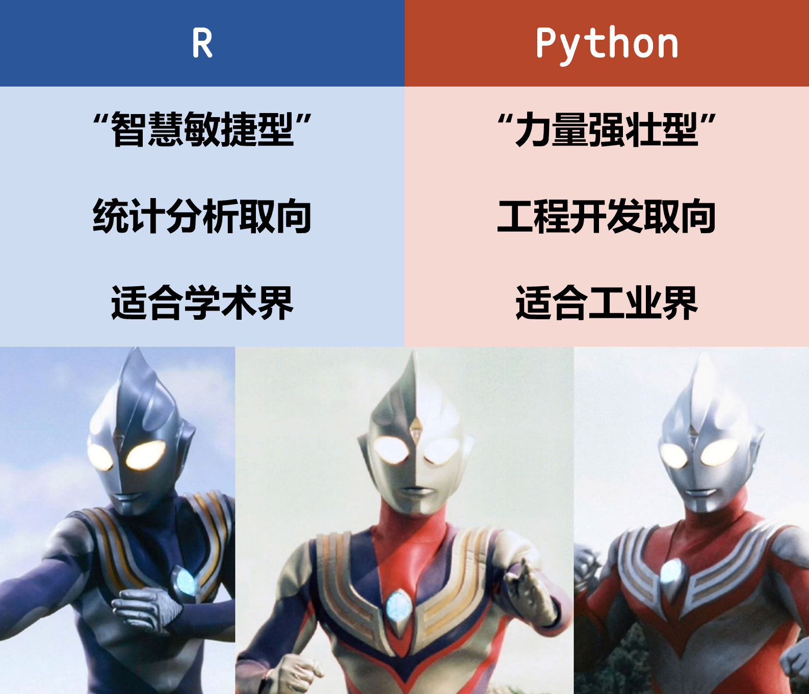

**发展中国家的全球R包开发贡献（截至2023年10月）**

-   占全球17%开发者
-   占全球15%软件包
-   占全球6%下载量

（[Chuan-Peng et al., 2025, AMPPS](https://doi.org/10.1177/25152459251357565){.uri}）

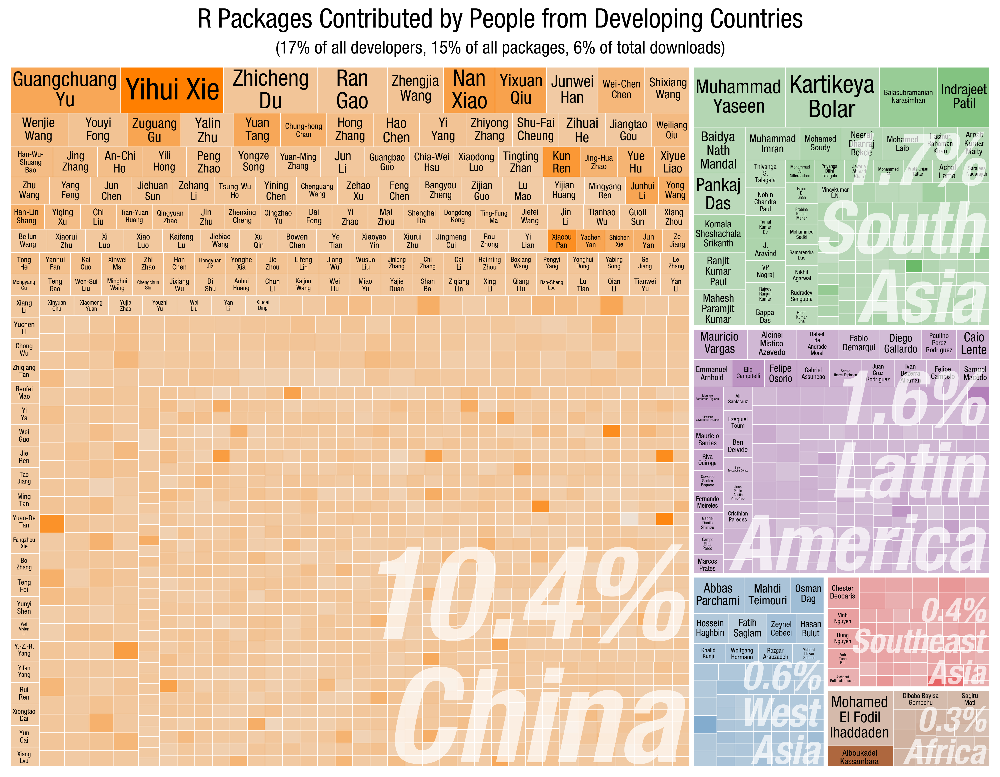

# R语言核心优势与编程理念

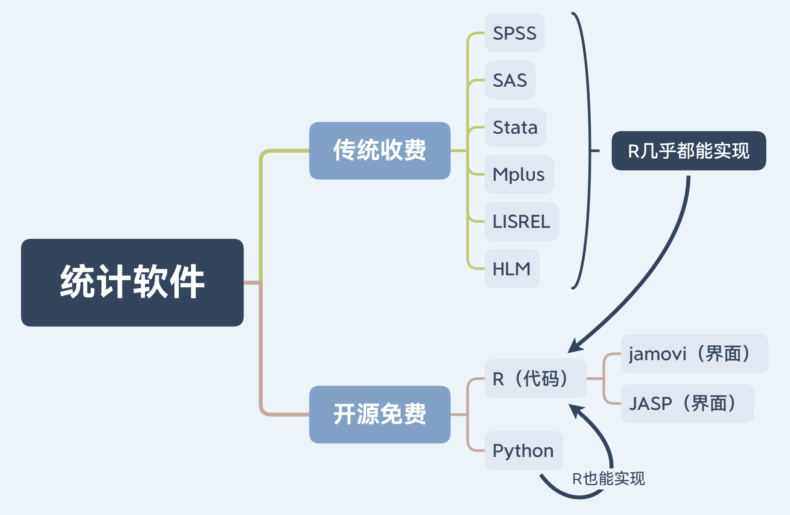

**为什么要「编程」（而不是菜单操作）？**

-   可再用（reusable）
-   可复现（reproducible）
-   可定制（modifiable）
-   可拓展（extendable）

**「函数式 + 向量化 + 管道流」编程理念⭐️**

-   一套复杂流程，应集成为一个函数（function），避免复制粘贴很多遍
    -   函数 = 一组程序的标准化流程 + 灵活的参数设置
-   一个问题的解决方法不是唯一的，需要考虑简洁性和易读性
    -   向量化批处理 \> for循环
    -   管道操作符步步拆解 \> 多个函数层层嵌套

**牢固掌握基础编程语法**

-   赋值、判断、循环、对象类型与转换、函数与参数

**全面了解选择最优R包**

-   R包使用：站在巨人肩膀上，避免“重复造轮子”
-   R包开发：你也可以批判创新，开发自己的R包

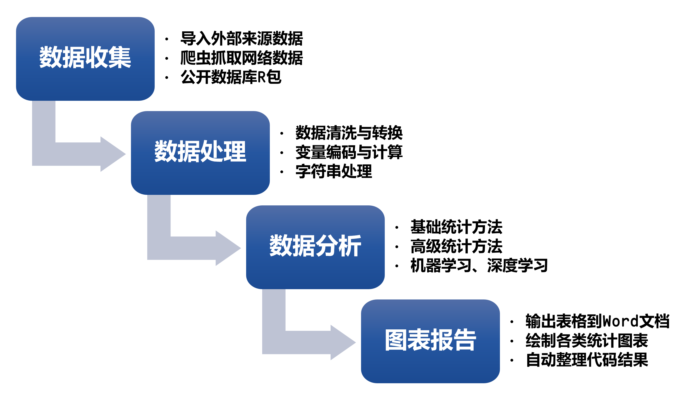

# R软件和RStudio编辑器下载安装

#### 【实践1】下载安装R软件和RStudio编辑器 {#实践1下载安装r软件和rstudio编辑器}

> “R是笔记本🗒️，RStudio是笔记本💻。”

-   R最新版（<https://cran.r-project.org/>）
    -   [Download R for Windows](https://cran.r-project.org/bin/windows/) → [install R for the first time](https://cran.r-project.org/bin/windows/base/){.uri} → Download R-x.x.x for Windows
    -   [Download R for macOS](https://cran.r-project.org/bin/macosx/) → 选择最新版本下载安装
    -   我们并不直接使用R自带软件界面“RGui”，因为实在太简陋了……
-   RStudio最新版（<https://posit.co/download/rstudio-desktop/>）
    -   选择适配版本，一路安装即可
    -   所有代码的编写和运行，都将在RStudio里完成\~！⭐️
    -   简介：“RStudio is an **Integrated Development Environment (IDE)** [集成开发环境] for R and Python. It includes a console, syntax-highlighting editor that supports direct code execution, and tools for plotting, history, debugging, and workspace management. RStudio is available in open source and commercial editions and runs on the desktop (Windows, Mac, and Linux).”
    -   特色：“RStudio具有非常强大的功能，能够极大地提升数据分析和可视化的工作效率。它支持语法高亮、自动补齐、多标签视图、文件管理、图形窗口、扩展包管理、集成帮助查看器、代码格式化、版本控制、交互式调试以及其他功能。”
-   Rtools本地编译工具（<https://cran.r-project.org/bin/windows/Rtools/>）
    -   用于从源代码本地编译R包
    -   仅Windows用户、R包开发时需要安装，务必装在C盘

# RStudio编辑器设置

#### 【实践2】设置RStudio界面 {#实践2设置rstudio界面}

-   **RStudio最上排“Tools”菜单 → “Global Options”菜单**
    -   **“Code”—“Display”—“Syntax”**
        -   勾选所有（语法高亮显示）
    -   **“Console”—“Display”**
        -   勾选“Show syntax highlighting in console input”（语法高亮显示）
    -   **“Appearance”**
        -   Editor font：选择字体“Consolas”（内置）或“Maple Mono SC NF”（需额外安装）
        -   Editor theme：选择主题配色“Tomorrow Night Bright”（对比醒目，深色护眼）
    -   **“Pane Layout”**
        -   左上角：Source（代码/脚本文件）
        -   左下角：Console（控制台/命令行/运行结果/临时代码）
        -   右上角：Environment（运行环境与变量）、Files（文件夹）、Plots（作图结果）、Packages（R包管理）、Help（帮助文档）、Viewer（浏览器）
        -   右下角：Build（R包开发）、VCS（Git版本控制）
    -   **“R Markdown”**
        -   取消勾选“Show output inline for all R Markdown documents”（所有结果均输出到Console）

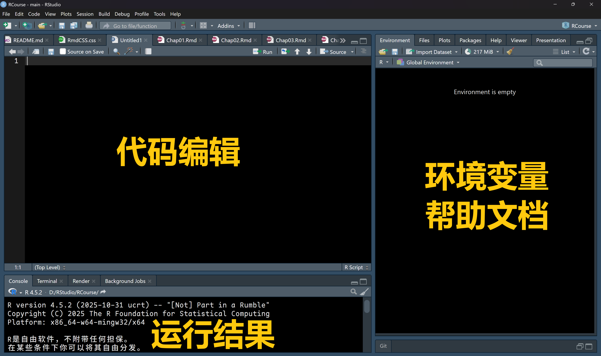

-   Environment（环境窗口）可以帮助你查看：
    -   变量是否成功创建？
    -   数据是否成功导入？
    -   环境变量类型大小？

#### 【探索发现】试试看这些代码 {#探索发现试试看这些代码}

```{r}
## R可以当计算器
1 + 1
pi  # 圆周率
sqrt(2)
(sqrt(5) - 1) / 2  # 黄金分割率
```

# R包安装与管理

#### 【探索发现】官方平台（CRAN）现在一共发布了多少个R程序包？ {#探索发现官方平台cran现在一共发布了多少个r程序包}

-   点击看看实时统计：<https://cran.r-project.org/web/packages/index.html>

#### 【探索发现】现有R包能覆盖哪些学科领域和统计方法？ {#探索发现现有r包能覆盖哪些学科领域和统计方法}

-   点击看看主题目录：<https://cran.r-project.org/web/views/>

#### 【实践3】下载安装R程序包 {#实践3下载安装r程序包}

安装/更新R包的两种方式：

1.  点菜单
    -   RStudio编辑器 → 右上方“Packages”窗口 → “Install”和“Update”
    -   进入“Install”菜单，输入R包名称（如：`tidyverse`），即可安装
2.  写代码
    -   CRAN正式版R包：`install.packages("pkgname")`
    -   GitHub开发版R包：`devtools::install_github("username/pkgname")`

`tidyverse`和`bruceR`是两个综合R包，国内多所高校（包括北大）在本科及研究生R语言教学中均有使用。

[](https://tidyverse.org/) [](https://CRAN.R-project.org/package=tidyverse) [](https://CRAN.R-project.org/package=tidyverse)

-   `tidyverse`开发者：Hadley Wickham（首发于2016）
    -   综合工具箱：**数据处理与可视化**功能集合

[](https://psychbruce.github.io/bruceR/) [](https://CRAN.R-project.org/package=bruceR) [](https://CRAN.R-project.org/package=bruceR)

-   `bruceR`开发者：Han Wu Shuang Bao（首发于2021）
    -   综合工具箱：**统计分析与结果汇报**功能集合（面向心理学与社会科学）

```{r, eval=FALSE}
## 复制下面的代码，粘贴到RStudio的Console中，运行
install.packages("tidyverse")
install.packages("bruceR", dep=TRUE)
# 参数 dependencies=TRUE 安装所有依赖包
```

#### 【探索发现】安装遇到报错怎么办？ {#探索发现安装遇到报错怎么办}

-   阅读报错信息
    -   `package ‘XXX’ is not available for this version of R`
        -   这个包可能只存在于GitHub平台？
        -   是不是拼写错了？
-   重启RStudio
    -   重启软件“包治百病”
-   手动卸载重装R包
    -   能确保解除当前R包占用
-   更新R软件和所有R包
    -   及时更新是一种好习惯
-   检查网络连接，换一个镜像
    -   “Tools”菜单 → “Global Options”菜单 → “Packages” → “Change” → 选一个国内镜像
-   实在不行，等一两天再安装
    -   R包在CRAN平台更新后，最初一两天安装时都需要暂时本地编译，等官方编译完成、发布编译版本后，用户才能快捷安装，所以你可能恰好遇到了刚刚更新的R包，不要心急，慢慢解决

#### 【实践4】加载本地R包 {#实践4加载本地r包}

```{r, warning=FALSE}
## Load R packages
library(tidyverse)
library(bruceR)
```

# 【作业1】R软件安装与配置

请在平台提交截图：

-   你设置好的RStudio编辑器布局截图，其中包括【实践4】的代码和成功运行结果

------------------------------------------------------------------------

# R编程环境

**总体建议：为每个项目单独建立一个“R Project”，使用“R Markdown”文档格式写代码。**

-   **R Markdown（兼具代码呈现与运行结果报告）⭐️**
    -   `.Rmd`文档格式
-   R Script（仅能保存R代码，没有运行结果）
    -   `.R`文档格式
-   R Console（仅能临时在命令行运行，无法保存代码）
    -   没有文档，RStudio中的Console

## （1）R Project（项目）

#### 【实践5】为《R语言》课程学习建立一个独立的项目环境 {#实践5为r语言课程学习建立一个独立的项目环境}

-   RStudio最上排“File”菜单 → “New Project”菜单
    -   “New Directory” → “New Project” → 起一个项目名称 (如“Project_R_Course”) → “Browse”选择存储该项目的上级目录 → “Create Project”

## （2）R Console（命令行）

#### 【探索发现】R语言赋值符号问题：一定要用箭头，不能用等号吗？ {#探索发现r语言赋值符号问题一定要用箭头不能用等号吗}

```{r}
## R的两种赋值符号
x <- 1
x = 1
```

很多人推荐用`<-`而不建议用`=`，理由是所谓“容易引起歧义”、“以后就知道好处了”……

是真的吗？有逻辑吗？No！

-   可以永远只用`=`赋值，完全没问题！
    -   与其他编程语言保持一致
-   提高可读性：等号`=`前后加空格，逗号`,`后加空格
    -   可读性低：
        -   `x=c(1,2,3,4,5,6)`
        -   `x=c(1.2,3.4,5.6)`
    -   可读性高：
        -   `x = c(1, 2, 3, 4, 5, 6)`
        -   `x = c(1.2, 3.4, 5.6)`

#### 【实践6】逐行运行代码，体会写法差异 {#实践6逐行运行代码体会写法差异}

小贴士：逐行运行代码的快捷键是Ctrl + Enter（Command + Return）哦\~！

```{r}
## 把123赋值给x
x=123
x = 123   # 推荐写法（与其他编程语言保持一致）
x<-123
x <- 123  # 教科书式写法（也是AI味儿的写法）

print(x)  # 查看对象
cat(x)    # 连接并打印对象里的字符（文本输出）
```

```{r}
## 把-1赋值给x
x=-1
x = -1   # 推荐写法（与其他编程语言保持一致）
x<--1
x <- -1  # 教科书式写法（也是AI味儿的写法）

print(x)  # 查看对象
cat(x)    # 连接并打印对象里的字符（文本输出）
```

#### 【知识点】为什么会“找不到对象”？ {#知识点为什么会找不到对象}

> “万物皆对象，万事皆函数。” —— John Chambers（R语言创始人之一）

-   **R里的一切，都是对象！**
    -   只要你把一个东西“存起来”，它就变成了一个对象
    -   你在R里做的所有事情，本质上都是在操作“对象”
-   “找不到对象”，是因为对象还没“出生”，后面所有相关代码都无法运行
    -   遇到报错，不要心慌，仔细阅读，逐一排查，追本溯源！

```{r, eval=FALSE}
## 如果对象还没有赋值，不在运行环境中，就会找不到对象！
ecnu
```

```         
错误: 找不到对象'ecnu'
Error: object 'ecnu' not found
```

```{r}
ecnu = "华东师范大学"
ecnu
```

-   `ecnu`是一个对象
-   `"ecnu"`是对象名
-   `"华东师范大学"`是对象的值

```{r, eval=FALSE}
## 如果函数所在的R包还没有加载，就会提示没有这个函数！
ecnu()
```

```         
错误于ecnu(): 没有"ecnu"这个函数
Error in ecnu() : could not find function "ecnu"
```

```{r}
ecnu = function() { cat("华东师范大学") }
ecnu()
```

#### 【探索发现】为什么R语言cat()函数名称叫“cat”？ {#探索发现为什么r语言cat函数名称叫cat}

为什么R语言`cat()`函数名称叫“cat”？🐱🐈😸🐈‍⬛

-   AI回答：R语言中的`cat()`函数之所以叫这个名字，是因为它源自Unix/Linux系统中的一个经典命令，其含义是**“concatenate and print”（连接并打印）**
    -   词源和历史
        -   Unix命令`cat`：在操作系统中，cat命令最初的核心功能是读取一个或多个文件，将它们连接（concatenate）起来，然后输出（打印）到标准输出（通常是终端屏幕），例如`cat file1.txt file2.txt`会将两个文件的内容连续显示出来
        -   R的继承：R语言诞生于Unix环境（贝尔实验室），其设计深受Unix哲学和已有工具的影响，许多R的基础函数名都直接借鉴了Unix命令或C语言函数，`cat()`就是其中之一
    -   R中`cat()`的核心功能
        -   **连接（concatenate）**：将多个对象（字符串、数字、变量值）连接成一个连续的输出流
        -   **打印（print）**：将这个连接后的结果直接输出到控制台或指定文件，不加任何额外的装饰（比如索引号`[1]`或引号）

```{r}
## 比较print()和cat()有什么不同
print(c("Hello", "World"))   # 字符串向量
cat("Hello", "World", "\n")  # 拼接字符串（\n表示换行）
```

## （3）R Script（脚本文件）

-   新建一个R Script脚本文件（`.R`）
    -   “File” → “New File” → “R Script”（也有快捷键：Ctrl + Shift + N）
    -   保存（快捷键：Ctrl + S）并取一个文档名

#### 【知识点】R包与R函数的调用方式 {#知识点r包与r函数的调用方式}

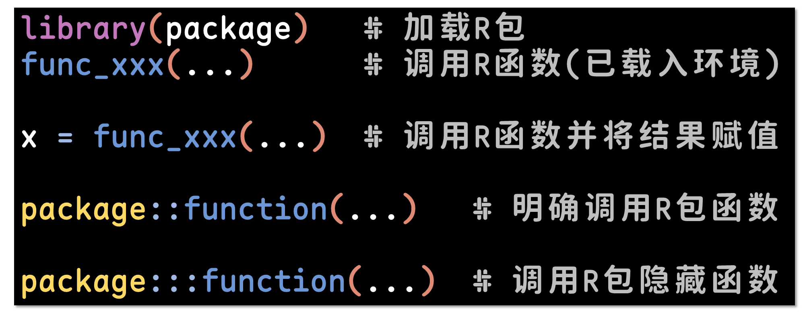

#### 【实践7】调用R包函数 {#实践7调用r包函数}

```{r, eval=FALSE}
set.wd()  # 如果不加载R包，就无法直接使用里面的函数
```

```         
错误于set.wd(): 没有"set.wd"这个函数
```

```{r}
library(bruceR)  # 加载R包
set.wd()  # 调用R函数（已载入环境）

x = set.wd()  # 调用R函数并将结果赋值给x
x

bruceR::set.wd()  # 明确调用R包函数（函数重名才用到）

bruceR:::p.trans(0)  # 调用R包隐藏函数（一般情况用不到）
```

试试这些代码：

```{r, eval=FALSE}
set.wd()  # set working directory to the path of the currently opened file
set.wd("~/")  # set working directory to the home path
set.wd("../")  # set working directory to the parent path
set.wd(ask=TRUE)  # select a folder with the prompt of a dialog
```

#### 【实践8】查询函数的帮助文档 {#实践8查询函数的帮助文档}

```{r, eval=FALSE}
## 1. help(函数名)
help(set.wd)

## 2. ?函数名
?set.wd

## 3. ?包名::函数名
?bruceR::set.wd

## 4. 将光标移至函数名中的任意位置，按F1(或Fn + F1)
set.wd()
```

#### 【知识点】RStudio常用快捷键 {#知识点rstudio常用快捷键}

| 功能                        | Windows & Linux   | Mac                    |
|-----------------------------|-------------------|------------------------|
| 自动**补全**代码            | Tab               | Tab                    |
| **运行**当前代码行(Run)     | Ctrl + Enter      | Command + Return       |
| **注释**当前代码行(Comment) | Ctrl + Shift + C  | Shift + Command + C    |
| **移动**当前代码行(上/下)   | Alt + ↑/↓         | Option + ↑/↓           |
| **复制**当前代码行(上/下)   | Alt + Shift + ↑/↓ | Option + Command + ↑/↓ |
| **缩进**当前代码行(Indent)  | Ctrl + I          | Command + I            |
| **删除**当前代码行(Delete)  | Ctrl + D          | Command + D            |
| 快捷输入**管道操作符**`%>%` | Ctrl + Shift + M  | Shift + Command + M    |
| 撤销(Undo)                  | Ctrl + Z          | Command + Z            |
| 重做(Redo)                  | Ctrl + Shift + Z  | Shift + Command + Z    |
| 保存文件(Save)              | Ctrl + S          | Command + S            |
| 清空Console                 | Ctrl + L          | Ctrl + L               |

: RStudio常用快捷键

## （4）R Markdown（综合文档）

-   新建一个R Markdown综合文档（`.Rmd`）
    -   “File” → “New File” → “R Markdown” → 输入文档标题、作者姓名等信息

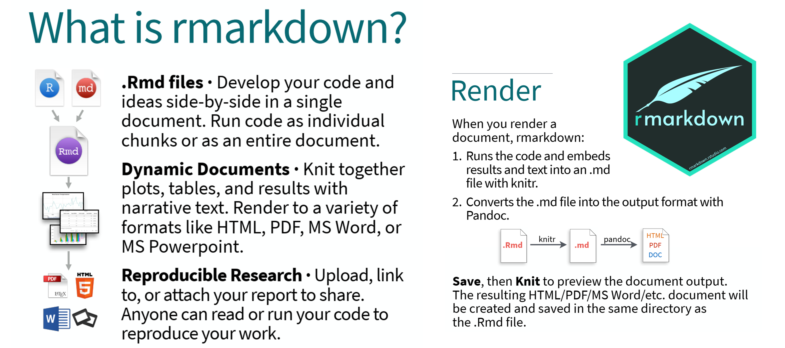

#### 【探索发现】为什么要使用R Markdown？ {#探索发现为什么要使用r-markdown}

-   融合文字、代码、结果、图表，适用于研究论文补充材料（HTML文档）
    -   Markdown语法
    -   R、Python等编程语言
    -   LaTeX数学公式
    -   HTML脚本
    -   CSS样式
    -   ……
-   辅助提高程序的结构性、逻辑性、简洁性，减少bug
-   无需手动运行，每次“Knit”（自动运行渲染）都重新完整运行一遍
-   高效率（自动整理结果）、可复现（完整记录所有处理步骤）、动态交互呈现

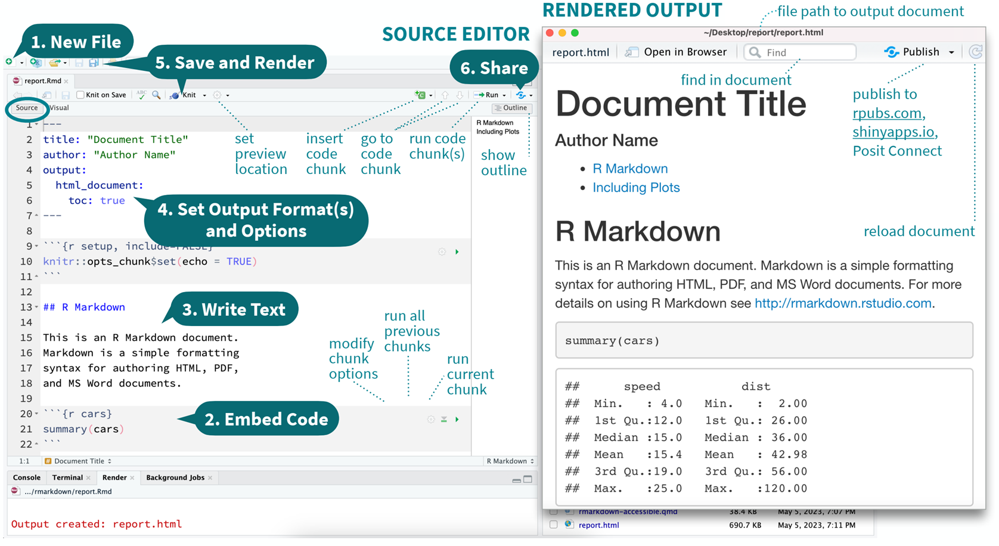

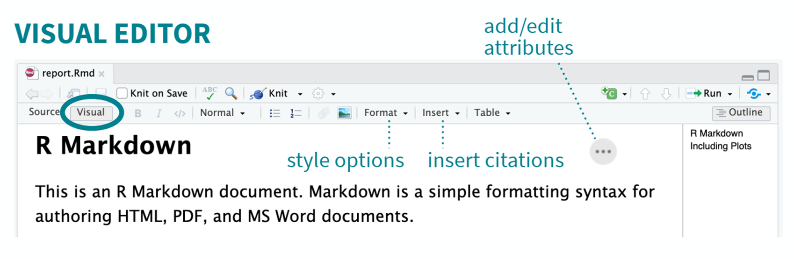

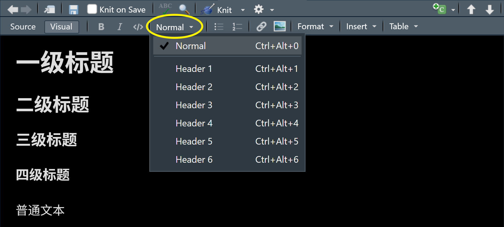

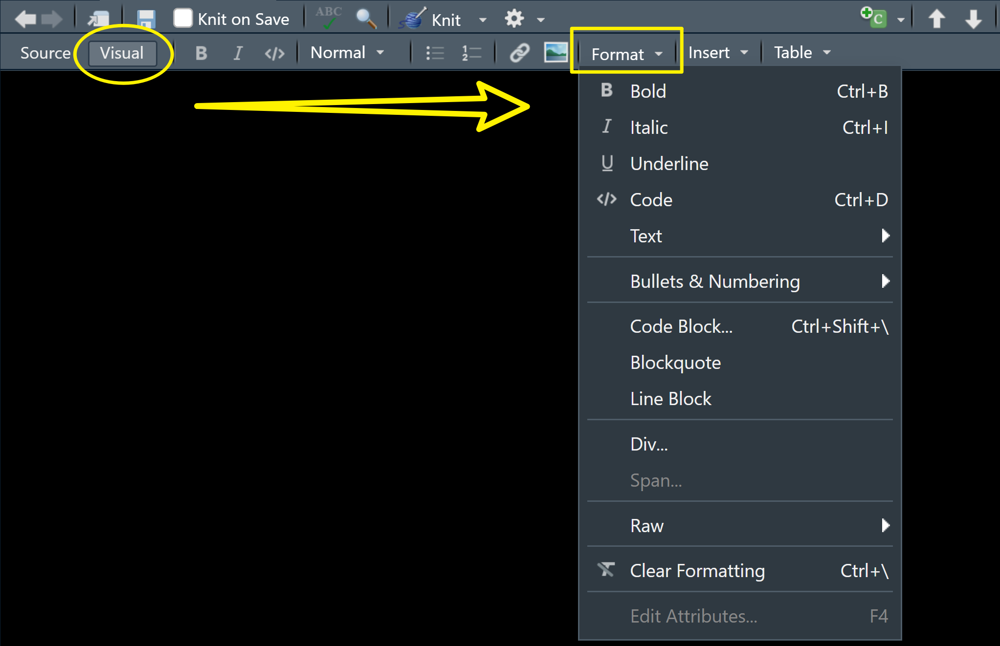

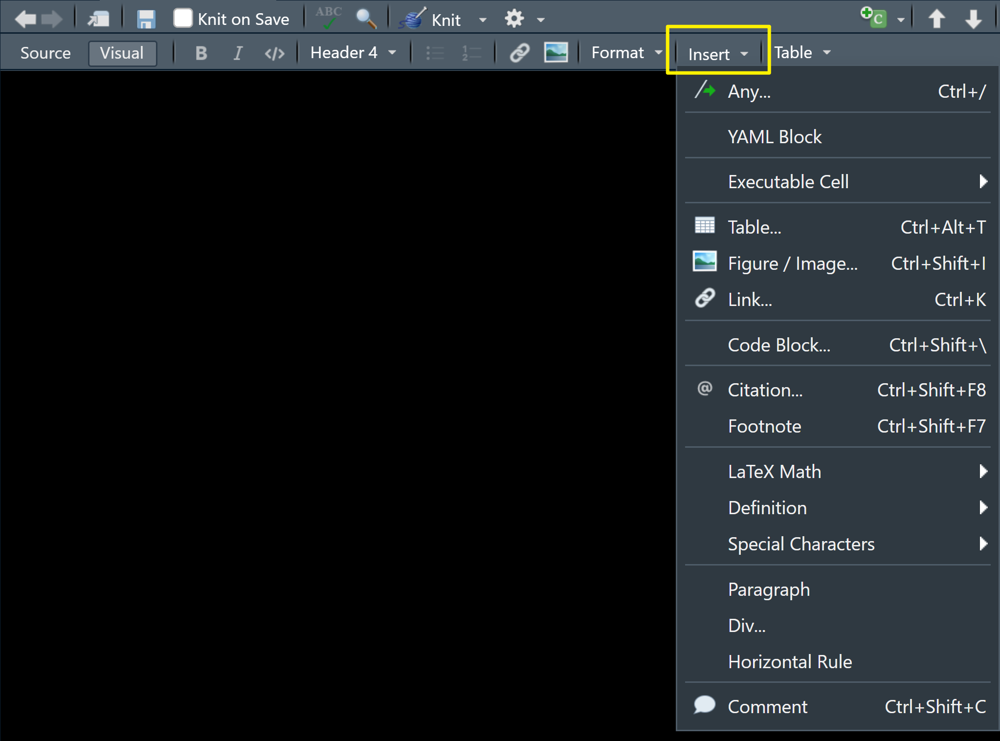

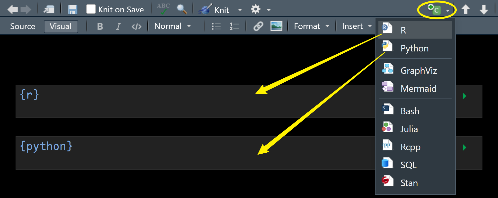

#### 【知识点】Markdown语法基础 {#知识点markdown语法基础}

```         
# 一级标题

## 二级标题

### 三级标题

#### 四级标题

普通文字，**粗体文字**，*斜体文字*，***粗斜体文字***，上标^2^，下标~2~

段内代码`mean(1:5)`用反引号

-   无序列表A
    -   无序列表A1
        -   无序列表A1-1
        -   无序列表A1-2
    -   无序列表A2
-   无序列表B
-   无序列表C

1.  有序列表01
2.  有序列表02
3.  有序列表03
```

普通文字，**粗体文字**，*斜体文字*，***粗斜体文字***，上标^2^，下标~2~

段内代码`mean(1:5)`用反引号

-   无序列表A
    -   无序列表A1
        -   无序列表A1-1
        -   无序列表A1-2
    -   无序列表A2
-   无序列表B
-   无序列表C

1.  有序列表01
2.  有序列表02
3.  有序列表03

> 以上都可以通过RStudio编辑器的“Visual”所见即所得模式快捷设置

#### 【知识点】R Markdown代码块设置 {#知识点r-markdown代码块设置 .tabset .tabset-fade .table-pill}

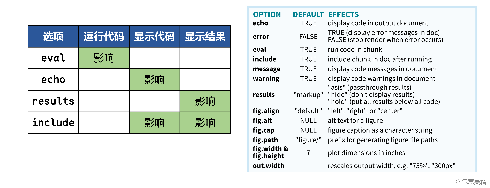

##### **eval 运行代码**

`{r, eval=TRUE}` 运行代码

```{r, eval=TRUE}
print(123)  # 运行代码
```

`{r, eval=FALSE}` 不运行代码

```{r, eval=FALSE}
print(123)  # 不运行代码
```

##### **echo 显示代码**

`{r, echo=TRUE}` 显示代码

```{r, echo=TRUE}
print(123)  # 显示代码
```

`{r, echo=FALSE}` 不显示代码（但运行）

```{r, echo=FALSE}
print(123)  # 不显示代码（但运行）
```

##### **results 显示结果**

`{r, results=TRUE}` 显示结果

```{r, results=TRUE}
print(123)  # 显示结果
```

`{r, results=FALSE}` 不显示结果（但运行）

```{r, results=FALSE}
print(123)  # 不显示结果（但运行）
```

##### **include 显示代码+显示结果**

`{r, include=TRUE}` 显示代码+显示结果

```{r, include=TRUE}
print(123)  # 显示代码+显示结果
```

`{r, include=FALSE}` 不显示代码+不显示结果（但运行）

```{r, include=FALSE}
print(123)  # 不显示代码+不显示结果（但运行）
```

#### 【实践9】设置Rmd文档属性 {#实践9设置rmd文档属性}

请在自己新建的R Markdown文档开头，替换修改以下属性信息，并删掉注释。

```{r, eval=FALSE}
---
title: "标题"
subtitle: "副标题"
author: "你的姓名+学号"
date: "`r Sys.Date()`"     # 自动获取当前日期
output:
  html_document:           # HTML输出文档设置
    toc: true              # 生成目录
    toc_depth: 3           # 目录最多显示到3级标题
    toc_float:             # 目录浮动
      collapsed: false     # 目录展开
    code_download: true    # 显示下载代码按钮
    anchor_sections: true  # 节标题定位标
    highlight: pygments    # 代码高亮配色方案(建议用pygments)
    theme: default         # 页面整体主题方案
---
```

主题方案：

-   default, cerulean, cosmo, darkly, flatly, journal, lumen, paper, readable, sandstone, simplex, spacelab, united, yeti

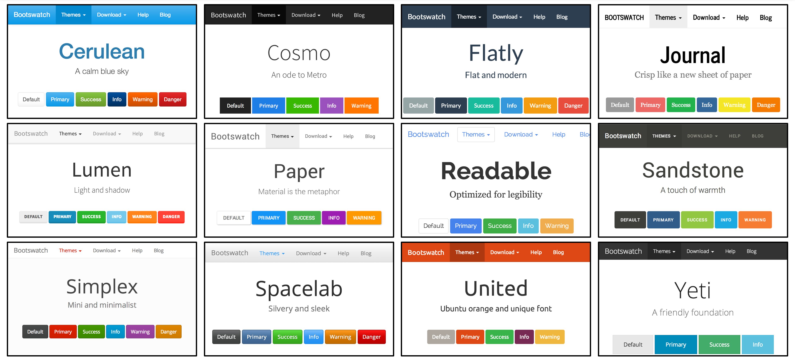

# 【作业2】建立R Markdown模板

作业要求：

-   将Rmd文档属性设置为你的信息（标题、副标题、姓名、学号、日期等），自选任意一种你喜欢的主题方案
-   修改Rmd新建文档中自带的R代码块例子，体现代码块参数`eval`、`echo`、`results`、`include`的不同设定分别会得到什么结果，并用多级标题分块整理这4个参数对应的效果
-   Knit运行渲染（快捷键：Ctrl + Shift + K）得到HTML网页结果

平台提交：

-   运行得到的HTML网页，及其关键部分截图

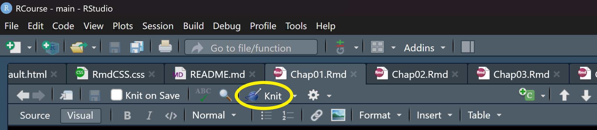
