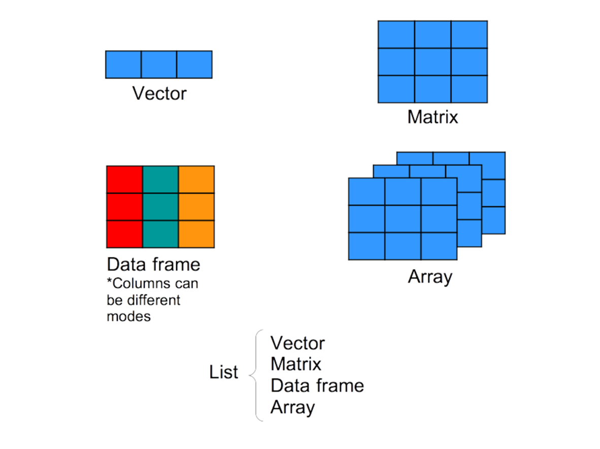
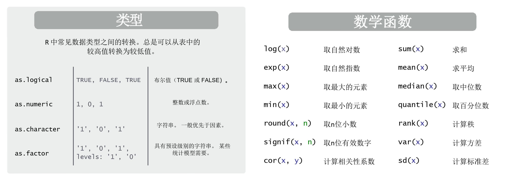
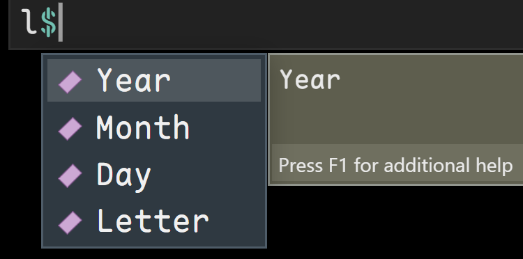

```{=html}
<p style="font-size: 12px">版权声明：本套课程材料开源，使用和分享必须遵守「创作共用许可协议 CC BY-NC-SA」（来源引用-非商业用途使用-以相同方式共享）。</p>
```

```{r Config, include=FALSE}
options(
  knitr.kable.NA = "",
  digits = 4
)
knitr::opts_chunk$set(
  comment = "",
  fig.width = 6,
  fig.height = 4,
  dpi = 300
)
```

------------------------------------------------------------------------

# Chap02：函数对象

#### 往期要点回顾

-   [Chap01 \# R包安装与管理](https://psychbruce.github.io/RCourse/Chap01#r%E5%8C%85%E5%AE%89%E8%A3%85%E4%B8%8E%E7%AE%A1%E7%90%86){.uri}

#### 本章要点目录

-   [【知识点】R对象与函数](#知识点r对象与函数)
-   [【实践1】数值向量](#实践1数值向量)
-   [【实践2】字符向量](#实践2字符向量)
-   [【知识点】因子型向量](#知识点因子型向量)（重点）
-   [【实践3】逻辑向量](#实践3逻辑向量)
-   [【知识点】条件判断运算符与对象类型判断函数](#知识点条件判断运算符与对象类型判断函数)
-   [【实践4】逻辑向量—数值向量—字符向量的相互转换](#实践4逻辑向量数值向量字符向量的相互转换)
-   [【知识点】管道操作符](#知识点管道操作符)（重点）
-   [【实践5】向量元素命名与提取](#实践5向量元素命名与提取)
-   [【实践6】向量代数运算](#实践6向量代数运算)
-   [【实践7】向量元素拼接](#实践7向量元素拼接)（重点）
-   [【实践8】列表构建与操作](#实践8列表构建与操作)（重点）
-   [【知识点】R函数体的结构](#知识点r函数体的结构)（重点）
-   [【实践9】文件夹里有什么？](#实践9文件夹里有什么)
-   [【实践10】今天晚上吃什么？](#实践10今天晚上吃什么)
-   [【实践11】正态分布随机数的平均值和标准差？](#实践11正态分布随机数的平均值和标准差)
-   [【实践12】“Hello World”的几种打印方法？](#实践12hello-world的几种打印方法)

```{r}
## 本章所需R包
library(bruceR)
```

# R对象类型与相互转换


#### 【知识点】R对象与函数 {#知识点r对象与函数}

> “万物皆对象，万事皆函数。” —— John Chambers（R语言创始人之一）

-   “Everything that exists in R is an object.”\
    （所用的一切都是对象）
    -   向量（vector）⭐️
        -   数值向量（numeric vector）
        -   字符向量（character vector）
        -   逻辑向量（logical vector）
    -   矩阵（matrix）
    -   数组（array）
    -   列表（list）⭐️
        -   混合存储多种类型的对象和数据
    -   数据框（data frame）⭐️
        -   R里90%的分析都是围绕`data.frame`（包括`data.table`）展开的
        -   相当于Excel表格在R里的样子（每一列是一个变量，每一行是一个观测值）
-   “Everything that happens in R is the result of a function call.”\
    （所做的一切都是函数）



## 向量（vector）

-   单维、单类型数据

### （1）数值向量

#### 【实践1】数值向量 {#实践1数值向量}

-   `c()`：生成任何类型向量（合并一组同类型的数据）⭐️
    -   “c”表示“combine”

```{r}
1
1:5
c(1, 2, 3, 4, 5)
c(1:5, 10, 15)
```

-   `seq()`：生成数值序列

```{r}
seq(1, 5, 0.5)
seq(from=1, to=5, by=0.5)
```

-   `rep()`：重复向量元素

```{r}
rep(1:2, 3)
rep(1:2, each=3)
```

### （2）字符向量

#### 【实践2】字符向量 {#实践2字符向量}

```{r}
c(1:5, 10.5, "next")  # 如果混着放，统统变成字符型！

"Psychology"  # 一个字符串，本质上是一个长度为1的字符向量
"Psychology"[1]  # 向量的第1个元素
"Psychology"[0]  # 向量的第0个元素（没有）
"Psychology"[2]  # 向量的第2个元素（缺失）
```

-   `nchar()`：计算字符串的字符个数
-   `length()`：计算对象内的元素个数

```{r}
nchar("Psychology")  # 字符个数为10
a = c("Psychology", "ECNU", "Shanghai", "China")
a
length(a)
nchar(a)  # 向量化计算
```

-   `class()`：获取R对象类型（可能是单个类型或多种类型的叠加）
-   `str()`：显示R对象内部结构（常用于探索数据结构）⭐️

```{r}
class(a)
str(a)  # structure：显示R对象的结构
```

-   `cc()`：比`c()`更方便的字符向量设定
    -   自动根据分隔符号（英文逗号、换行符等）拆解字符串

```{r}
## cc() 用法：必须是英文逗号或换行符
cc("心理学, 社会学, 教育学, 管理学, 计算机, 人工智能")
cc("
心理学
社会学
教育学
管理学
计算机
人工智能
")
```

#### 【知识点】因子型向量 {#知识点因子型向量}

-   `as.factor()`：将任意类型向量转换为因子型向量⭐️
    -   因子（factor）本质上是带有“类别/分组信息”的向量（将向量中的不重复元素排序后作为类别选项）
    -   因子水平（levels）是所有可能的类别（当涉及类别间的对比时，默认以第一类为参照组）
-   `factor()`：比`as.factor()`更完整的因子型向量设定⭐️
    -   `levels`：定义因子水平顺序
    -   `labels`：定义因子取值标签

```{r}
## 数值向量 ==> 因子向量
a = c(2, 0, 0, 0, 6, 2)
a
unique(a)

a = as.factor(a)
a
levels(a)  # 因子水平：所有可能的类别

## 字符向量 ==> 因子向量
a = c("Psychology", "ECNU", "Shanghai", "China")
as.factor(a)
factor(a, levels=c("China", "Shanghai", "ECNU", "Psychology"))
factor(
  a,
  levels = c("China", "Shanghai", "ECNU", "Psychology"),
  labels = c("CN", "SH", "ECNU", "Psy")
)
```

### （3）逻辑向量

#### 【实践3】逻辑向量 {#实践3逻辑向量}

```{r}
c(TRUE, TRUE, FALSE, TRUE, FALSE, FALSE)
1:5 > 2
```

-   `%in%`：向量化判断前一个对象的每个元素是否在后一个对象中

```{r}
c(0, 5, 10, 15) %in% 1:10
```

-   `ifelse()`：根据条件语句，向量化逻辑判断

```{r}
ifelse(1:10 >= 5, "Yes", "No")  # ifelse(test, yes, no)
```

#### 【知识点】条件判断运算符与对象类型判断函数 {#知识点条件判断运算符与对象类型判断函数}

```{r, eval=FALSE}
## 条件判断运算符
a == b
a != b
a > b
a < b
a >= b
a <= b
a %in% b

## 对象类型判断函数
is.na(x)
is.null(x)
is.numeric(x)
is.character(x)
is.factor(x)
# 还有非常多其他 is.xxx() 系列函数！
```

### 向量相互转换

#### 【实践4】逻辑向量—数值向量—字符向量的相互转换 {#实践4逻辑向量数值向量字符向量的相互转换}

-   `as.logical()`：`0`转换为`FALSE`，非`0`转换为`TRUE`
-   `as.character()`：转换为字符向量
-   `as.numeric()`：转换为数值向量（无法转换的记为`NA`缺失值）

```{r}
as.logical(0:5)
as.character(0:5)
as.numeric(c("-1.5", "0", "1.5"))
as.numeric(c("1.2", "-.12", "1.2.3"))  # NA表示缺失值
```

#### 【知识点】管道操作符 {#知识点管道操作符}

-   `%>%`：管道操作符⭐️（tidyverse系列包的通用函数）
    -   **默认将【左侧结果】传给右侧函数的【第1个参数】！**
        -   **如果想传给右侧函数的其他参数，需要用点`.`占位！**
    -   快捷键：Ctrl + Shift + M（注意检查其他软件的快捷键冲突）
    -   如果提示`没有"%>%"这个函数`，请`library(tidyverse)`或`library(bruceR)`

```{r}
a = c("Psychology", "ECNU", "Shanghai", "China")
as.factor(a)  # 不使用管道操作符
a %>% as.factor()  # 使用管道操作符，默认传给as.factor()第1个参数
a %>% as.factor() %>% as.numeric()  # 默认传给这些函数的第1个参数
a %>% as.factor() %>% as.numeric() %>% c(666)  # 默认传给c()第1个参数
a %>% as.factor() %>% as.numeric() %>% c(., 666)  # .占位第1个参数
a %>% as.factor() %>% as.numeric() %>% c(666, .)  # .占位第2个参数
a %>% as.factor() %>% as.numeric() %>% c(666, 888, .)  # .占位第3个参数
a %>% as.factor() %>% as.numeric() %>% c(666, ., 888)  # .占位第2个参数
```

知识点小结：`LHS %>% RHS`这种写法，可以将`LHS`（Left-Hand Side）的输出结果作为`RHS`（Right-Hand Side）第1个参数的输入值，从而实现流程化的管道操作效果，避免繁琐、可读性差的“函数套娃”！

```{r}
## 可读性差的“函数套娃”
c(666, as.numeric(as.factor(as.character(c("Psychology", "ECNU")))))
```

### 向量元素操作

#### 【实践5】向量元素命名与提取 {#实践5向量元素命名与提取}

-   `names()`：对象元素名称或命名
    -   直接使用：返回对象元素名称
    -   赋值使用：赋予对象元素名称（将会改变当前对象）

```{r}
LETTERS  # 26个英文字母
a = 1:5
names(a)  # 直接用法（刚刚出生，还没名字）

names(a) = LETTERS[1:5]  # 赋值用法，a已改变
a
names(a)  # 现在上好户口，有名字了！
```

-   `x[...]`：`[]`操作符取对象元素内容
    -   `x[逻辑/数值向量]`：取对应位置元素（若为负数，则删除对应元素）
    -   `x[字符向量]`：取对应名称元素

```{r}
a["E"]
a[c("A", "C", "E")]

a[-1]  # 删除元素，但不改变a
a[-(2:4)]  # 删除元素，但不改变a
```

-   `rev()`：向量反向排列
-   `sort()`：按照数值大小或字母序重新排列
-   `unique()`：取向量中的所有独特元素（去重复值）
-   `table()`：向量元素频次统计

```{r}
x = c(2, 0, 0, 0, 6, 2)
rev(x)
sort(x)
unique(x)
x %>% unique() %>% sort() %>% rev()
table(x)

x %in% 1:5
x[x %in% 1:5]
x[x %in% 1:5] = NA
x
```

#### 【实践6】向量代数运算 {#实践6向量代数运算}

```{r}
a = 1:5
a + 1    # 1:5 + 1 【思考：a + 1:2 的结果？】
a * 2    # 1:5 * 2
a^2      # (1:5)^2
a * 5:1  # 对应位置相乘，长度必须相等
a %% 2   # 取余数
```

-   `sum()`、`mean()`、`min()`、`max()`：向量求和、平均值、最小值、最大值
    -   `na.rm`参数：忽视缺失值`NA`

```{r}
sum(1:100)  # 求和
mean(1:100)  # 求平均值
min(1:100)  # 最小值
max(1:100)  # 最大值

x = c(1, NA, 3, NA, 5)
sum(x)
sum(x, na.rm=TRUE)
mean(x)
mean(x, na.rm=TRUE)
min(x)
min(x, na.rm=TRUE)
max(x)
max(x, na.rm=TRUE)
```

-   `abs()`、`log()`、`sqrt()`等：各种常用的数学运算

```{r}
abs(-1)
log(2.718281828)  # ln（自然对数）
sqrt(81)
sqrt(sqrt(81))
81 %>% sqrt() %>% sqrt()

abs(log(sqrt(pi)))
pi %>% sqrt() %>% log() %>% abs()  # 管道操作符
```

#### 【实践7】向量元素拼接 {#实践7向量元素拼接}

-   `paste()`、`paste0()`：把向量元素拼接在一起
    -   `sep`参数：多个输入之间的黏合字符
    -   `collaspe`参数：向量不同元素之间的黏合字符

```{r}
paste(1, 2, 3, 4, 5)  # paste()拼接带空格
paste0(1, 2, 3, 4, 5)  # paste()拼接不带空格

paste(1, 2, 3, 4, 5, sep="-")  # 多个参数输入之间
paste(1:5, collapse="-")  # 单个向量的不同元素之间
paste(1:10, collapse="+")  # 打印计算公式
cat(paste(1:10, collapse="+"), "=", sum(1:10))
```



## 列表（list）

-   单维、多类型数据

#### 【实践8】列表构建与操作 {#实践8列表构建与操作}

-   `list()`：建立一个列表对象，可存储任意类型、任意结构的对象
    -   `$`：根据元素名称，取列表中的元素内容（Tab键弹出所有元素名称）
    -   `[[...]]`：取列表中对应位置的元素内容（不同于`[...]`）



```{r}
l = list(Year=2000:2015, Month=1:12, Day=1:31, Letter=LETTERS)
l
names(l)
length(l)
l$Year
l[2]    # 取第2个子集，返回list子集
l[[2]]  # 取第2个元素，返回元素本身，相当于 l$Month
```

-   `unlist()`：解除列表结构，还原为向量

```{r}
unlist(l)  # 解除列表结构，强行统一对象类型（数值 -> 字符）
```

-   `lapply()`：批量应用函数，返回为列表

```{r}
## lapply(向量或列表, 函数)
lapply(l, length)  # 每个元素批量应用length()函数
lapply(l, mean)    # 每个元素批量应用mean()函数

a = 1:5
a^2
lapply(a, function(x) x^2)  # x是形参（形式参数）
lapply(a, function(x) x^2) %>% unlist()
```

# R函数使用与参数设置

#### 【知识点】R函数体的结构 {#知识点r函数体的结构}

-   `function(...)`：函数接收输入参数，内部操作后，返回输出结果
    -   `{ }`：大括号内定义所有形式参数（形参）的操作过程
    -   返回结果可用两种方式
        -   `return(...)`：显式返回
        -   `invisible(...)`：隐式返回

```{r}
func = function(param1, param2, ...) {
  ## 函数内部操作
  results = param1 + param2
  cat(param1, "+", param2, "=", results, "\n")
  
  ## 函数返回结果
  return(results)
  # 也可以隐式返回：
  # invisible(results)
}
func(16, 9)
```

## 常用R函数使用

#### 【实践9】文件夹里有什么？ {#实践9文件夹里有什么}

```{r, eval=FALSE}
## 请自己运行
library(bruceR)
set.wd()  # 设置工作路径为当前打开文件的路径

list.files()          # 列出当前路径的所有文件/文件夹
list.files("../")     # 列出上一级路径的所有文件/文件夹
list.files("../../")  # 列出上两级路径的所有文件/文件夹
```

#### 【实践10】今天晚上吃什么？ {#实践10今天晚上吃什么}

```{r, eval=FALSE}
## 请自己运行
choice = c("河西食堂", "河东食堂", "环球港", "点外卖")
sample(choice, size=1)  # 随机抽样

# 设置随机种子，使结果可重复
set.seed(123)  # 随机种子可以是任意整数，没有特定含义
sample(choice, size=1)
```

#### 【实践11】正态分布随机数的平均值和标准差？ {#实践11正态分布随机数的平均值和标准差}

```{r}
set.seed(123)  # 设置随机种子，使结果可重复
x = rnorm(30)  # 生成30个随机数（正态分布）

mean(x)  # 求平均值
sd(x)    # 求标准差
hist(x)  # 画直方图

x > mean(x) + sd(x)         # 返回TRUE/FALSE向量
x[x > mean(x) + sd(x)]      # 返回(取出)符合条件的数值
which(x > mean(x) + sd(x))  # 返回符合条件数值所在位置

set.seed(123)  # 设置随机种子，使结果可重复
x = rnorm(1000)  # 生成1000个随机数（正态分布）

mean(x)  # 求平均值
sd(x)    # 求标准差
hist(x)  # 画直方图
```

#### 【实践12】“Hello World”的几种打印方法？ {#实践12hello-world的几种打印方法}

-   `cli`是命令行交互的专业R包，系统性提供了各种输出文本设定函数
    -   详见：<https://cli.r-lib.org/>

```{r}
print("Hello World!")
cat("Hello World!")
cat("Hello", "World!")
cli::cli_text("Hello World!")
cli::cli_h1("Hello World!")
cli::cli_h2("Hello World!")
cli::cli_h3("Hello World!")
cli::cli_alert("Hello World!")
cli::cli_alert_success("Hello World!")
cli::cli_alert_info("Hello World!")
cli::cli_alert_warning("Hello World!")
cli::cli_alert_danger("Hello World!")
```

# R逻辑控制语句

## if判断语句

```{r, eval=FALSE}
if (condition) {
  # Do something
} else if {
  # Do something
} else {
  # Do sth. else
}
```

```{r}
x = 3
if (x %in% 1:5) {
  cat("Yes")
} else {
  cat("No")
}
```

## while循环语句

```{r, eval=FALSE}
while (condition) {
  # Do something
}
```

```{r}
x = 1
while (x < 5) {
  cat(x, "is smaller than 5\n")
  x = x + 1
}
```

## for循环语句

```{r, eval=FALSE}
for (var in seq) {
  # Do something
}
```

```{r}
for (x in 1:5) {
  y = x * 2
  print(y)
}
```

# 【作业3】编程解决抛硬币问题

问题情境：一枚硬币，连续抛了N次都是正面朝上，再抛一次反面朝上的概率是多少？

-   比如，一枚硬币，连续抛了3次都是正面朝上，再抛一次反面朝上的概率是多少？
-   连续10次呢？连续1000次呢？连续1亿次呢？……
-   思路提示：利用假设检验的思想，判断这枚硬币是不是普通硬币（H0：硬币是普通的）

作业要求：

-   编写一段R程序，计算并判断至少连续多少次正面朝上，可以认定硬币不再是普通硬币（拒绝零假设）
-   尽可能用R Markdown完成

平台提交：

-   R代码和运行结果截图
