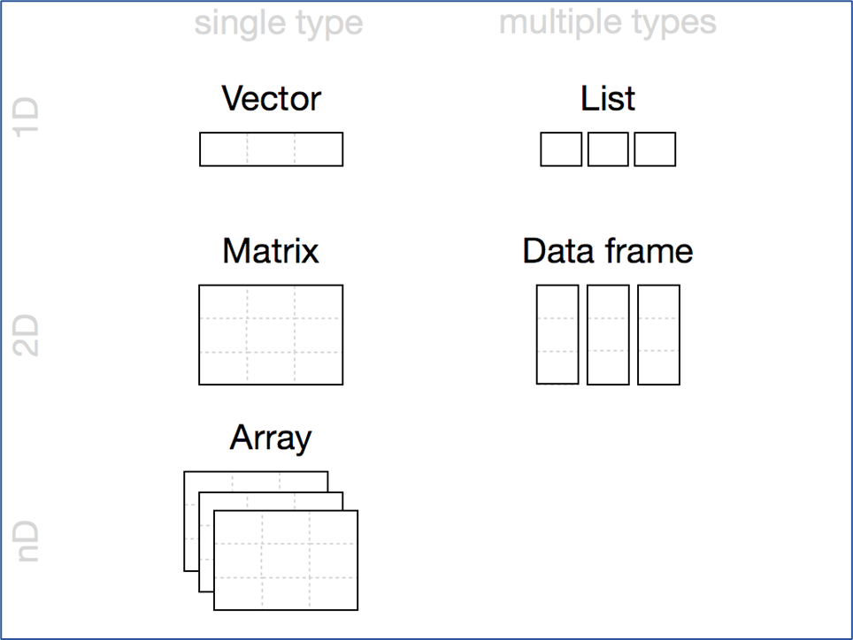
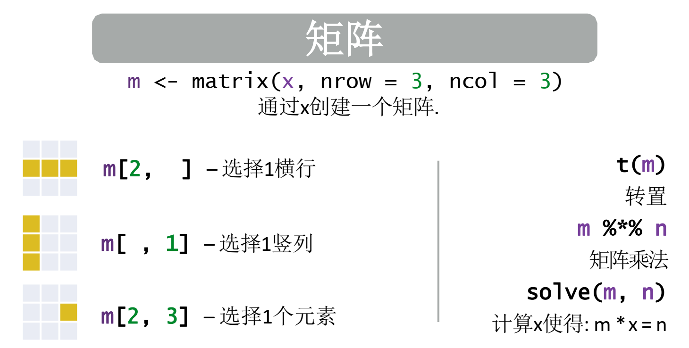
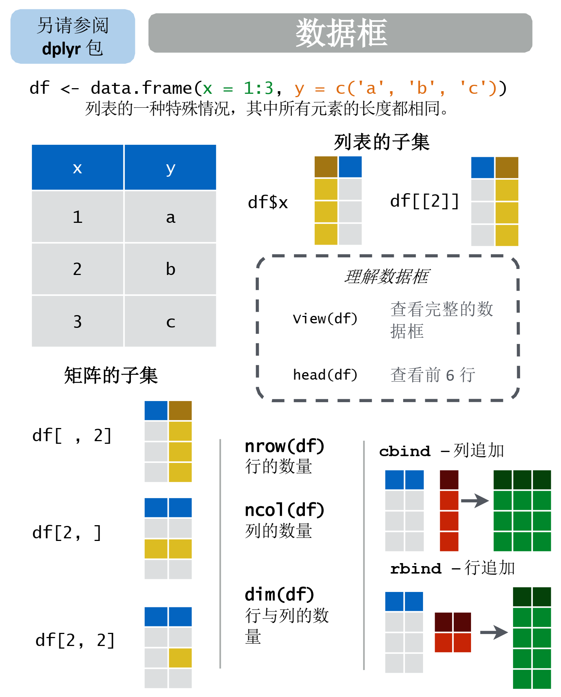
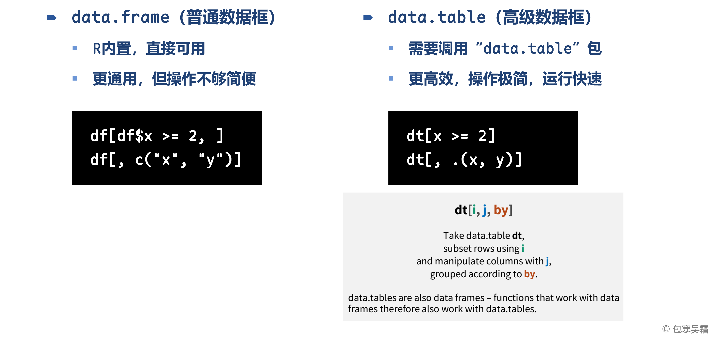
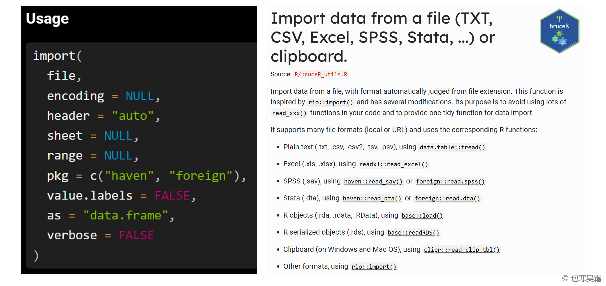
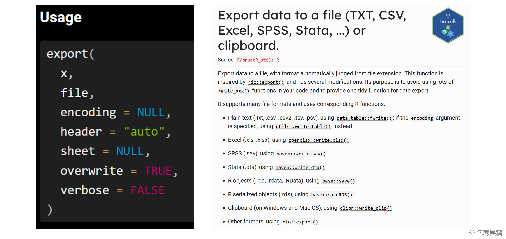
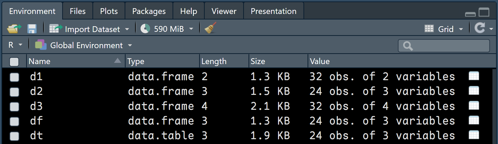
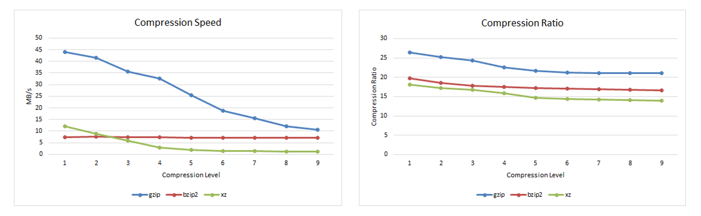
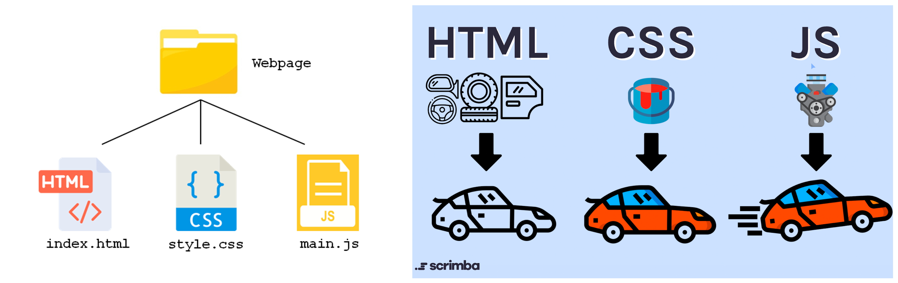
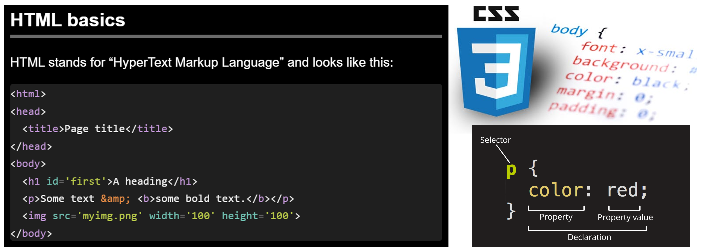

```{=html}
<p style="font-size: 12px">版权声明：本套课程材料开源，使用和分享必须遵守「创作共用许可协议 CC BY-NC-SA」（来源引用-非商业用途使用-以相同方式共享）</p>
```

```{r Config, include=FALSE}
options(
  knitr.kable.NA = "",
  digits = 4
)
knitr::opts_chunk$set(
  comment = "",
  fig.width = 8,
  fig.height = 6,
  dpi = 500
)
```

------------------------------------------------------------------------

#### 课程要点复习

-   [Chap02 \# R对象类型（向量、列表）](https://psychbruce.github.io/RCourse/Chap02#%E7%9F%A5%E8%AF%86%E7%82%B9r%E5%AF%B9%E8%B1%A1%E4%B8%8E%E5%87%BD%E6%95%B0){.uri}

```{r, message=FALSE, warning=FALSE}
## 本章所需R包
library(bruceR)
library(rvest)  # 网络爬虫
```

# R对象类型：二维数据表结构



## 矩阵（matrix）

-   二维、单类型数据

#### 【实践1】矩阵操作

```{r}
x = 1:9
m = matrix(x, nrow=3, ncol=3)
m
m[1, ]
m[, 3]
m[1, 3]

nrow(m)  # 行数
ncol(m)  # 列数
rowMeans(m)  # 行平均
colMeans(m)  # 列平均

t(m)  # 矩阵转置

rownames(m)  # 矩阵行名称（默认没有）
colnames(m)  # 矩阵列名称（默认没有）

rownames(m) = c("a", "b", "c")  # 设置矩阵行名称
colnames(m) = c("A", "B", "C")  # 设置矩阵列名称
m  # 矩阵有名字了！
m[1, 3]
m["a", "C"]
```



## 数据框（data frame）

-   二维、多类型数据⭐️（最常用的数据类型！）

#### 【实践2】数据变量操作（重点）

```{r}
## 数据框生成
d = data.frame(x=1:4, y=c("a", "b", "c", "d"))
d

## 数据框信息
names(d)  # 变量名
length(d)  # 变量个数
ncol(d)  # 列数（变量个数）
nrow(d)  # 行数（观测个数）
str(d)  # 查看数据结构与变量类型
View(d)  # 查看对象

d$x  # 取变量
d$y  # 取变量
d[["y"]]  # 取变量
d[1, "y"]  # 取单个值

## 新变量增加
d$univ = c("ECNU", "BNU", "PKU", "THU")
d$univ = as.factor(d$univ)
str(d)  # 数据结构

## 数据框提取
d[, 2:3]  # 取子集
d[1:2, 2:3]  # 取子集
d[d$x < 3, ]  # 按条件取子集
d[d$x < 3 & d$y %in% c("a", "c"), c("y", "univ")]  # 按条件取子集

## 数据框组合
d$univ = NULL  # 删除变量
d1 = data.frame(x=5:8, y=c("e", "f", "g", "h"))
d.d1 = rbind(d, d1)  # rbind()行合并
d.d1
d2 = data.frame(z=5:8)
d.d2 = cbind(d, d2)  # cbind()列合并
d.d2

## 变量名设置
names(d.d2)
names(d.d2)[2]
names(d.d2)[1:2] = c("xxx", "yyy")  # 修改变量名
d.d2  # 变量名已修改
names(d.d2) = c("var.1", "var.2", "var.3")  # 变量名可以包含.
d.d2  # 变量名已修改
```

#### 【知识点】数据框的变量名要求

-   建议使用英文（区分大小写）、数字、点（`.`）、下划线（`_`）命名变量
    -   一般以英文开头，如`Item1`、`Item.1`、`Item_1`
-   不建议使用中文、横线（`-`）、空格（）命名变量



#### 【探索发现】数据框（data.frame）和数据表（data.table）对比

-   [第6章](https://psychbruce.github.io/RCourse/Chap06)将会系统学习一种**先进、高效、简约**的数据表类型（data.table）



# 外部数据导入导出

#### 【知识点】“一站式”数据导入导出函数

-   `bruceR`包的`import()`和`export()`函数提供了“一站式”数据导入导出功能
    -   根据文件后缀名，全自动选择最优导入导出方式，不再需要记住大量的`read_xxx()`函数，节省时间，提升效率！
        -   细节可查阅帮助文档
-   `import()`帮助文档
    -   <https://psychbruce.github.io/bruceR/reference/import.html>



-   `export()`帮助文档
    -   <https://psychbruce.github.io/bruceR/reference/export.html>



## “一站式”数据导出

#### 【实践3】数据导出练习

```{r}
library(bruceR)
between.2  # 将要导出的示例数据
```

```{r, eval=FALSE}
export(between.2)  # 导出到剪切板，可粘贴（Ctrl + V）到其他地方
```

```{r}
export(between.2, file="data.csv")  # 导出到CSV逗号分隔值纯文本文件
export(between.2, file="data.sav")  # 导出到SPSS数据文件

export(list(between.1, between.2, between.3), file="data.xlsx") 
# 导出到Excel文件（Sheet1、Sheet2、Sheet3）

export(
  list(between.1, between.2, between.3),
  sheet = c("d1", "d2", "d3"),  # 设定每个数据导出的Sheet名称
  file = "data_named.xlsx"
)
# 导出到Excel文件（Sheet名称：d1、d2、d3）
```

## “一站式”数据导入

#### 【实践4】数据导入练习

```{r}
library(bruceR)

d1 = import("data_named.xlsx", sheet="d1")
d2 = import("data_named.xlsx", sheet="d2")
d3 = import("data_named.xlsx", sheet="d3")

df = import("data.csv")
dt = import("data.csv", as="data.table")  # 导入为data.table对象

class(df)  # data.frame
class(dt)  # data.table（基于data.frame的高级数据表对象）
str(dt)  # 数据结构
```



## \* 拓展：数据压缩存储格式

#### 【知识点】RData数据压缩存储格式

-   .RData（也可写为.rdata、.rda）：特殊文件格式，可压缩存储多个R对象、数据集
    -   `"gzip"`：快速压缩（最快，默认）
    -   `"bzip2"`：中度压缩（较快）
    -   `"xz"`：极限压缩（较慢）



```{r}
save(d1, d2, d3, file="datasets1.RData")  # 保存为RData

save(d1, d2, d3,
     file = "datasets2.RData",
     compress = "xz",        # "gzip", "bzip2", "xz"
     compression_level = 9)  # 压缩程度：1~9

rm(d1, d2, d3)  # 移除环境中的数据对象

load("datasets1.RData")  # 载入RData中压缩存储的数据对象
str(d1)  # 已载入到环境
str(d2)  # 已载入到环境
str(d3)  # 已载入到环境
```

```{r Clear up, include=FALSE}
unlink(c("data.csv", "data.sav", "data.xlsx", "data_named.xlsx",
         "datasets1.RData", "datasets2.RData"))
```

## \* 拓展：网络爬虫自动数据采集

#### 【知识点】Web前端数据结构

-   网页组成三大元素
    -   HTML（结构）：超文本标记语言
    -   CSS（样式）：层叠样式表
    -   JavaScript（动作）：网页动作脚本






#### 【实践5】静态网页解析

-   静态网页示例：华东师范大学心理与认知科学学院“师资队伍”页面
    -   点击查看网页内容：<https://psy.ecnu.edu.cn/17437/list.htm>
-   网页元素提取：CSS选择代码
    -   CSS选择代码定义了用于精准定位HTML元素的基本模式，可简洁描述想要提取的元素
    -   自行安装浏览器插件“SelectorGadget”：<https://selectorgadget.com/>


```{r}
library(rvest)

url = "https://psy.ecnu.edu.cn/17437/list.htm"  # 网页链接
xml = url %>% read_html()  # 读取网页所有信息

xml %>% html_elements(".column-item-link .column-name") %>% html_text2()
xml %>% html_elements(".subcolumn-name") %>% html_text2()
xml %>% html_elements(".column-news-title") %>% html_text2()
```

# 【作业4】任选公开数据导入

作业要求：

-   开始准备个人期末大作业，自主选择任意一个感兴趣的公开数据，写出数据导入代码
    -   数据选择：按照自己的兴趣，从国内外期刊中选择一篇公开了研究数据的论文，下载其中一个公开数据（有可能存放于[OSF](https://osf.io/)、[SciDB](https://www.scidb.cn/psych)等平台），数据文件一般为CSV、Excel等格式
    -   数据导入：参考【实践4】代码，使用`bruceR`包的`import()`函数，将该数据导入为`data.table`对象

平台提交：

-   自选论文的DOI链接和公开数据链接
-   原数据打开后的前几行、前几列截图
-   数据导入代码（使用`import()`函数）及导入后的数据结构（使用`str()`函数）截图
