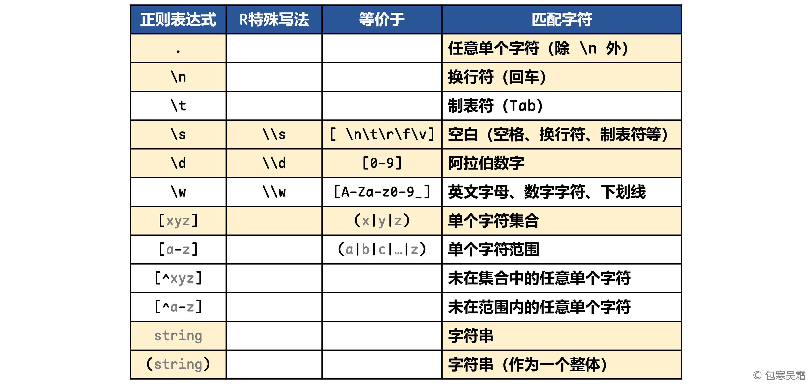
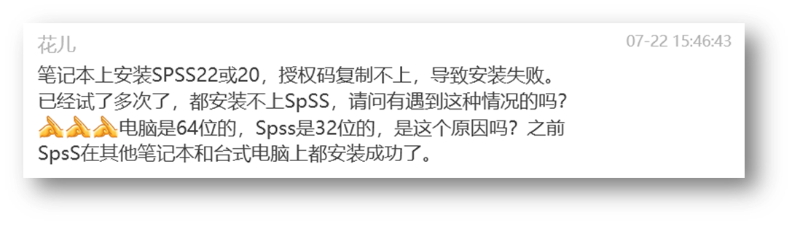
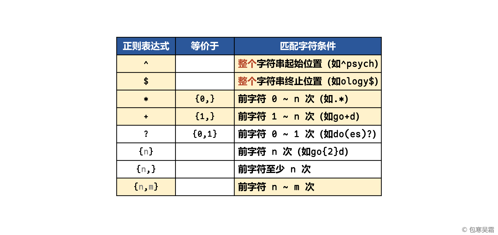
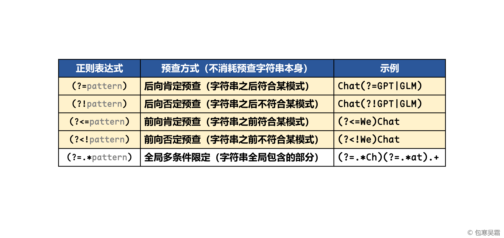
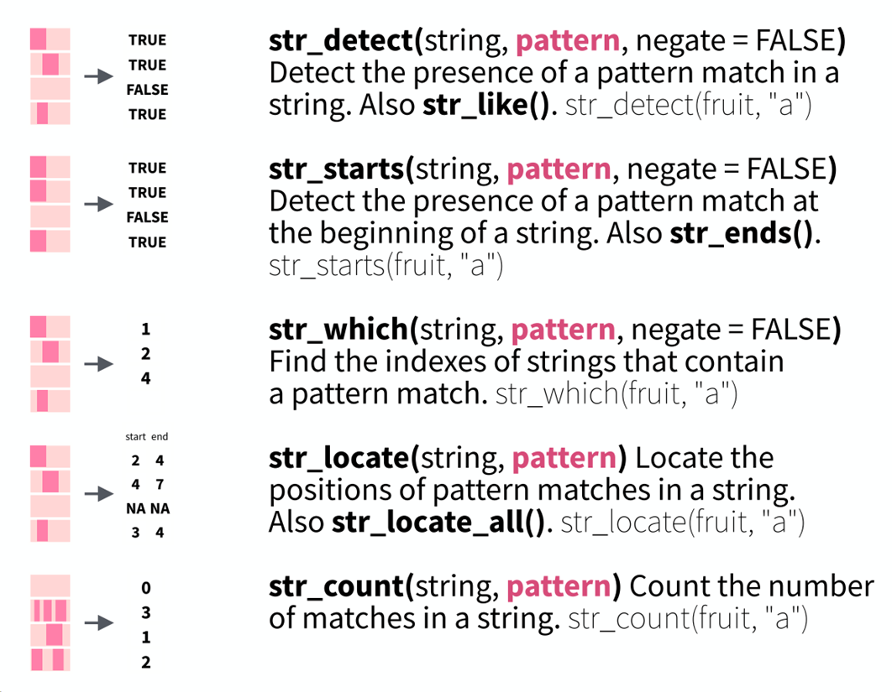
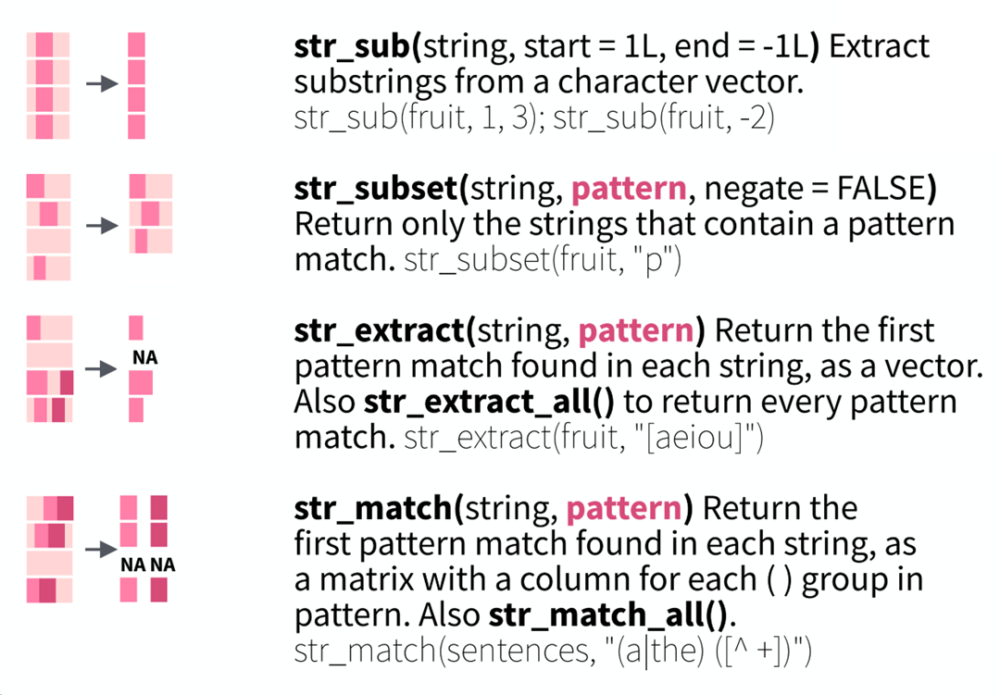
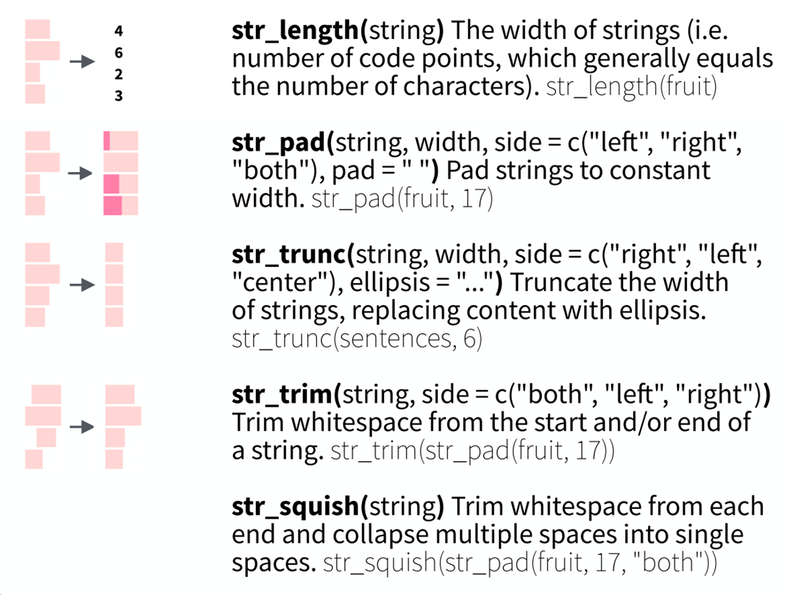
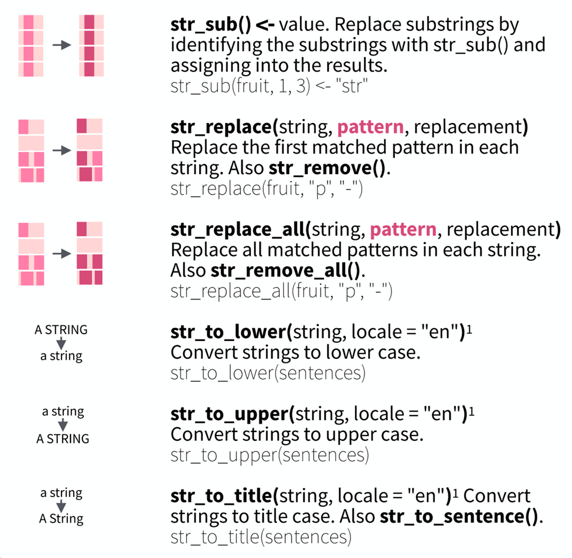
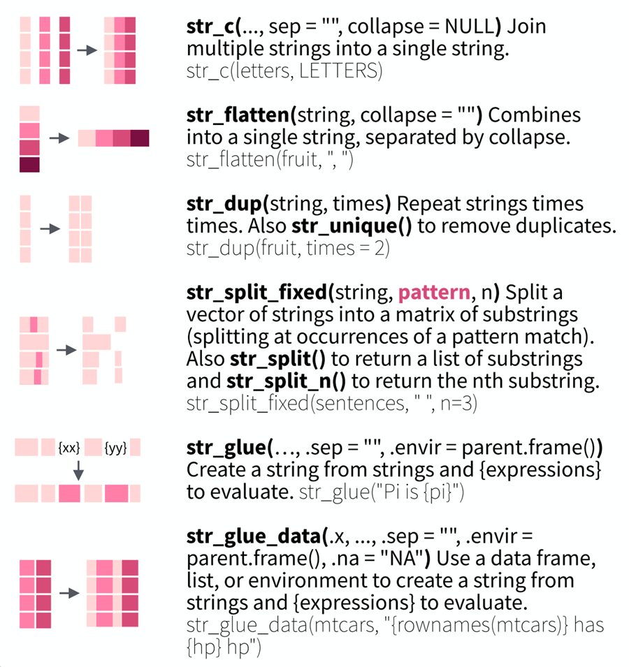

```{=html}
<p style="font-size: 12px">版权声明：本套课程材料开源，使用和分享必须遵守「创作共用许可协议 CC BY-NC-SA」（来源引用-非商业用途使用-以相同方式共享）。</p>
```

```{r Config, include=FALSE}
options(
  knitr.kable.NA = "",
  digits = 4
)
knitr::opts_chunk$set(
  comment = "",
  fig.width = 6,
  fig.height = 4,
  dpi = 300
)
```

------------------------------------------------------------------------

# Chap04：字符处理

#### 往期要点回顾

-   [Chap03 \# 数据框（data frame）](https://psychbruce.github.io/RCourse/Chap03#%E6%95%B0%E6%8D%AE%E6%A1%86data-frame){.uri}
-   [Chap03 \# “一站式”数据导入导出](https://psychbruce.github.io/RCourse/Chap03#%E5%A4%96%E9%83%A8%E6%95%B0%E6%8D%AE%E5%AF%BC%E5%85%A5%E5%AF%BC%E5%87%BA){.uri}

#### 本章要点目录

-   [【知识点】正则表达式](#知识点正则表达式)（重点）
-   [【实践1】字符匹配](#实践1字符匹配)
-   [【实践2】条件匹配](#实践2条件匹配)
-   [【实践3】预查匹配](#实践3预查匹配)
-   [【实践4】字符串综合处理](#实践4字符串综合处理)（重点）
-   [【探索发现】stringr包的函数功能](#探索发现stringr包的函数功能)

```{r, message=FALSE, warning=FALSE}
## 本章所需R包
library(bruceR)
library(stringr)  # 字符串处理（加载bruceR时已默认加载stringr）
library(rvest)  # 网络爬虫
```

# 正则表达式基础

> 想象一下，你是一位侦探，接手了一个大案子。案件资料是厚厚一摞、杂乱无章的日记本，足足有几千页。你的任务是从中找出所有与一辆“蓝色的车子”相关的记录。如果一页一页地翻，眼睛一行一行地扫，可能几天几夜也看不完，还很容易漏掉关键线索。
>
> 现在，假设你有一个非常聪明的“小助手”。你不需要告诉它一页页翻，只需要对它说一句话：“去把所有包含‘蓝色’、并且紧接着是‘汽车’或‘轿车’这几个词的句子都给我摘出来。”
>
> 这个“小助手”瞬间就能扫描完所有日记，并把你想要的句子准确无误地整理好。这个“小助手”的能力，其实就非常接近我们所说的正则表达式。

#### 【知识点】正则表达式 {#知识点正则表达式}

**正则表达式 / 规律表达式（regular/pattern expression，RegEx）**

简单来说，正则表达式就是一套用来**描述文本规则的“密码”**。它用一些特殊符号（比如`*`、`+`、`?`、`[]`）组合成“指令”，让电脑按照这些规则去文本的海洋里精准地找到你想要的内容（比如一定要是“蓝色”之后紧跟的“汽车”，而不是“红色汽车”）。

-   含义：描述字符串规律（模式）的表达式
-   用途：根据模式，匹配字符（自动处理文本）
    -   **“大海捞针”（词频统计）**：从海量的文本数据里，快速找到符合特定模式的字词、句子或段落
    -   **“点石成金”（数据清洗）**：找到之后，可以对这些内容进行批量的修改、删除、替换或提取，整理成数据分析所需要的格式
    -   **“去伪存真”（条件判断）**：还可以用来检查信息格式是否正确，比如手机号码是不是11位、邮箱地址里有没有“\@”符号等
-   正则表达式的“密码”其实很有逻辑，也很好理解，比如：
    -   `\d`：代表“任何一个数字”（0-9），就像在说“给我找一个数字”
    -   `[a-z]`：代表“任何一个英文小写字母”，就像在说“给我找一个小写字母”
    -   `*`：代表“前面的东西可以出现零次或多次”，就像在说“这个模式可以重复无数次”
    -   `+`：代表“前面的东西至少出现一次”，就像在说“这个模式至少要出现一次”
    -   `.`：代表“任何一个字符”（除了换行符），就像一张万能牌，可以代替任何一个字符

> 一旦学会，你就拥有了一种神奇的能力：别人还在一条条复制粘贴、肉眼搜索的时候，你已经可以喝着咖啡，看着电脑帮你把几万条甚至几百万条文本数据在几秒之内就自动整理好了。这就是正则表达式的魅力——把繁琐的手工劳动，变成自动化的“魔法”。

## （1）字符匹配



#### 【实践1】字符匹配 {#实践1字符匹配}



```{r}
text = "笔记本上安装SPSS22或20，授权码复制不上，导致安装失败。已经试了多次了，都安装不上SpSS，请问有遇到这种情况的吗？电脑是64位的，Spss是32位的，是这个原因吗？之前SpsS在其他笔记本和台式电脑上都安装成功了。"
cat(text)

str_extract_all(text, "SPSS")  # 完整字符串
str_extract_all(text, "SPSS|Spss")  # "|"表示或者
str_extract_all(text, "[SPSS|spss]")  # 思考：为什么？
str_extract_all(text, "[SsPp]")
str_extract_all(text, "[Ss][Pp][Ss][Ss]")

str_extract_all(text, "\\d")
str_extract_all(text, "\\d\\d")
str_extract_all(text, "\\d\\d位")
```

## （2）条件匹配



#### 【实践2】条件匹配 {#实践2条件匹配}

```{r}
text = "笔记本上安装SPSS22或20，授权码复制不上，导致安装失败。已经试了多次了，都安装不上SpSS，请问有遇到这种情况的吗？电脑是64位的，Spss是32位的，是这个原因吗？之前SpsS在其他笔记本和台式电脑上都安装成功了。"
cat(text)

str_extract_all(text, "\\d{2}位")
str_extract_all(text, "[SsPp]{4}")
str_extract_all(text, "[SP]{4}")
str_extract_all(text, "[Sps]+")
str_extract_all(text, "(Sps)+")
str_extract_all(text, "Sps+")
```

## （3）预查匹配



#### 【实践3】预查匹配 {#实践3预查匹配}

```{r}
text = "笔记本上安装SPSS22或20，授权码复制不上，导致安装失败。已经试了多次了，都安装不上SpSS，请问有遇到这种情况的吗？电脑是64位的，Spss是32位的，是这个原因吗？之前SpsS在其他笔记本和台式电脑上都安装成功了。"
cat(text)

str_extract_all(text, "\\d{2}位")
str_extract_all(text, "\\d{2}(?=位)")  # 后向肯定预查
str_extract_all(text, "\\d{2}(?!位)")  # 后向否定预查
str_extract_all(text, "(?<=SPSS)\\d{2}")  # 前向肯定预查
str_extract_all(text, "(?<!SPSS)\\d{2}")  # 前向否定预查
```

# 字符串处理实战

`stringr`包

-   共同参数
    -   `string`：字符串输入
    -   `pattern`：正则表达式
-   常用函数
    -   判断：`str_detect()`
    -   计数：`str_count()`
    -   提取：`str_extract()`、`str_extract_all()`
    -   替换：`str_replace()`、`str_replace_all()`
    -   删除：`str_remove()`、`str_remove_all()`
    -   分割：`str_split()`
    -   向量取匹配子集：`str_subset()`

#### 【实践4】字符串综合处理 {#实践4字符串综合处理}

-   课程回顾：[Chap03 \# 静态网页解析](https://psychbruce.github.io/RCourse/Chap03#%E5%AE%9E%E8%B7%B55%E9%9D%99%E6%80%81%E7%BD%91%E9%A1%B5%E8%A7%A3%E6%9E%90){.uri}
-   网页素材：[华东师范大学心理与认知科学学院“师资队伍”](https://psy.ecnu.edu.cn/17437/list.htm){.uri}

```{r}
## 数据采集
## 已加载rvest包：library(rvest)
url = "https://psy.ecnu.edu.cn/17437/list.htm"  # 学院师资队伍页面
xml = url %>% read_html()  # 读取网页所有信息
xml

## 字符串处理（1）：院系名称
menu = xml %>% html_elements(".column-item-link .column-name") %>% html_text2()
menu

str_subset(menu, "系")
str_subset(menu, "系$")
str_subset(menu, ".*系$")
str_subset(menu, ".*(?=系$)")  # 只是取子集，并不能预查提取
str_extract(menu, ".*(?=系$)")  # 真正的预查提取
str_extract(menu, ".*(?=系$)") %>% na.omit()  # 移除缺失值NA

## 字符串处理（2）：人才计划
title = xml %>% html_elements(".subcolumn-name") %>% html_text2()
title
str_subset(title, "人才")
str_subset(title, "人才$")
str_subset(title, "上海市.*")
str_subset(title, "^上海市")
str_extract(title, "(?<=^上海市).*(?=学者$|计划$)") %>% na.omit()

## 字符串处理（3）：教师姓名
name = xml %>% html_elements(".column-news-title") %>% html_text2()
name

table(name)
unique(name)

name %>% unique() %>% sort()
name %>% unique() %>% sort() %>% str_remove_all("博士|\\s")

name %>%
  unique() %>%
  sort() %>%
  str_remove_all("博士|\\s") %>%
  str_subset("宁")

name %>%
  unique() %>%
  sort() %>%
  str_remove_all("博士|\\s") %>%
  str_subset("^赵|^钱|^孙|^李")  # 赵钱孙李，周吴郑王

name %>%
  unique() %>%
  sort() %>%
  str_remove_all("博士|\\s") %>%
  str_subset("^[周吴郑王]")  # 赵钱孙李，周吴郑王

## 补充：字符向量 vs. 固定位置字符提取
"Psychology"[1]  # 长度为1的字符向量，[1]仍然是字符串，而不是第1个字母
str_sub("Psychology", 1, 1)  # 提取第1个字母
str_sub("Psychology", 1, 5)  # 提取第1~5个字母
```

#### 【探索发现】stringr包的函数功能 {#探索发现stringr包的函数功能}

-   检测匹配



-   子集提取



-   长度控制



-   替换修改



-   拼接分割



#### 【拓展了解】正则表达式在社会科学研究中有什么用？（整合自DeepSeek回答）

现在的社会科学研究越来越依赖大数据和文本分析，经常要和海量文本打交道：10万条微博、5万份问卷、几百年的历史档案……正则表达式就是处理文本数据的“神兵利器”。

1.  清洗和整理数据（数据“洗澡”）

从网上爬下来的数据经常很“脏”：夹杂着广告代码、乱码、多余的空格。正则表达式可以一键把这些垃圾清理掉，留下干净的文字。原本需要手动清理几万条数据，可能需要一个团队干一周；现在用几行正则表达式代码，几秒钟就能完成，而且准确率极高。

2.  提取文本中信息（信息“采矿”）

比如你想研究“幸福感”这个词在社交媒体上的用法。正则表达式可以帮你找出所有包含“幸福”的句子，并且自动把“幸福”前面是谁在说（比如“我觉得幸福”“他感到幸福”）提取出来，又快又准。

3.  内容分析与编码（将文字变数据）

社会科学研究经常需要对文本进行分类和编码。比如，你想分析新闻报道对某个社会事件的态度是“正面”、“负面”还是“中立”。可以先设定好规则，比如包含“赞赏”、“支持”、“成功”等词的归为“正面”，包含“反对”、“批评”、“问题”等词的归为“负面”。然后，正则表达式就能自动扫描所有文章，并根据这些关键词的出现情况，给每一篇文章贴上“态度”标签。几秒钟就能把几万条帖子分类完毕，这不仅比人工阅读编码快无数倍，而且标准完全统一，避免了因为研究者疲劳或个人主观判断带来的误差。它让定性研究可以拥有定量分析的规模。

# 【作业5】字符向量处理

作业要求：

-   围绕`stringr`包提供的字符串示例数据`fruit`（80个水果名称），运用`str_detect()`、`str_subset()`、`str_extract_all()`、`str_replace_all()`等`stringr`包函数中的至少2个，任意完成至少2种字符串处理任务，并对代码和结果进行简单的注释和解读
-   使用R Markdown完成

平台提交：

-   运行得到的HTML网页文件（本地的“.html”后缀格式文件），及其关键部分截图

```{r}
## 附：作业需要用到的数据集（字符向量）
stringr::fruit
```
