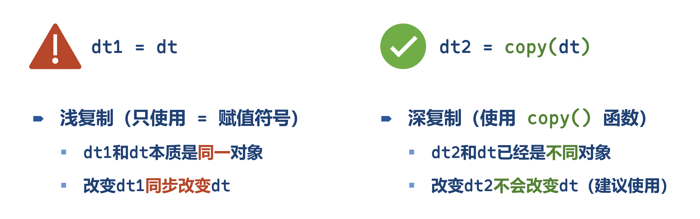
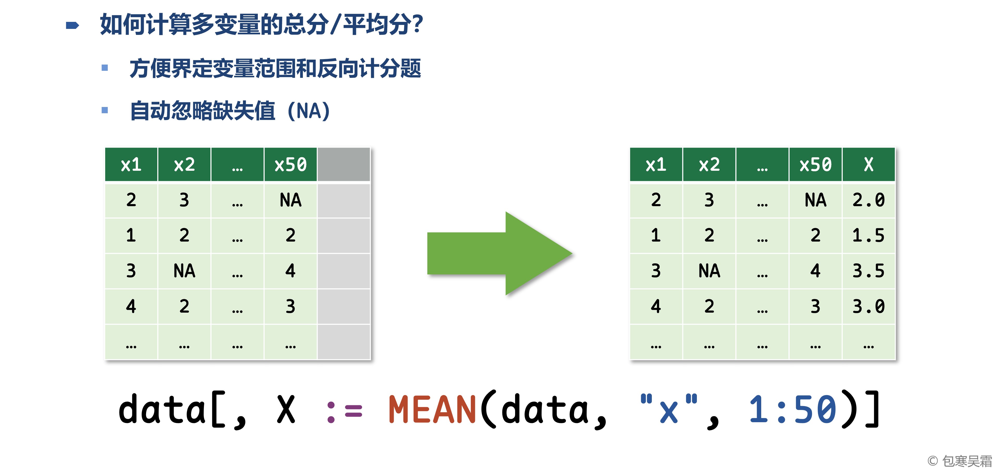

```{=html}
<p style="font-size: 12px">版权声明：本套课程材料开源，使用和分享必须遵守「创作共用许可协议 CC BY-NC-SA」（来源引用-非商业用途使用-以相同方式共享）。</p>
```

```{r Config, include=FALSE}
options(
  knitr.kable.NA = "",
  digits = 4
)
knitr::opts_chunk$set(
  comment = "",
  fig.width = 6,
  fig.height = 4,
  dpi = 300
)
```

------------------------------------------------------------------------

# Chap05：变量计算

#### 往期要点回顾

-   [Chap03 \# 数据框（data frame）](https://psychbruce.github.io/RCourse/Chap03#%E6%95%B0%E6%8D%AE%E6%A1%86data-frame){.uri}
-   [Chap04 \# 字符串处理实战](https://psychbruce.github.io/RCourse/Chap04#%E5%AD%97%E7%AC%A6%E4%B8%B2%E5%A4%84%E7%90%86%E5%AE%9E%E6%88%98){.uri}

#### 本章要点目录

-   [【实践1】数据框变量的多种计算方式](#实践1数据框变量的多种计算方式)
-   [【实践2】基于data.table的字符串处理和变量计算](#实践2基于data.table的字符串处理和变量计算)（重点）
-   [【知识点】data.table的“浅复制”与“深复制”问题](#知识点data.table的浅复制与深复制问题)
-   [【知识点】变量中心化与标准化](#知识点变量中心化与标准化)
-   [【实践3】基于data.table的变量中心化与标准化](#实践3基于data.table的变量中心化与标准化)
-   [【实践4】计算多变量的总分与平均分](#实践4计算多变量的总分与平均分)（重点）
-   [【实践5】题目序号在变量名中间的特殊情况](#实践5题目序号在变量名中间的特殊情况)
-   [【实践6】大五人格问卷BFI各维度平均分计算](#实践6大五人格问卷bfi各维度平均分计算)（重点）

```{r, message=FALSE, warning=FALSE}
## 本章所需R包
library(bruceR)
# library(dplyr)       # 加载bruceR时已默认加载dplyr
# library(data.table)  # 加载bruceR时已默认加载data.table
```

# 变量计算的总体介绍

#### 【实践1】数据框变量的多种计算方式 {#实践1数据框变量的多种计算方式}

-   `$`操作符：直接赋值⭐️
-   `dplyr`包：`mutate()`函数
-   `data.table`包：`:=`象牙运算符 / `let()`函数⭐️
-   `bruceR`包：`add()`与`added()`函数⭐️

```{r}
d = data.frame(Var = c("可乐", "雪碧", "咖啡", "茶"))
d

## 方式 1：$ 操作符
d$NewVar1 = as.factor(d$Var)
d
str(d)

## 方式 2：mutate() 函数【dplyr包】
d = d %>% mutate(
  NewVar2 = as.factor(Var),
  NewVar3 = as.numeric(NewVar2),
  NewVar4 = as.character(NewVar3)
)
d
str(d)

## 方式 3：`:=` 象牙运算符 / let() 函数【data.table包】
d = data.table(Var = c("可乐", "雪碧", "咖啡", "茶"))
d
d[, NewVar1 := as.factor(Var)]       # 一次只能计算一个变量
d
d[,`:=`(NewVar2 = as.factor(Var))]   # 一次可以计算多个变量
d
d[, let(NewVar2 = as.factor(Var))]   # let() 完全等于 `:=`()
d[, let(
  NewVar2 = as.factor(Var),
  NewVar3 = NewVar1 %>% as.numeric(),
  NewVar4 = NewVar1 %>% as.numeric() %>% as.character()
)]
d
str(d)

## 方式(4)：add() 与 added() 函数【bruceR包】
d = data.table(Var = c("可乐", "雪碧", "咖啡", "茶"))
dd = d %>% add({                  # add()：不改变原数据
  NewVar1 = as.factor(Var)        # 行尾无需逗号
  NewVar2 = as.numeric(NewVar1)   # 新变量可复用
})
dd
d %>% added({                     # added()：原地更新数据
  NewVar1 = as.factor(Var)        # 行尾无需逗号
  NewVar2 = as.numeric(NewVar1)   # 新变量可复用
})
d
```

#### 【实践2】基于data.table的字符串处理和变量计算 {#实践2基于data.table的字符串处理和变量计算}

```{r}
d1 = data.table(word=stringr::words[1:10])
d1

d1[, let(
  len = nchar(word),
  a_t = str_detect(word, "^a.*t$"),
  new = str_replace_all(word, "c", "_")
)]
d1

d2 = data.table(word=stringr::words[1:10])
d3 = d2 %>% add({
  len = nchar(word)
  a_t = str_detect(word, "^a.*t$")
  new = str_replace_all(word, "c", "_")
})
d3
d2  # add()不改变原数据
```

#### 【知识点】data.table的“浅复制”与“深复制”问题 {#知识点data.table的浅复制与深复制问题}



```{r}
## 浅复制（=）
d1 = d2 = data.table(word=stringr::words[1:5])
d1[, let(len = nchar(word))]
d1
d2  # d2跟着d1一起变了！

## 深复制（copy函数）
d1 = data.table(word=stringr::words[1:5])
d2 = copy(d1)  # 完全复制，两者已是不同对象
d1[, let(len = nchar(word))]
d1
d2  # d2不会跟着d1一起变
```

# 变量中心化与标准化

#### 【知识点】变量中心化与标准化 {#知识点变量中心化与标准化}

-   中心化：变量减去均值（mean）
-   标准化：变量减去均值（mean），再除以标准差（sd）

#### 【实践3】基于data.table的变量中心化与标准化 {#实践3基于data.table的变量中心化与标准化}

```{r}
## 例1
d = data.table(x = seq(0, 100, 10))
d

mean(d$x)
sd(d$x)
(d$x - mean(d$x)) / sd(d$x)
scale(d$x)

added(d, {
  x.c1 = x - mean(x)              # 中心化：手动计算
  x.c2 = scale(x, scale=FALSE)    # 中心化：scale()函数
  x.std1 = (x - mean(x)) / sd(x)  # 标准化：手动计算
  x.std2 = scale(x)               # 标准化：scale()函数
})
d

str(d)  # 数据结构
attributes(d$x.c2)
attributes(d$x.std2)
```

```{r}
## 例2（使用bruceR包的中心化函数）
d = data.table(x = seq(0, 100, 10),
               y = seq(100, 200, 10))

d1 = grand_mean_center(d)
d1

d2 = grand_mean_center(
  d,
  vars = c("x", "y"),
  add.suffix = ".c")
d2

d3 = grand_mean_center(
  d,
  vars = c("x", "y"),
  std = TRUE,  # 标准化
  add.suffix = ".std")
d3
```

# 总分与平均分的计算



#### 【实践4】计算多变量的总分与平均分 {#实践4计算多变量的总分与平均分}

```{r}
d = data.table(
  x1 = 1:5,
  x4 = c(2,2,5,4,5),
  x3 = c(3,2,NA,NA,5),
  x2 = c(4,4,NA,2,5),
  x5 = c(5,4,1,4,5)
)
d  # d是数据框对象，也是数据框名称，之后需要频繁使用

## 大写函数（需要提供数据框名称）：SUM()、MEAN()
d1 = add(d, {
  sum = SUM(d, "x", 1:5)    # SUM(data=d, var="x", items=1:5)
  mean = MEAN(d, "x", 1:5)  # MEAN(data=d, var="x", items=1:5)
  mean1 = MEAN(d, vars=c("x1", "x4"))
  mean2 = MEAN(d, varrange="x1:x4")  # 找变量名，而不是从1数到4
  mean3 = MEAN(d, varrange="x1:x3")  # 找变量名，而不是从1数到3
})
d1

## 小写函数（必须搭配add或added使用）：.sum()、.mean()
d2 = add(d, {
  sum = .sum("x", 1:5)
  mean = .mean("x", 1:5)
})
d2
```

#### 【实践5】题目序号在变量名中间的特殊情况 {#实践5题目序号在变量名中间的特殊情况}

-   在`var`变量名共同部分中，以大括号`{i}`占位题目序号

```{r}
d = data.table(
  XX.1.pre = 1:5,
  XX.2.pre = 6:10,
  XX.3.pre = 11:15
)
d

add(d, {
  XX.mean = .mean("XX.{i}.pre", 1:3)
})

# 相同效果
add(d, {
  XX.mean = .mean("XX.{items}.pre", 1:3)
})
```

# 反向计分与重新编码

#### 【实践6】大五人格问卷BFI各维度平均分计算 {#实践6大五人格问卷bfi各维度平均分计算}

-   大五人格维度
    -   Extraversion（外倾性）
    -   Agreeableness（宜人性）
    -   Conscientiousness（尽责性）
    -   Neuroticism（神经质/情绪性）
    -   Openness（开放性）

```{r}
d.bfi = as.data.table(psych::bfi)
str(d.bfi)

added(d.bfi, {
  age = age
  gender = factor(gender, levels=1:2, labels=c("Male", "Female"))
  education = as.factor(education)
  E = .mean("E", 1:5, rev=c(1,2), range=1:6)
  A = .mean("A", 1:5, rev=1, range=1:6)
  C = .mean("C", 1:5, rev=c(4,5), range=1:6)
  N = .mean("N", 1:5, rev=NULL, range=1:6)
  O = .mean("O", 1:5, rev=c(2,5), range=1:6)
}, drop=TRUE)  # 删去原有变量，只保留新变量
d.bfi
str(d.bfi)
```

# 【作业6】期末作业数据变量计算

作业要求：

-   基于[【作业4】](https://psychbruce.github.io/RCourse/Chap03#%E4%BD%9C%E4%B8%9A4%E6%9C%9F%E6%9C%AB%E8%87%AA%E9%80%89%E5%85%AC%E5%BC%80%E6%95%B0%E6%8D%AE%E5%AF%BC%E5%85%A5)的期末自选公开数据，运用本章所学的变量计算方法，对数据变量进行计算和预处理
    -   请使用`data.table`数据对象类型（而不是`data.frame`）
    -   可选用`data.table`包的`let()`函数或`bruceR`包的`add()`、`added()`函数计算变量
-   使用R Markdown完成

平台提交：

-   运行得到的HTML网页，及其关键部分截图
