```{=html}
<p style="font-size: 12px">版权声明：本套课程材料开源，使用和分享必须遵守「创作共用许可协议 CC BY-NC-SA」（来源引用-非商业用途使用-以相同方式共享）</p>
```

```{r Config, include=FALSE}
options(
  knitr.kable.NA = "",
  digits = 4
)
knitr::opts_chunk$set(
  comment = "",
  fig.width = 8,
  fig.height = 6,
  dpi = 500
)
```

------------------------------------------------------------------------

# Chap06：数据操作

#### 课程要点复习

-   [Chap05 \# 变量计算的多种方式](https://psychbruce.github.io/RCourse/Chap05#%E5%8F%98%E9%87%8F%E8%AE%A1%E7%AE%97%E7%9A%84%E6%80%BB%E4%BD%93%E4%BB%8B%E7%BB%8D){.uri}

```{r, message=FALSE, warning=FALSE}
## 本章所需R包
library(bruceR)
# library(dplyr)       # 加载bruceR时已默认加载dplyr
# library(tidyr)       # 加载bruceR时已默认加载tidyr
# library(data.table)  # 加载bruceR时已默认加载data.table
```

# 数据操作类R包概述与比较

#### 【知识点】data.table的设计理念

-   [一图学会data.table包（官方速查表）](https://psychbruce.github.io/RCourse/cheatsheet/data.table.pdf)
-   极简代码风格：`data[i, j, by]` —— 只需要一对中括号，就能完成所有操作！
    -   `i`：行操作
    -   `j`：列操作
    -   `by`：分组变量

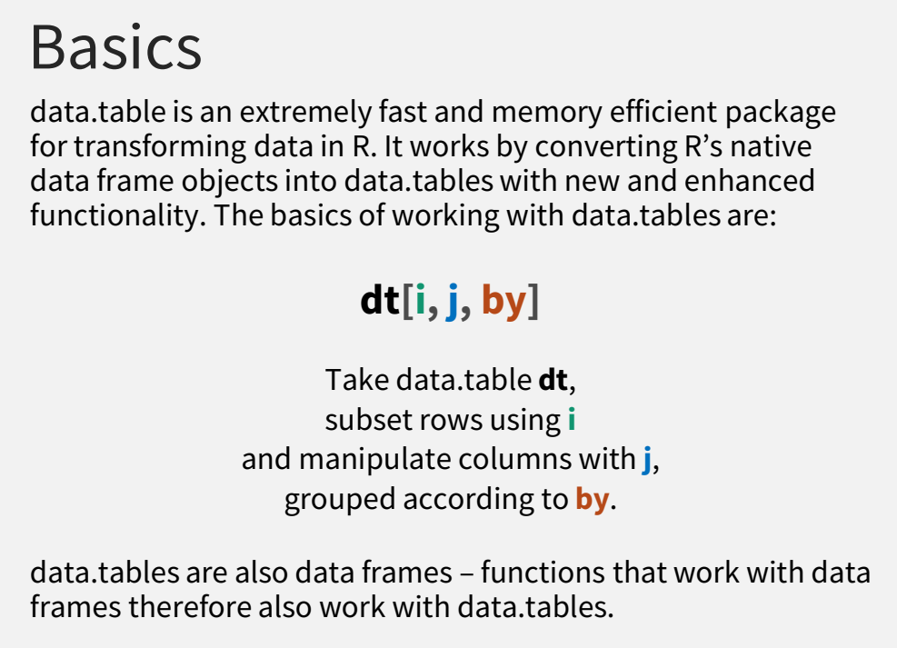

#### 【探索发现】data.table vs. dplyr (tidyverse) 数据操作代码风格比较

-   [A data.table and dplyr tour (Atrebas, 2019)](https://atrebas.github.io/post/2019-03-03-datatable-dplyr/){.uri}


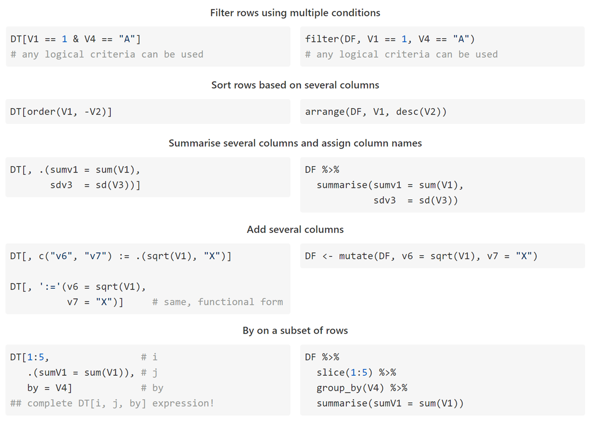

#### 【探索发现】性能大PK：data.table (R) vs. dplyr (R) vs. pandas (Python) {.tabset .tabset-fade .table-pill}

-   <https://h2oai.github.io/db-benchmark/>

##### **分组汇总速度 (0.5 GB)**

（数据规模：1000万行 × 9个变量）

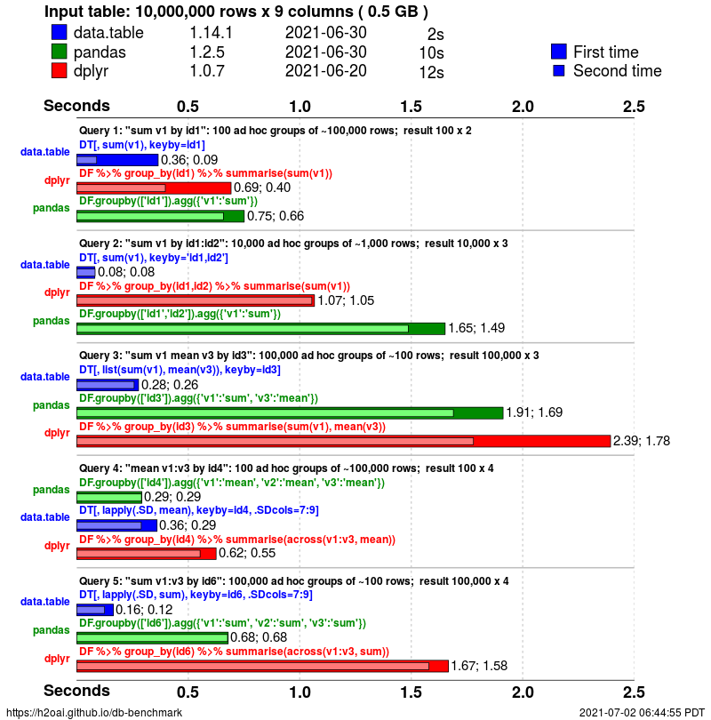

##### **分组汇总速度 (5 GB)**

（数据规模：1亿行 × 9个变量）

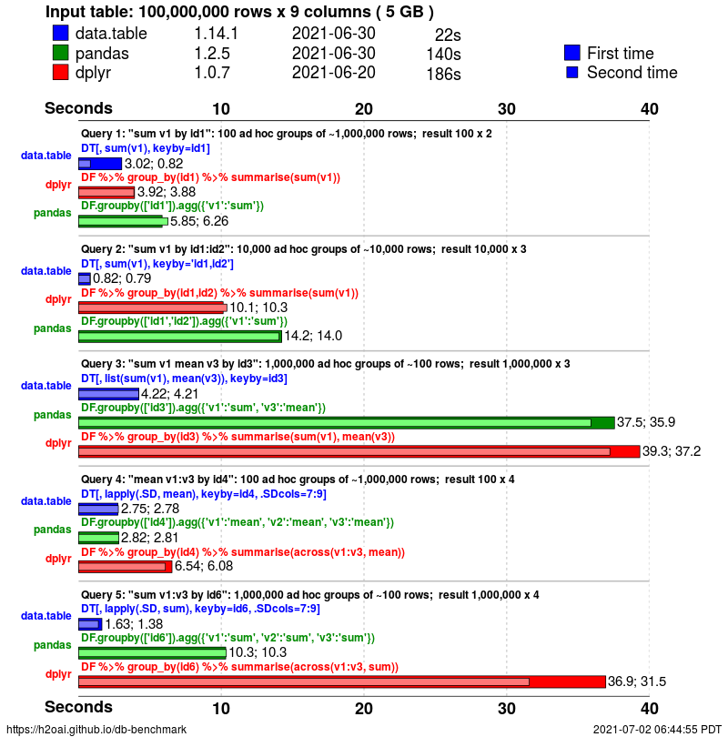

##### **分组汇总速度 (50 GB)**

（数据规模：10亿行 × 9个变量）

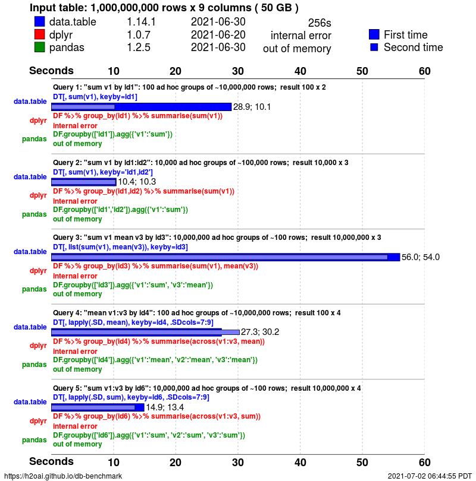

# 增删查改（data.table）

#### 【实践1】增删查改 {.tabset .tabset-fade .table-pill}

```{r}
## 数据准备：大五人格问卷BFI（部分数据）
data = as.data.table(psych::bfi)
d = data[31:50, c("gender", "education", "age")]
d
str(d)
```

##### **1. 增加**

```{r}
## 方式 1: 单变量 $ 操作符
d$Gender = factor(d$gender, levels=1:2, labels=c("Male", "Female"))
d

## 方式 2: 单变量 := 运算符 (原地更新)
d[, Gender := factor(gender, levels=1:2, labels=c("Male", "Female"))]
d

## 方式 3: 多变量 let() 函数 (原地更新)
d[, let(
  Gender = factor(gender, levels=1:2, labels=c("Male", "Female")),
  Age = as.numeric(age),
  Edu = as.factor(education)
)]
d
str(d)
```

（本小节进度：1/4）

##### **2. 删除**

```{r}
## 单变量
d$Age = d$Edu = NULL
d

## 多变量
d[, let(
  gender = NULL,
  education = NULL,
  age = NULL
)]
d
```

（本小节进度：2/4）

##### **3. 查找**

```{r}
d = data[31:50, c("gender", "education", "age", paste0("A", 1:5))]
d
str(d)

d[1:5, "gender"]  # DT[i, j]
d[1:5, gender]  # DT[i, j]
d[1:5, c("gender", "age")]  # DT[i, j]
d[1:5, .(gender, age)]  # DT[i, j]

d[1:3]  # DT[i]
d[1:3, ]  # DT[i, ]
d[, 2:3]  # DT[i, ]
d[, age:A3]  # DT[, j]（变量名范围，不会数数字）
```

（本小节进度：3/4）

##### **4. 修改**

```{r}
d = data[2536:2540, c("gender", "education", "age")]
d

d[2, "age"] = NA  # 无效年龄（3岁），替换为NA缺失值
d
```

-   Q：如何自动筛选、替换无效年龄？
    -   A：请看下一部分

（本小节进度：4/4）

# 行列筛选（data.table）

#### 【实践2】行列筛选 {.tabset .tabset-fade .table-pill}

```{r}
## 数据准备：大五人格问卷BFI（部分数据）
data = as.data.table(psych::bfi)
data[, let(
  Gender = factor(gender, levels=1:2, labels=c("Male", "Female")),
  Age = as.numeric(age),
  Edu = as.factor(education)
)]
d = data[2535:2546, c("Gender", "Age", "Edu", paste0("A", 1:5))]
d
str(d)
```

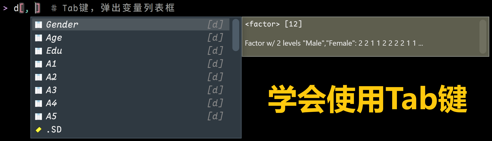

##### **1. 行筛选**

```{r}
d[Gender == "Female"]

d[Gender == "Male"]

d[Gender == "Male" & Age >= 16]

d[Gender == "Male" & Age >= 16 & !is.na(Edu)]

d[Gender == "Male" & Age %in% 20:45]

d[Gender == "Male" & Age %notin% 20:45]

d[Gender == "Male" & (Age < 20 | Age > 45)]

d[Age < 15]
d[Age < 15, "Age"] = NA  # 自动筛选、替换无效年龄
d
```

（本小节进度：1/3）

##### **2. 列筛选**

```{r}
d = data[2535:2546, c("Gender", "Age", "Edu", paste0("A", 1:5))]

## 直接筛选列
d[, Age:A3]  # DT[, j]（变量名范围，不会数数字）
d[, .(A1, A2, A3, Edu, Age)]

## 间接筛选列
vars = c("Age", "Edu")
try({
  d[, vars]  # 报错，vars不是data.table内部环境中的变量名
})
d[, ..vars]  # ..表示从data.table内部环境返回到全局环境，使用变量选择列

## 还可以使用 dplyr::select() 函数，搭配 tidyselect 系列函数
select(d, starts_with("A"))
select(d, matches("A\\d"))  # 正则表达式
select(d, num_range("A", 1:5))  # 题序号范围
d %>% select(num_range("A", 1:5))  # 管道操作符
```

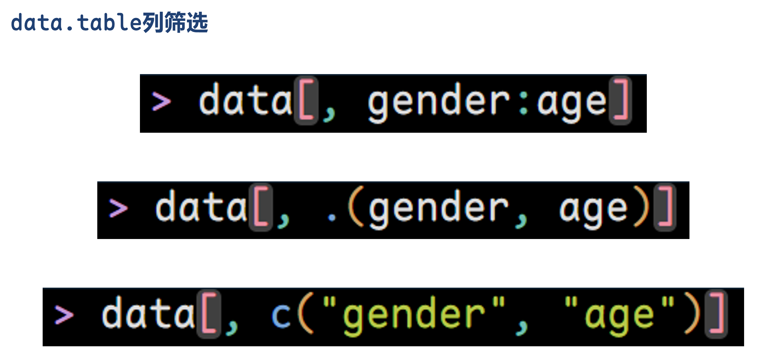

拓展了解：[tidyselect变量选择语法](https://tidyselect.r-lib.org/reference/language.html){.uri}

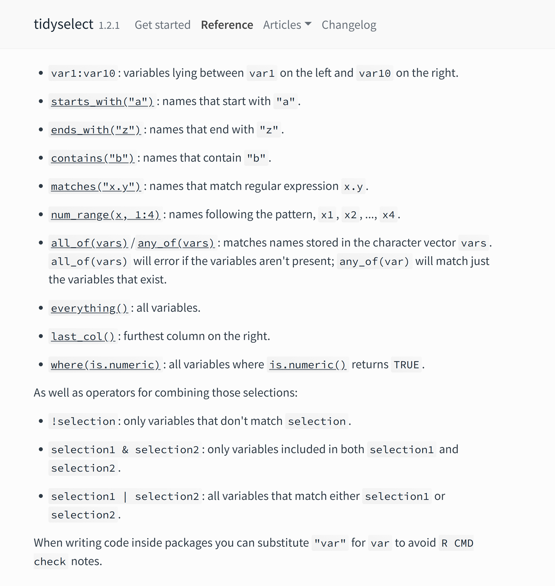

（本小节进度：2/3）

##### **3. 综合练习**

```{r}
data[Age >= 18 & Edu == 5]
data[, A1:C5]
data[, Gender:Edu]
data[, .(Gender, Edu)]
data[Age >= 18 & Edu == 5, .(Gender, Age, Edu)]

data %>% select(A1:C5)
data %>% select(matches("^E"))
data %>% select(matches("E\\d"))
data %>% select(num_range("A", 1:5))
```

（本小节进度：3/3）

# 排序去重（data.table）

#### 【实践3】排序去重 {.tabset .tabset-fade .table-pill}

```{r}
## 数据准备：大五人格问卷BFI（部分数据）
data = as.data.table(psych::bfi)
data[, let(
  Gender = factor(gender, levels=1:2, labels=c("Male", "Female")),
  Age = as.numeric(age),
  Edu = as.factor(education)
)]
d = data[2535:2546, c("Gender", "Age", "Edu", paste0("A", 1:5))]
d
str(d)
```

##### **1. 排序**

```{r}
d[order(Gender, Age, Edu)]  # 正序

d[order(-Gender, -Age, -Edu)]  # 倒序

d[order(-Gender, -Age, -Edu)][Age <= 20]  # [ ][ ][ ] 依次执行，无限叠加
```

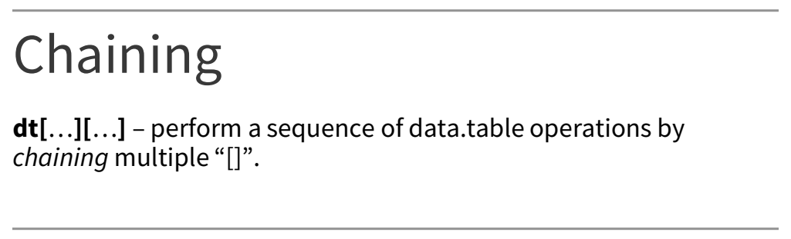

（本小节进度：1/2）

##### **2. 去重**

```{r}
unique(d, by="Gender")  # 根据某个变量去重，重复数据取第一个

unique(d, by=c("Gender", "Edu"))  # 根据多个变量去重，重复数据取第一个

unique(d[order(-Gender, -Age, -Edu)], by=c("Gender", "Edu"))
```

（本小节进度：2/2）

# 【自由练习】数据基本操作

参考前三小节代码（增删查改、行列筛选、排序去重），基于`psych::bfi`或期末自选数据，在自己电脑上自由练习数据基本操作，为【阶段作业①】做准备。

-   可以尝试改变上述示例代码中的数值范围、变量范围、筛选条件、排序方式等
-   **自己敲代码，掌握更扎实！（AI替代不了你的肌肉记忆！）**

# 分组汇总（data.table）

#### 【实践4】分组汇总 {.tabset .tabset-fade .table-pill}

```{r}
## 数据准备：大五人格问卷BFI（部分数据）
data = as.data.table(psych::bfi)
data[, let(
  Gender = factor(gender, levels=1:2, labels=c("Male", "Female")),
  Age = as.numeric(age),
  Edu = as.factor(education)
)]
d = data[2535:2546, c("Gender", "Age", "Edu", paste0("A", 1:5))]
d
str(d)
```

##### **1. 分组聚合**

`DT[i, j, by]`

-   `by`：定义分组变量（原始顺序）
-   `keyby`：定义分组变量（重新排序）

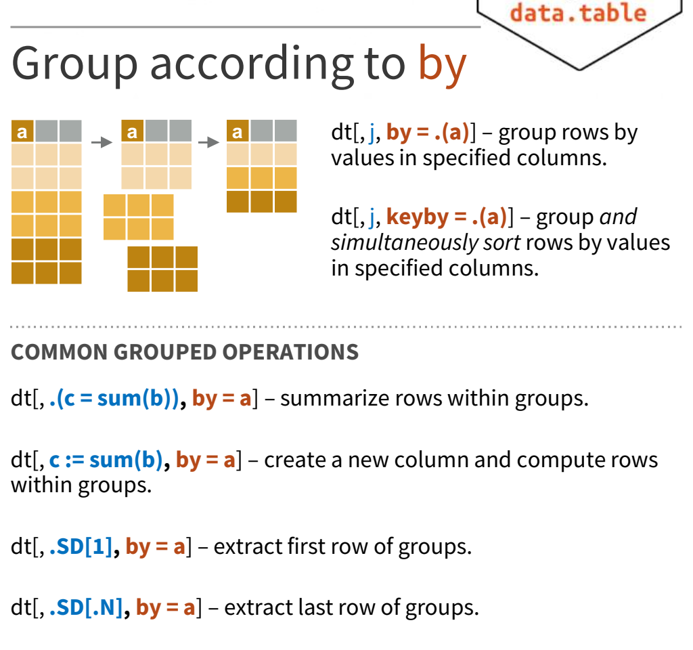

```{r}
## by分组，原始顺序
d[, .(.N), by=Gender]  # .N 是data.table保留关键字，用于统计样本量

## keyby分组，重新排序
d[, .(.N), keyby=Gender]  # .N 是data.table保留关键字，用于统计样本量

d[, .(.N, Mean.Age = mean(Age)), keyby=Gender]

d[, .(
  .N,
  Mean.Age = mean(Age),
  SD.Age = sd(Age)
), keyby=Gender]

d[Age >= 15, .(
  .N,
  Mean.Age = mean(Age),
  SD.Age = sd(Age)
), keyby=Gender]

## 全部数据的分组统计
# Education:
# 1 = high school
# 2 = finished high school
# 3 = some college
# 4 = college graduate
# 5 = graduate degree
data[, .(
  .N,
  Mean.Age = mean(Age)
), keyby=.(Gender, Edu)]
```

（本小节进度：1/2）

##### **2. 分组计算**

```{r}
d[, Mean.Age := mean(Age)]  # 总均值
d

d[, Mean.Age.G := mean(Age), keyby=Gender]  # 组均值
d

d[Gender=="Male", AgeGroup := ifelse(Age<40, "Young", "Middle")]
d

## 总均值中心化
d[, Age.Grand.C := Age - mean(Age)]
d[, .(Gender, Age, Mean.Age, Age.Grand.C)]

## 组均值中心化
d[, Age.Group.C := Age - mean(Age), keyby=Gender]
d[, .(Gender, Age, Mean.Age, Mean.Age.G, Age.Group.C)]
```

#### 【知识点】data.table核心知识点总结

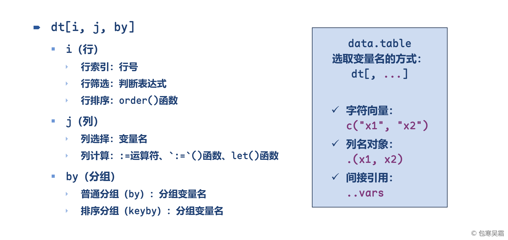

（本小节进度：2/2）

# 匹配拼接（dplyr）

#### 【知识点】dplyr包：join系列函数

两个数据`d1`和`d2`具有相同变量`"var"`：

-   `left_join(d1, d2, by="var")`：向`d1`合并⭐️（最常用）
-   `right_join(d1, d2, by="var")`：向`d2`合并
-   `inner_join(d1, d2, by="var")`：取`d1`和`d2`交集合并
-   `full_join(d1, d2, by="var")`：取`d1`和`d2`并集合并

（data.table也能完成匹配拼接操作，但比dplyr难用）

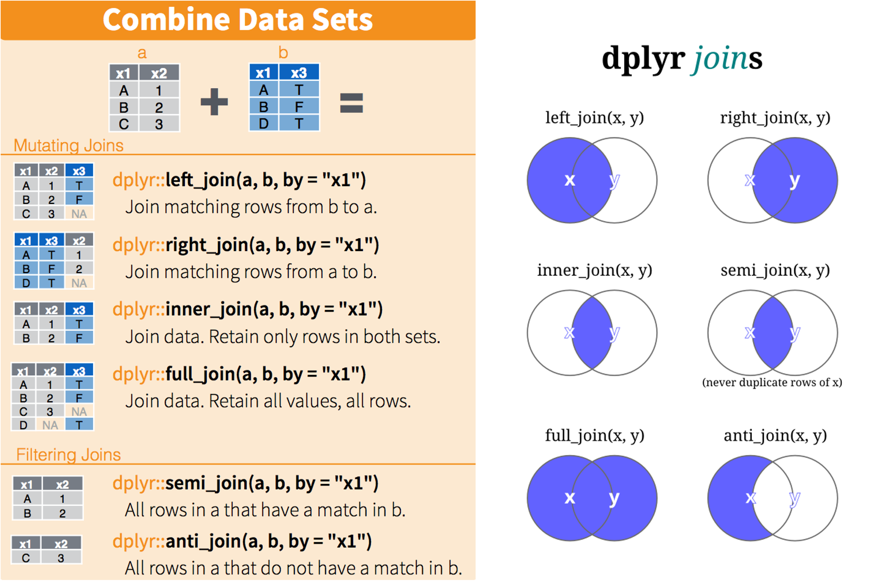

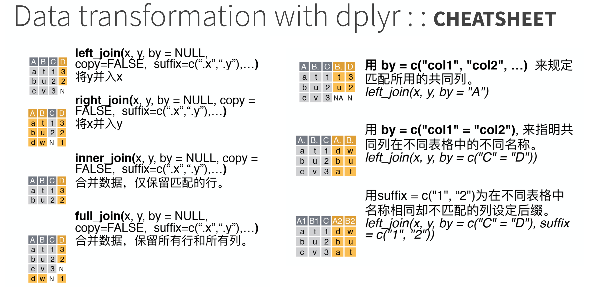

#### 【实践5】匹配拼接 {.tabset .tabset-fade .table-pill}

##### **1. 匹配拼接-例1**

```{r}
## 数据准备：两个来源的数据，至少包含一个共同变量
d1 = as.data.table(dplyr::band_members)
d1
d2 = as.data.table(dplyr::band_instruments)
d2
d3 = as.data.table(dplyr::band_instruments2)
d3

## 匹配拼接：相同变量名
data = left_join(d1, d2, by="name")  # 向左边数据合并
data

right_join(d1, d2, by="name")  # 向右边数据合并
inner_join(d1, d2, by="name")  # 两个数据的交集
full_join(d1, d2, by="name")  # 两个数据的并集

## 匹配拼接：不同变量名
names(d1)  # 人名变量为"name"
names(d3)  # 人名变量为"artist"
data = left_join(d1, d3, by=c("name"="artist"))
data
```

（本小节进度：1/2）

##### **2. 匹配拼接-例2**

```{r}
set.seed(1)
d = data.table(x=rnorm(9), city=rep(1:3, each=3))
d

d.group = data.table(
  city = 1:3,
  label = c("北京", "上海", "广州"),
  GDP = c(521, 567, 310)
)
d.group

d.merge = left_join(d, d.group, by="city")
d.merge
```

（本小节进度：2/2）

# 长宽转换（tidyr）

#### 【知识点】宽数据 vs. 长数据

-   **宽数据（wide-format data）**—— “汇总表”或“透视表”
    -   每个被观测的对象只占一行，而该对象的多个属性或随时间变化的观测值作为不同的列横向展开
        -   核心特征：一主体一行，多变量多列
        -   灵活性：增加新变量需增加新列
        -   优点：对人类阅读比较友好，很像我们常见的电子表格或汇总报表，很多统计模型的输入也要求是宽格式
        -   缺点：不利于进行某些分析和可视化，因为数据维度（变量）被锁定在列结构中

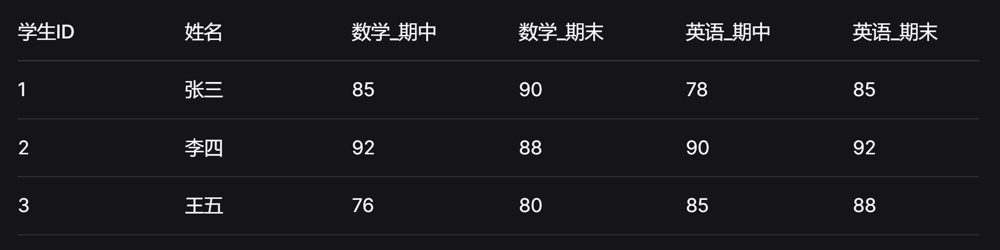

-   **长数据（long-format data）**—— “流水记录”或“规范化”的数据库表
    -   每个被观测的对象会占据多行，每一行通常只包含一个变量在某一个时间点或条件下的观测值
        -   核心特征：一观测一行，键值对形式
        -   灵活性：增加新观测或变量只需增加新行，结构稳定
        -   优点：结构规整，是整洁数据的标准格式，特别适合用`ggplot2`等工具进行数据可视化，也便于进行分组、聚合和复杂变换，数据库存储也常采用类似结构
        -   缺点：对人类阅读不太直观，显得冗长

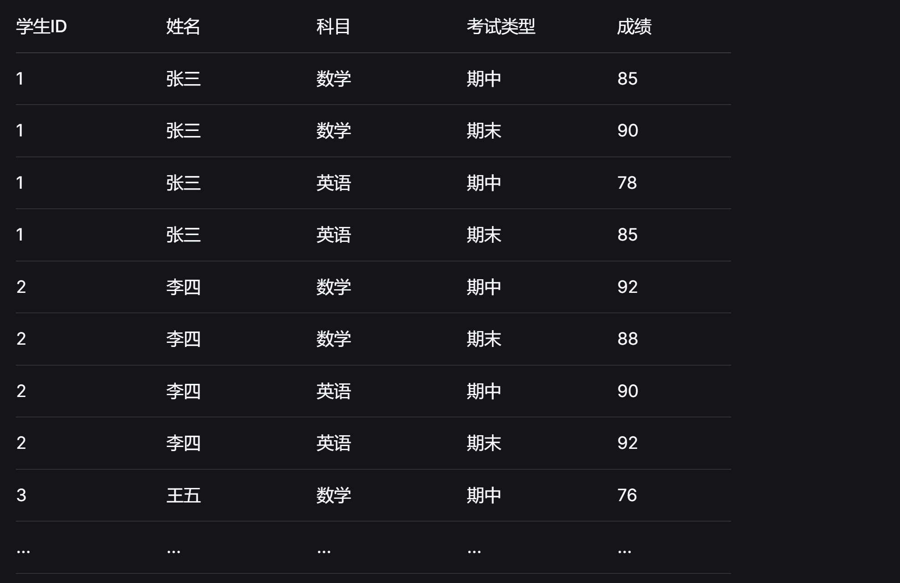

#### 【知识点】tidyr包：pivot系列函数

（data.table也能完成长宽转换操作，但比tidyr难用）

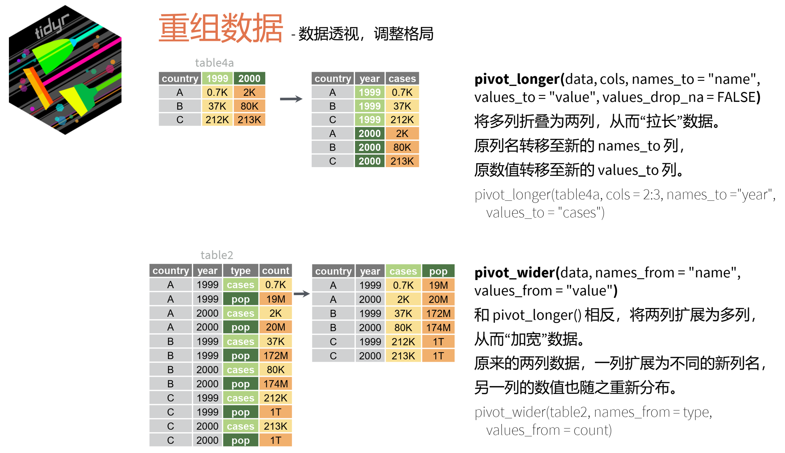

#### 【实践6】长宽转换 {.tabset .tabset-fade .table-pill}

##### **1. 宽变长**

```{r}
bruceR::within.1  # 被试内重复测量（宽数据）

d.long.1 = pivot_longer(
  data = within.1,
  cols = A1:A4,
  names_to = "Condition",
  values_to = "Y"
) %>% as.data.table()
d.long.1  # 长数据
```

```{r}
bruceR::within.2  # 被试内重复测量（宽数据）

d.long.2 = pivot_longer(
  data = within.2,
  cols = A1B1:A2B3,
  names_to = c("Cond.A", "Cond.B"),
  names_pattern = "A(.)B(.)",
  values_to = "Y"
) %>% as.data.table()
d.long.2  # 长数据
```

（本小节进度：1/3）

##### **2. 长变宽**

```{r}
d.long.1  # 长数据（见“宽变长”部分代码）

d.wide.1 = pivot_wider(
  data = d.long.1,
  id_cols = ID,
  names_from = "Condition",
  values_from = "Y"
) %>% as.data.table()
d.wide.1  # 宽数据
```

```{r}
d.long.2  # 长数据（见“宽变长”部分代码）

d.wide.2 = pivot_wider(
  data = d.long.2,
  id_cols = ID,
  names_from = c("Cond.A", "Cond.B"),
  names_prefix = "A",
  names_sep = "_B",
  values_from = "Y"
) %>% as.data.table()
d.wide.2  # 宽数据
```

（本小节进度：2/3）

##### **3. 更复杂情况**

```{r}
d.wide.2  # 宽数据（见“长变宽”部分代码）

d.long.3 = pivot_longer(
  data = d.wide.2,
  cols = starts_with("A"),
  names_to = c("VariableA", ".value"),
  names_pattern = "A(.)_(.+)"
) %>% as.data.table()
d.long.3  # A变长，B保持宽
```

```{r}
d.wide.3 = pivot_wider(
  data = d.long.3,
  names_from = "VariableA",
  names_glue = "A{VariableA}{.value}",
  values_from = c("B1", "B2", "B3")
) %>% as.data.table()
d.wide.3
```

（本小节进度：3/3）

# 【阶段作业①】数据处理综合

作业要求：

-   基于[【作业4】](https://psychbruce.github.io/RCourse/Chap03#%E4%BD%9C%E4%B8%9A4%E6%9C%9F%E6%9C%AB%E8%87%AA%E9%80%89%E5%85%AC%E5%BC%80%E6%95%B0%E6%8D%AE%E5%AF%BC%E5%85%A5)和[【作业6】](https://psychbruce.github.io/RCourse/Chap05#%E4%BD%9C%E4%B8%9A6%E6%9C%9F%E6%9C%AB%E4%BD%9C%E4%B8%9A%E6%95%B0%E6%8D%AE%E5%8F%98%E9%87%8F%E8%AE%A1%E7%AE%97){.uri}的期末自选数据和代码积累，综合运用本章所学的各种数据操作方法和代码，对数据进行增删查改、行列筛选、排序去重、分组汇总、匹配拼接、长宽转换等操作，体现对目前所学全部内容的掌握和迁移应用
-   使用R Markdown完成，对关键代码及结果要有注释说明

平台提交：

-   运行得到的HTML网页
    -   提交文件命名格式：`学号-姓名-R阶段作业1.html`
