```{=html}
<p style="font-size: 12px">版权声明：本套课程材料开源，使用和分享必须遵守「创作共用许可协议 CC BY-NC-SA」（来源引用-非商业用途使用-以相同方式共享）。</p>
```

```{r Config, include=FALSE}
options(
  knitr.kable.NA = "",
  digits = 4
)
knitr::opts_chunk$set(
  comment = "",
  fig.width = 8,
  fig.height = 6,
  dpi = 300
)
```

------------------------------------------------------------------------

# Chap07：基础统计

#### 往期要点回顾

-   [Chap05 \# 变量计算](https://psychbruce.github.io/RCourse/Chap05){.uri}
-   [Chap06 \# 数据操作](https://psychbruce.github.io/RCourse/Chap06){.uri}

#### 本章要点目录

-   [【实践1】频次统计](#实践1频次统计)
-   [【实践2】描述统计](#实践2描述统计)
-   [【知识点】正态分布与正负偏态](#知识点正态分布与正负偏态)
-   [【实践3】相关分析](#实践3相关分析)（重点）
-   [【知识点】相关系数（r）的效应量大小](#知识点相关系数r的效应量大小)
-   [【实践4】单样本t检验](#实践4单样本t检验)
-   [【知识点】标准化均值差异（d）的效应量大小](#知识点标准化均值差异d的效应量大小)
-   [【实践5】独立样本t检验](#实践5独立样本t检验)（重点）
-   [【实践6】配对样本t检验](#实践6配对样本t检验)
-   [【实践7】大五人格量表信度分析](#实践7大五人格量表信度分析)（重点）
-   [【实践8】大五人格量表探索性因素分析（EFA）](#实践8大五人格量表探索性因素分析efa)
-   [【实践9】大五人格量表验证性因素分析（CFA）](#实践9大五人格量表验证性因素分析cfa)

```{r, message=FALSE, warning=FALSE}
## 本章所需R包
library(bruceR)
```

```{r}
## 数据准备：大五人格问卷BFI（完整数据）
data = as.data.table(psych::bfi)
data[, let(
  Gender = factor(gender, levels=1:2, labels=c("Male", "Female")),
  Age = as.numeric(age),
  Edu = as.factor(education),
  E = MEAN(data, "E", 1:5, rev=c(1,2), range=1:6),
  A = MEAN(data, "A", 1:5, rev=1, range=1:6),
  C = MEAN(data, "C", 1:5, rev=c(4,5), range=1:6),
  N = MEAN(data, "N", 1:5, rev=NULL, range=1:6),
  O = MEAN(data, "O", 1:5, rev=c(2,5), range=1:6)
)]
str(data)
```

# 描述统计与相关分析

## 频次统计

#### 【实践1】频次统计 {#实践1频次统计}

-   [`Freq()`函数帮助文档](https://psychbruce.github.io/bruceR/reference/Freq.html){.uri}

```{r}
## Freq(x, varname, labels, sort, digits, file)
## 请查阅帮助文档：?Freq 或 help(Freq)

Freq(data$Gender)  # 直接放变量
Freq(data, "Gender")  # 分别设定数据集和变量名
Freq(data$Gender, digits=3)  # 保留3位小数
Freq(data$Gender, digits=3, file="Freq.doc")  # 保存结果表到Word文档
```

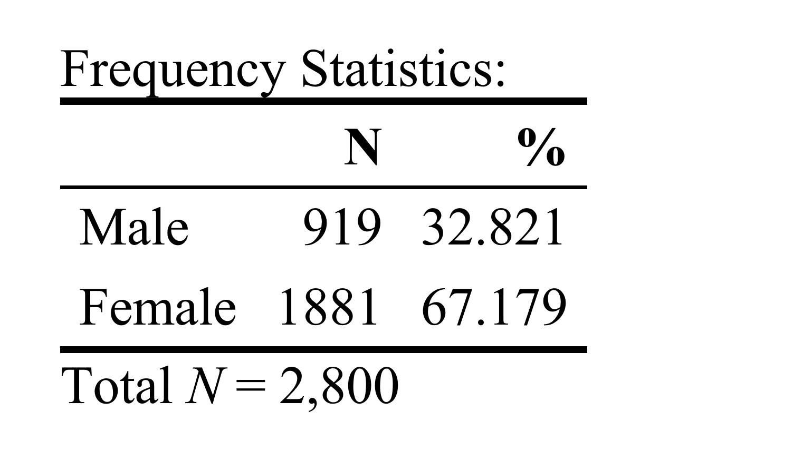

```{r}
Freq(data$Edu)  # 默认按数值标签排序
Freq(data$Edu, sort="-")  # 按频次结果倒序排
Freq(data$Edu, sort="+")  # 按频次结果正序排

Freq(data$Age)  # 查看可能的异常值
```

## 描述统计

#### 【实践2】描述统计 {#实践2描述统计}

-   [`Describe()`函数帮助文档](https://psychbruce.github.io/bruceR/reference/Describe.html){.uri}

```{r}
## Describe(data, ..., digits, file, plot, plot.file, ...)
## 请查阅帮助文档：?Describe 或 help(Describe)

Describe(data$Age)
Describe(data$Age, plot=TRUE)  # 正偏态（长尾指向右边/正向极端值多）

Describe(data[, .(Gender, Age, Edu)], plot=TRUE,
         upper.triangle=TRUE)

Describe(data[, Gender:O], plot=TRUE,
         upper.triangle=TRUE,
         upper.smooth="lm")

Describe(data[, Gender:O], file="Desc.doc")  # 保存结果表到Word文档
```

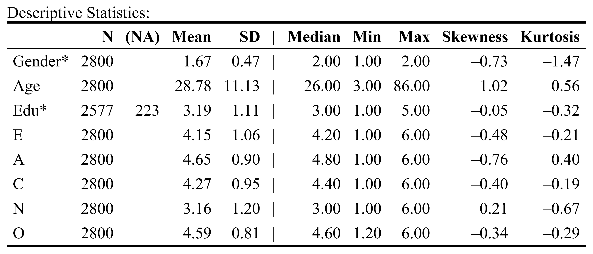

#### 【知识点】正态分布与正负偏态 {#知识点正态分布与正负偏态}

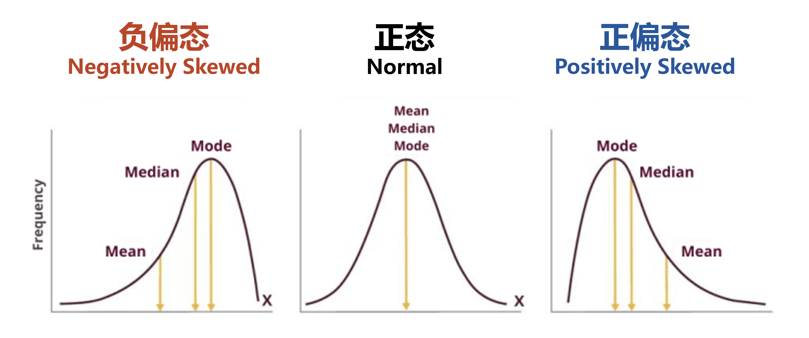

## 相关分析

#### 【实践3】相关分析 {#实践3相关分析}

-   [`Corr()`函数帮助文档](https://psychbruce.github.io/bruceR/reference/Corr.html){.uri}

```{r}
## Corr(data, method, ..., digits, file, plot, plot.file, ...)
## 请查阅帮助文档：?Corr 或 help(Corr)

Corr(data[, Gender:O])
Corr(data[, Gender:O], plot=FALSE, file="Corr.doc")
```

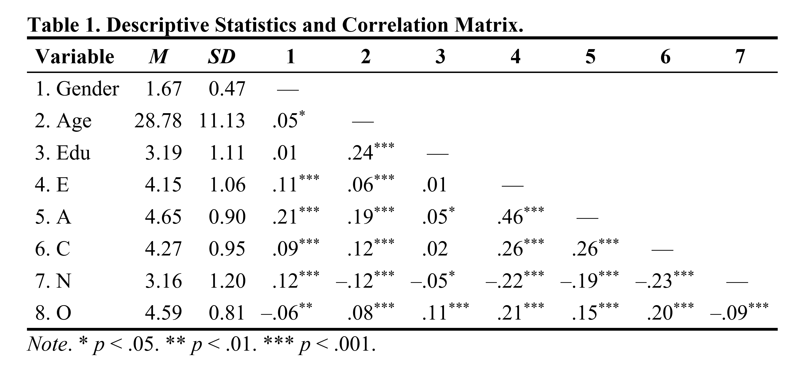

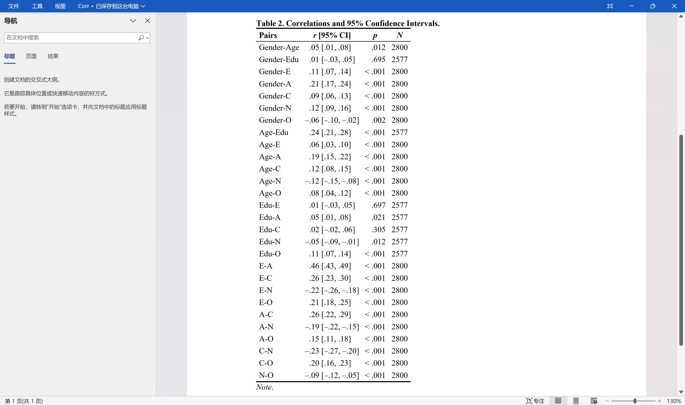

注意：较早版本SPSS的相关系数表，只输出到\*\* *p* \< .01显著性水平，不够精确。

最新学术规范：大于.001的需要**报告精确*p*值**（如*p* = .035、*p* = .006、*p* \< .001），不能只报告范围（如*p* \< .05）！***p*****值不能等于0**（不能写*p* = .000，要写*p* \< .001）！

#### 【知识点】相关系数（r）的效应量大小 {#知识点相关系数r的效应量大小}

-   相关系数 \|*r*\|（请参阅`effectsize::interpret_r()`函数帮助文档）
    -   经典参考（Cohen, 1988）
        -   极小效应：0\~0.1
        -   小效应：0.1\~0.3
        -   中效应：0.3\~0.5
        -   大效应：0.5\~1
    -   现代参考（Funder & Ozer, 2019）
        -   微小效应：0\~0.05
        -   极小效应：0.05\~0.1
        -   小效应：0.1\~0.2
        -   中效应：0.2\~0.3
        -   大效应：0.3\~0.4
        -   极大效应：0.4\~1

```{r}
effectsize::interpret_r(0.01)
effectsize::interpret_r(0.05)
effectsize::interpret_r(0.1)
effectsize::interpret_r(0.2)
effectsize::interpret_r(0.3)
effectsize::interpret_r(0.4)
```

# t检验

## 单样本t检验

#### 【实践4】单样本t检验 {#实践4单样本t检验}

-   [`TTEST()`函数帮助文档](https://psychbruce.github.io/bruceR/reference/TTEST.html){.uri}

```{r}
TTEST(data, y="Age")
TTEST(data, y="Age", test.value=20)
TTEST(data, y="Age", test.value=28)  # 统计显著不等于大效应！
```

#### 【知识点】标准化均值差异（d）的效应量大小 {#知识点标准化均值差异d的效应量大小}

-   Cohen's *d*（请参阅`effectsize::interpret_cohens_d()`函数帮助文档）
    -   经典参考（Cohen, 1988）
        -   极小效应：0\~0.2
        -   小效应：0.2\~0.5
        -   中效应：0.5\~0.8
        -   大效应：0.8及以上（至无穷大）

## 独立样本t检验

#### 【实践5】独立样本t检验 {#实践5独立样本t检验}

-   [`TTEST()`函数帮助文档](https://psychbruce.github.io/bruceR/reference/TTEST.html){.uri}

```{r}
TTEST(data, y="E", x="gender")

TTEST(data, y="E", x="gender", var.equal=FALSE)

TTEST(data, y=c("E", "A", "C", "N", "O"), x="gender")
```

```{r, results=FALSE}
TTEST(data,
      y = c("E", "A", "C", "N", "O"),
      x = "Gender",
      bf10 = TRUE,  # 计算贝叶斯因子（BF10）
      file = "T-test1.doc")
```

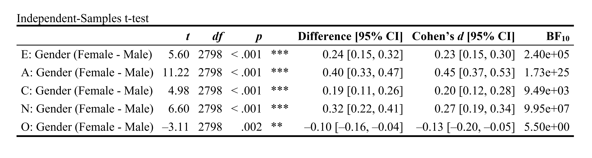

## 配对样本t检验

#### 【实践6】配对样本t检验 {#实践6配对样本t检验}

-   [`TTEST()`函数帮助文档](https://psychbruce.github.io/bruceR/reference/TTEST.html){.uri}

```{r}
bruceR::within.1  # 宽数据

TTEST(within.1, y=c("A1", "A2"), paired=TRUE)

TTEST(within.1, y=c("A1", "A2", "A3", "A4"), paired=TRUE)
```

# \* 拓展：手动计算*p*值

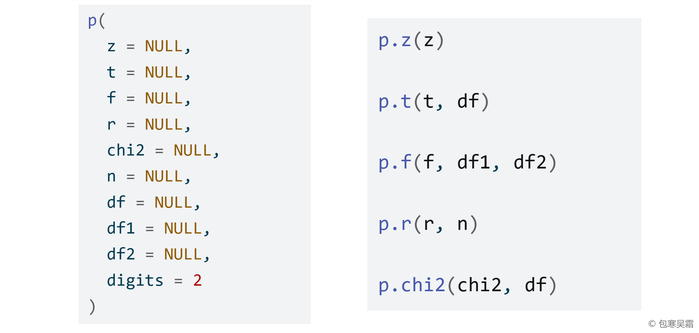

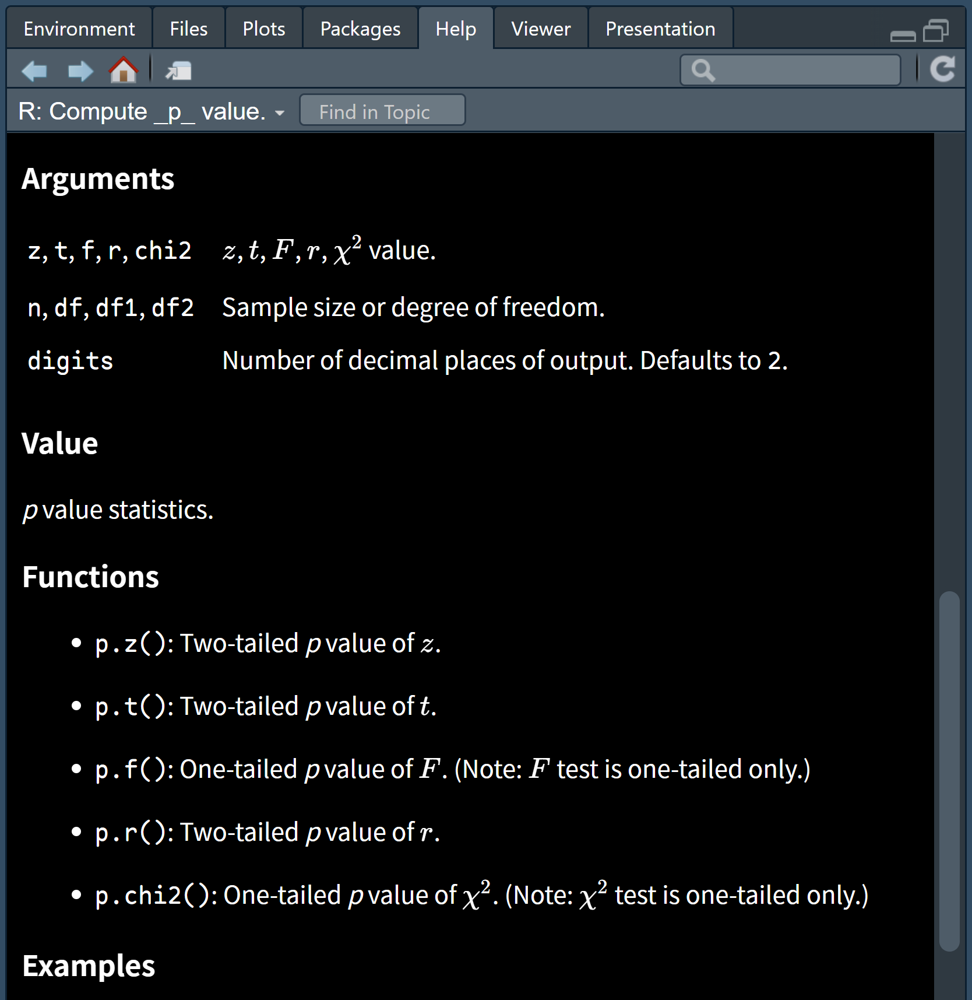

```{r}
p.z(1.96)
p(z=1.96)
p(z=2.58)
p(z=3.30)
```

```{r}
p.t(2, 100)
p(t=2, df=100)
p(t=2, df=1000)
p(t=2, df=10000)
```

```{r}
p.f(4, 1, 100)
p(f=4, df1=1, df2=100)
```

```{r}
p.r(0.2, 100)
p(r=0.2, n=100)
p(r=0.3, n=100)
p(r=0.4, n=100)

p(r=0.2, n=100)
p(r=0.2, n=1000)
p(r=0.2, n=10000)
```

```{r}
p.chi2(3.84, 1)
p(chi2=3.84, df=1)
```

# 信度分析

## 内部一致性信度

#### 【实践7】大五人格量表信度分析 {#实践7大五人格量表信度分析}

-   Cronbach's α
    -   [`Alpha()`函数帮助文档](https://psychbruce.github.io/bruceR/reference/Alpha.html){.uri}
-   设定变量范围的三种方式
    -   **`var` + `items`**: common and unique parts of variable names
    -   **`vars`**: a character vector of variable names
    -   **`varrange`**: starting and stopping positions of variables

```{r}
## Alpha(data, var, items, ..., rev, digits)
## 请查阅帮助文档：?Alpha 或 help(Alpha)

Alpha(data, "E", 1:5)  # 外倾性：E1、E2应该反向计分
Alpha(data, "E", 1:5, rev=1:2)  # 反向计分
Alpha(data, "A", 1:5, rev=1)  # 宜人性
Alpha(data, "C", 1:5, rev=c(4, 5))  # 尽责性
Alpha(data, "N", 1:5)  # 神经质/情绪不稳定性
Alpha(data, "O", 1:5, rev=c(2, 5))  # 开放性
```

# \* 拓展：探索性因素分析（EFA）

#### 【实践8】大五人格量表探索性因素分析（EFA） {#实践8大五人格量表探索性因素分析efa}

-   [`EFA()`函数帮助文档](https://psychbruce.github.io/bruceR/reference/EFA.html){.uri}

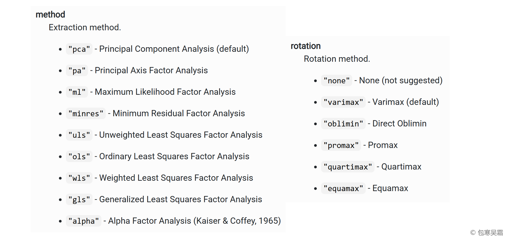

```{r, warning=FALSE}
EFA(psych::bfi, "E", 1:5)

EFA(data = psych::bfi,
    varrange = "A1:O5",
    nfactors = "parallel",
    hide.loadings = 0.45)
```

# \* 拓展：验证性因素分析（CFA）

#### 【实践9】大五人格量表验证性因素分析（CFA） {#实践9大五人格量表验证性因素分析cfa}

-   [`CFA()`函数帮助文档](https://psychbruce.github.io/bruceR/reference/CFA.html){.uri}

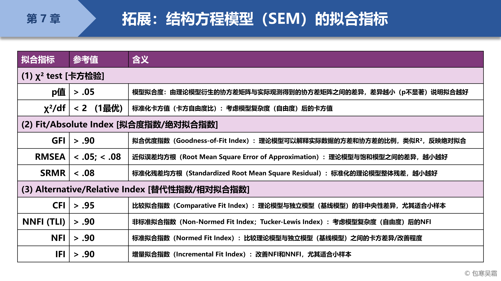

```{r}
CFA(data = na.omit(psych::bfi),
    "E =~ E[1:5]
     A =~ A[1:5]
     C =~ C[1:5]
     N =~ N[1:5]
     O =~ O[1:5]")
```

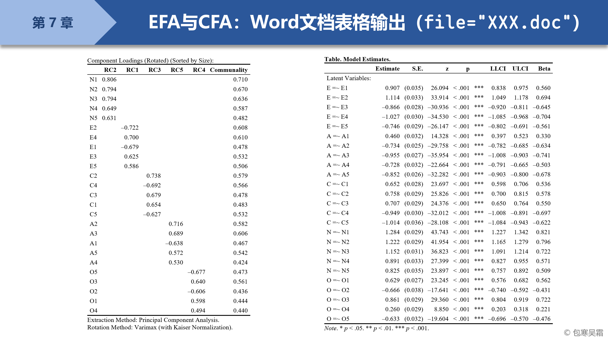

# 【作业7】基础统计练习

作业要求：

-   基于[【作业4】](https://psychbruce.github.io/RCourse/Chap03#%E4%BD%9C%E4%B8%9A4%E6%9C%9F%E6%9C%AB%E8%87%AA%E9%80%89%E5%85%AC%E5%BC%80%E6%95%B0%E6%8D%AE%E5%AF%BC%E5%85%A5)和[【作业6】](https://psychbruce.github.io/RCourse/Chap05#%E4%BD%9C%E4%B8%9A6%E6%9C%9F%E6%9C%AB%E4%BD%9C%E4%B8%9A%E6%95%B0%E6%8D%AE%E5%8F%98%E9%87%8F%E8%AE%A1%E7%AE%97){.uri}的期末自选数据和代码积累，运用本章所学的基础统计方法和代码，练习**描述统计、相关分析、t检验**（根据自己的数据情况选择最合适的一种t检验方法）
-   使用R Markdown完成，对关键代码及结果要有注释说明

平台提交：

-   运行得到的HTML网页，及其关键部分截图

```{r, include=FALSE}
unlink(c("Freq.doc", "Desc.doc", "Corr.doc",
         "T-test1.doc"))
```
