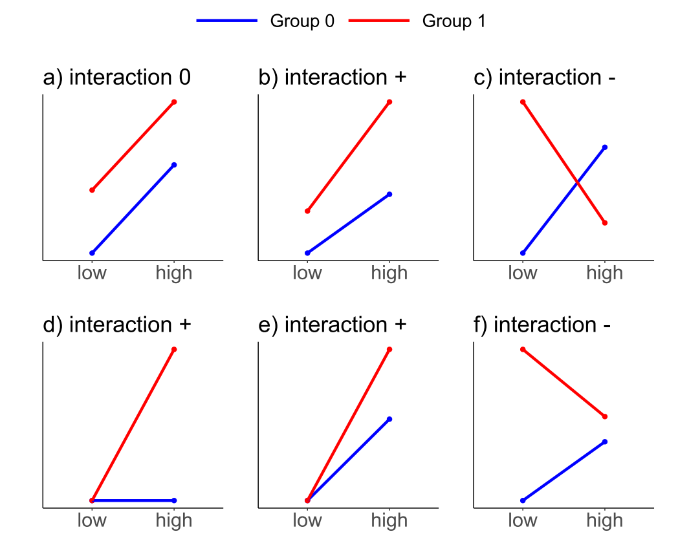
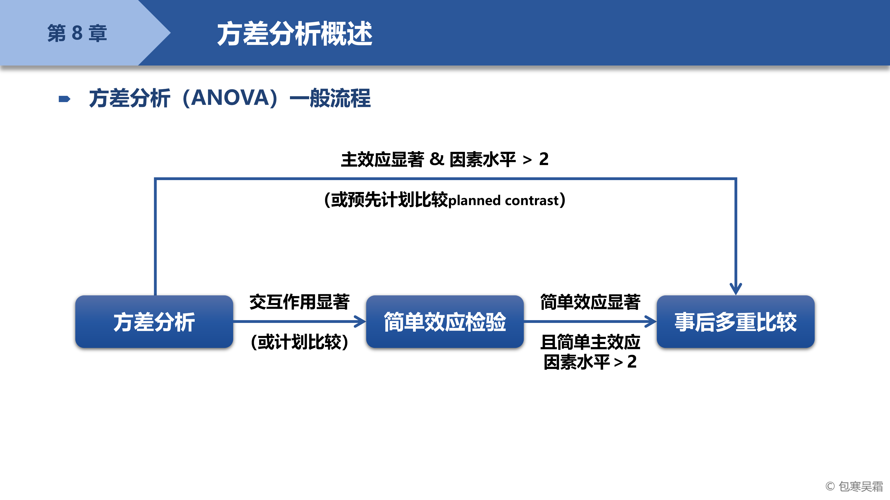
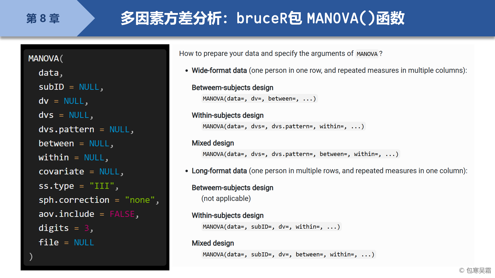
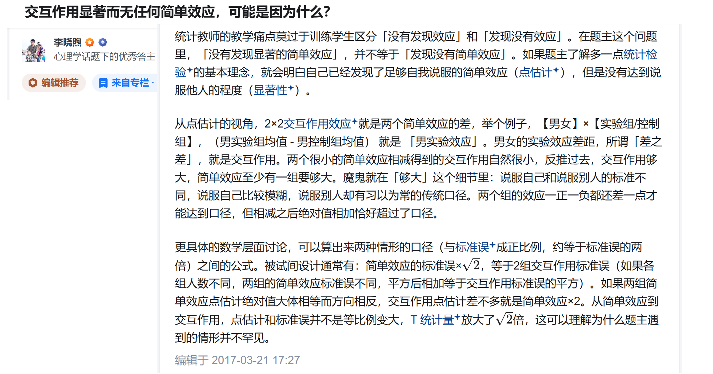

```{=html}
<p style="font-size: 12px">版权声明：本套课程材料开源，使用和分享必须遵守「创作共用许可协议 CC BY-NC-SA」（来源引用-非商业用途使用-以相同方式共享）。</p>
```

```{r Config, include=FALSE}
options(
  knitr.kable.NA = "",
  digits = 4
)
knitr::opts_chunk$set(
  comment = "",
  fig.width = 6,
  fig.height = 4,
  dpi = 300
)
```

------------------------------------------------------------------------

# Chap08：方差分析

#### 往期要点回顾

- [Chap07 \# 描述统计与相关分析](https://psychbruce.github.io/RCourse/Chap07#%E6%8F%8F%E8%BF%B0%E7%BB%9F%E8%AE%A1%E4%B8%8E%E7%9B%B8%E5%85%B3%E5%88%86%E6%9E%90){.uri}
- [Chap07 \# t检验](https://psychbruce.github.io/RCourse/Chap07#t%E6%A3%80%E9%AA%8C){.uri}

#### 本章要点目录

- [【知识点】方差分析（ANOVA）统计术语](#知识点方差分析anova统计术语)
- [【实践1】组间设计ANOVA](#实践1组间设计anova)（重点）
- [【实践2】组内设计ANOVA](#实践2组内设计anova)
- [【实践3】混合设计ANOVA](#实践3混合设计anova)
- [【实践4】组间设计ANOVA的多重比较](#实践4组间设计anova的多重比较)（重点）
- [【探索发现】多重比较的p值校正方法](#探索发现多重比较的p值校正方法)
- [【实践5】组间设计ANOVA的简单效应检验](#实践5组间设计anova的简单效应检验)（重点）
- [【探索发现】对于两因素方差分析（A × B），以下情况都有可能发生吗？](#探索发现对于两因素方差分析a-b以下情况都有可能发生吗)
- [【实践6】交互作用显著，但A的两个简单效应都不显著](#实践6交互作用显著但a的两个简单效应都不显著)
- [【实践7】交互作用不显著，但A的简单效应一个显著、一个不显著](#实践7交互作用不显著但a的简单效应一个显著一个不显著)

```{r, message=FALSE, warning=FALSE}
## 本章所需R包
library(bruceR)
```

# 方差分析的统计知识回顾

#### 【知识点】方差分析（ANOVA）统计术语 {#知识点方差分析anova统计术语}



- **方差分析ANOVA**（以2 × 2 “高低组别 × 男女性别”两因素组间设计ANOVA为例）
  - **主效应（main effect）**
    - 代表“平均效应”，某个因素在其他因素不同条件下的边际平均效应
    - [例：高组和低组之间的总体差异（无论男性和女性，组别的平均效应）]{.underline}
  - **交互作用（interaction）**
    - 代表“效应差异”，某个因素在其他因素不同条件下存在不同的效应
    - [例：高低组间的差异在男性和女性群体之间也存在差异（差异的差异）]{.underline}
- **交互作用显著后的简单效应检验**
  - **简单效应（simple effect）**，也称“条件效应”（conditional effect）
    - 通常特指：简单主效应（simple main effect），也称“条件主效应”（conditional main effect）
    - [例：分别在男性或女性群体中，高低组间的差异（组别的简单主效应）]{.underline}
  - （拓展）三阶交互作用（A × B × C）中的复杂情况
    - 简单交互作用（simple interaction）：C不同条件下的A × B简单交互作用
    - 简单简单效应（simple-simple effect）：B和C不同组合条件下的A简单主效应
- **某个因素多个条件间（≥ 3）的两两对比**
  - 事后检验（post-hoc test）
    - 通常特指：**事后多重比较（post-hoc multiple comparison）**
    - 需要对*p*值做**“多重比较校正”（adjust *p*-values for multiple comparisons）**以降低假阳性概率（false discovery rate, FDR）



# 多因素方差分析



## 完全随机/组间设计ANOVA

#### 【实践1】组间设计ANOVA {#实践1组间设计anova}

- [`MANOVA()`函数帮助文档](https://psychbruce.github.io/bruceR/reference/MANOVA.html){.uri}

```{r}
between.1  # 单因素四水平组间设计
MANOVA(between.1, dv="SCORE", between="A")
```

```{r}
between.2  # 2×3两因素组间设计
MANOVA(between.2, dv="SCORE", between=c("A", "B"))

## 使用 emmeans 包的 emmip() 函数绘制交互图
## 请查阅帮助文档：?emmeans::emmip()
m = MANOVA(between.2, dv="SCORE", between=c("A", "B"))
emmip(m, ~ A | B, CIs=TRUE)
emmip(m, ~ B | A, CIs=TRUE)
emmip(m, B ~ A, CIs=TRUE)
emmip(m, A ~ B, CIs=TRUE)
```

```{r}
between.3  # 2×2×2三因素组间设计
MANOVA(between.3, dv="SCORE", between=c("A", "B", "C"))
```

## 重复测量/组内设计ANOVA

#### 【实践2】组内设计ANOVA {#实践2组内设计anova}

- [`MANOVA()`函数帮助文档](https://psychbruce.github.io/bruceR/reference/MANOVA.html){.uri}

```{r}
within.1  # 单因素四水平组内设计
MANOVA(within.1,
       dvs = "A1:A4",
       dvs.pattern = "A(.)",
       within = "A")

# 相同：
MANOVA(within.1,
       dvs = c("A1", "A2", "A3", "A4"),
       dvs.pattern = "A(.)",
       within = "AnyVarNameIsOK")
```

```{r}
within.2  # 2×3两因素组内设计
m = MANOVA(within.2,
           dvs = "A1B1:A2B3",
           dvs.pattern = "A(.)B(.)",
           within = c("A", "B"))
emmip(m, ~ A | B, CIs=TRUE)
emmip(m, ~ B | A, CIs=TRUE)
emmip(m, B ~ A, CIs=TRUE)
emmip(m, A ~ B, CIs=TRUE)
```

```{r}
within.3  # 2×2×2三因素组内设计
MANOVA(within.3,
       dvs = "A1B1C1:A2B2C2",
       dvs.pattern = "A(.)B(.)C(.)",
       within = c("A", "B", "C"))
```

## 混合设计ANOVA

#### 【实践3】混合设计ANOVA {#实践3混合设计anova}

- [`MANOVA()`函数帮助文档](https://psychbruce.github.io/bruceR/reference/MANOVA.html){.uri}

```{r}
mixed.2_1b1w  # 2×3两因素混合设计（A为组间，B为组内）
MANOVA(mixed.2_1b1w,
       dvs = "B1:B3",
       dvs.pattern = "B(.)",
       between = "A",
       within = "B")
MANOVA(mixed.2_1b1w,
       dvs = "B1:B3",
       dvs.pattern = "B(.)",
       between = "A",
       within = "B",
       sph.correction = "GG")
```

```{r}
mixed.3_1b2w  # 2×2×2三因素混合设计（A为组间，B、C为组内）
MANOVA(mixed.3_1b2w,
       dvs = "B1C1:B2C2",
       dvs.pattern = "B(.)C(.)",
       between = "A",
       within = c("B", "C"))
```

```{r}
mixed.3_2b1w  # 2×2×2三因素混合设计（A、C为组间，B为组内）
MANOVA(mixed.3_2b1w,
       dvs = "B1:B2",
       dvs.pattern = "B(.)",
       between = c("A", "C"),
       within = "B")
```

# 简单效应检验与多重比较

## 多重比较

#### 【实践4】组间设计ANOVA的多重比较 {#实践4组间设计anova的多重比较}

- [`EMMEANS()`函数帮助文档](https://psychbruce.github.io/bruceR/reference/EMMEANS.html){.uri}（**E**stimated **M**arginal **Means**，估计边际均值）

```{r}
m = MANOVA(between.1, dv="SCORE", between="A")
emmip(m, ~ A, CIs=TRUE)

EMMEANS(m, "A", p.adjust="none")
EMMEANS(m, "A", p.adjust="bonferroni")
EMMEANS(m, "A", contrast="seq")
EMMEANS(m, "A", contrast="poly")
```

#### 【探索发现】多重比较的p值校正方法 {#探索发现多重比较的p值校正方法}

`p.adjust`参数

- `"none"`（无校正）
- `"fdr"`
- `"hochberg"`
- `"hommel"`
- `"holm"`
- `"tukey"`
- `"mvt"`
- `"dunnettx"`
- `"sidak"`
- `"scheffe"`
- `"bonferroni"`（默认，最严格）
  - Bonferroni校正：直接将原始*p*值与多重比较次数*n*相乘，得到校正后的*p*值
    - 比如，3个条件之间的两两比较组合有C(3, 2) = 3次，某效应的原始*p* = .04，校正后*p* = .04 × 3 = .12，不再显著

## 简单效应检验

#### 【实践5】组间设计ANOVA的简单效应检验 {#实践5组间设计anova的简单效应检验}

- [`EMMEANS()`函数帮助文档](https://psychbruce.github.io/bruceR/reference/EMMEANS.html){.uri}（**E**stimated **M**arginal **Means**，估计边际均值）

```{r}
m = MANOVA(between.2, dv="SCORE", between=c("A", "B"))

emmip(m, ~ A | B, CIs=TRUE)
EMMEANS(m, "A", by="B")

emmip(m, ~ B | A, CIs=TRUE)
EMMEANS(m, "B", by="A")
```

```{r}
## 使用管道操作符 %>% 连接多个 EMMEANS()
MANOVA(between.3, dv="SCORE", between=c("A", "B", "C")) %>%
  EMMEANS("A", by="B") %>%
  EMMEANS(c("A", "B"), by="C") %>%
  EMMEANS("A", by=c("B", "C"))
```

# \* 拓展：特殊情况

#### 【探索发现】对于两因素方差分析（A × B），以下情况都有可能发生吗？ {#探索发现对于两因素方差分析a-b以下情况都有可能发生吗}

**交互作用 & 主效应：**

- [x] 交互作用**显著**，A和B的主效应**都显著**（很正常）
- [x] 交互作用**显著**，A和B的主效应**都不显著**（很正常，只有交互作用）
- [x] 交互作用**不显著**，A和B的主效应**都显著**（很正常，只有主效应）
- [x] 交互作用**不显著**，A和B的主效应**都不显著**（很正常，啥效应都没）

**交互作用 & 简单效应：**\
（例如：A在B1、B2水平上的两个简单主效应）

- [x] 交互作用**显著**，A的两个简单效应**都显著**\
  （很正常，交互作用体现了简单效应的定量差异）
- [x] 交互作用**显著**，A的两个简单效应**都不显著**❓️\
  （比较少见，但有概率发生！）
- [x] 交互作用**显著**，A的简单效应一个**显著**、一个**不显著**\
  （很正常，交互作用体现了简单效应的定性差异）
- [x] 交互作用**不显著**，A的两个简单效应**都显著**\
  （很正常，主效应为主）
- [x] 交互作用**不显著**，A的两个简单效应**都不显著**\
  （很正常，啥效应都没）
- [x] 交互作用**不显著**，A的简单效应一个**显著**、一个**不显著**❓️\
  （并不少见，显著的简单效应恰好卡在了临界点附近！）

> “Seeing is believing.”（眼见为实）

#### 【实践6】交互作用显著，但A的两个简单效应都不显著 {#实践6交互作用显著但a的两个简单效应都不显著}

```{r}
data1 = data.table(
  A = c(1, 1, 1, 1, 2, 2, 2, 2),
  B = c(1, 1, 2, 2, 1, 1, 2, 2),
  Y = c(0, 7, 10, 12, 12, 10, 7, 0)
)
m = MANOVA(data1, dv="Y", between=c("A", "B"))
emmip(m, B ~ A, CIs=TRUE)
EMMEANS(m, "A", by="B")
```



#### 【实践7】交互作用不显著，但A的简单效应一个显著、一个不显著 {#实践7交互作用不显著但a的简单效应一个显著一个不显著}

```{r}
data2 = data.table(
  A = c(1, 1, 1, 1, 2, 2, 2, 2),
  B = c(1, 1, 2, 2, 1, 1, 2, 2),
  Y = c(0, 1, 0, 4, 5, 6, 2, 4)
)
m = MANOVA(data2, dv="Y", between=c("A", "B"))
emmip(m, B ~ A, CIs=TRUE)
EMMEANS(m, "A", by="B")
```

# 【作业8】方差分析练习

作业要求：

- 基于[【作业4】](https://psychbruce.github.io/RCourse/Chap03#%E4%BD%9C%E4%B8%9A4%E6%9C%9F%E6%9C%AB%E8%87%AA%E9%80%89%E5%85%AC%E5%BC%80%E6%95%B0%E6%8D%AE%E5%AF%BC%E5%85%A5)和[【作业6】](https://psychbruce.github.io/RCourse/Chap05#%E4%BD%9C%E4%B8%9A6%E6%9C%9F%E6%9C%AB%E4%BD%9C%E4%B8%9A%E6%95%B0%E6%8D%AE%E5%8F%98%E9%87%8F%E8%AE%A1%E7%AE%97){.uri}的期末自选数据和代码积累，运用本章所学的方差分析方法和代码，练习**方差分析**（根据自己的数据情况选择最合适的一种方差分析类型）
- 使用R Markdown完成，对关键代码及结果要有注释说明

平台提交：

- 运行得到HTML网页文件的**关键部分截图（只需上传截图）**

------------------------------------------------------------------------

[返回课程主页](https://psychbruce.github.io/RCourse/)

© 包寒吴霜
