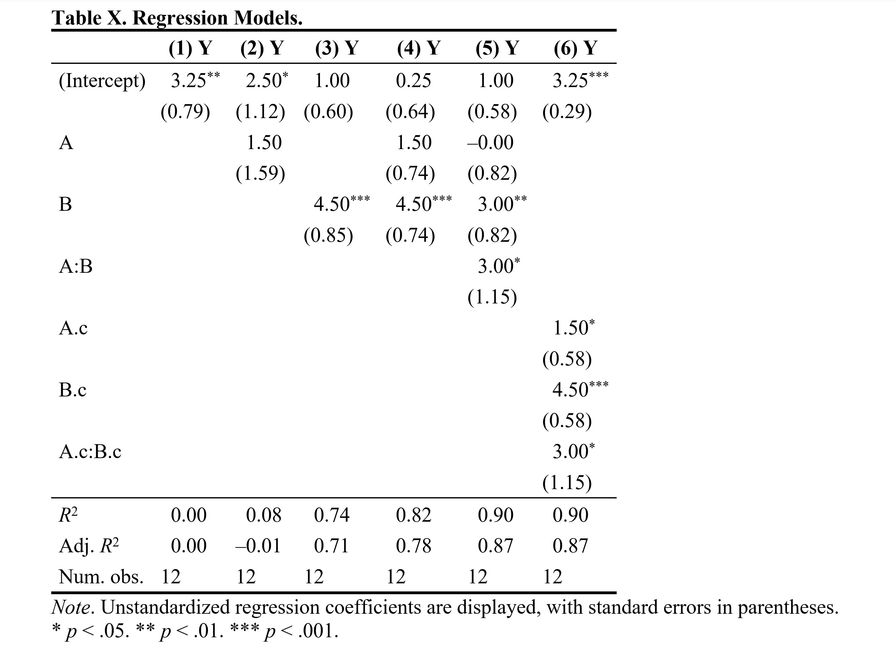
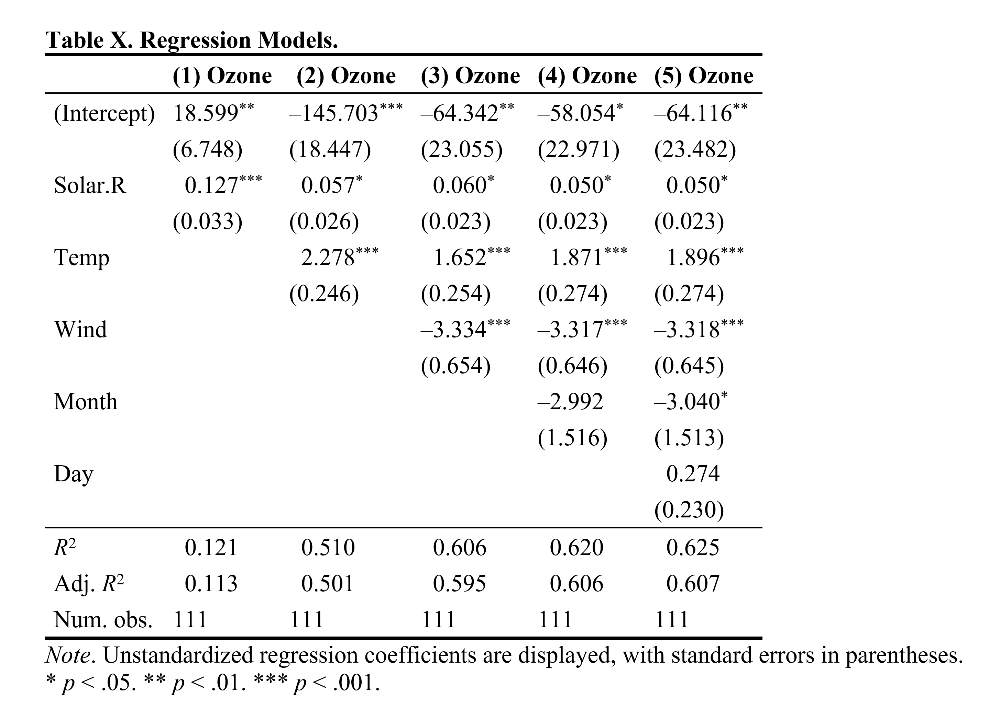
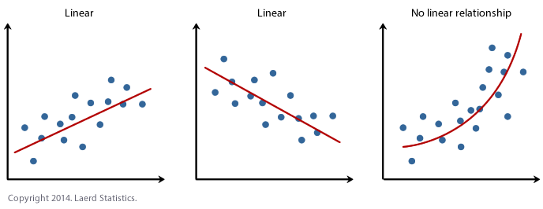
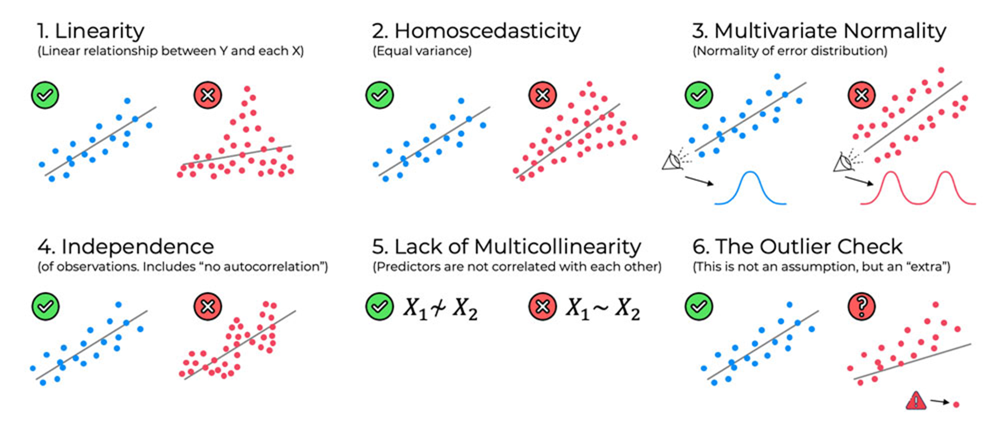
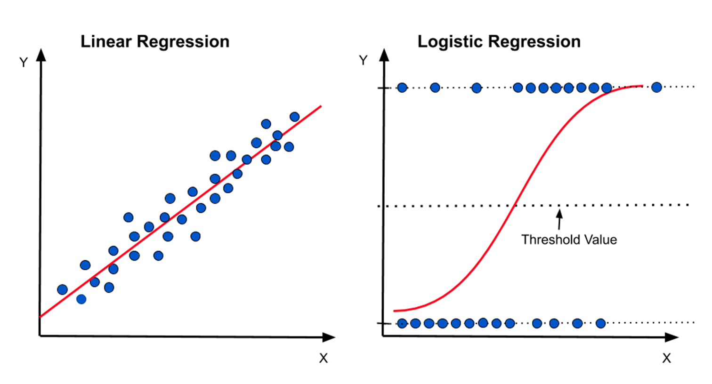
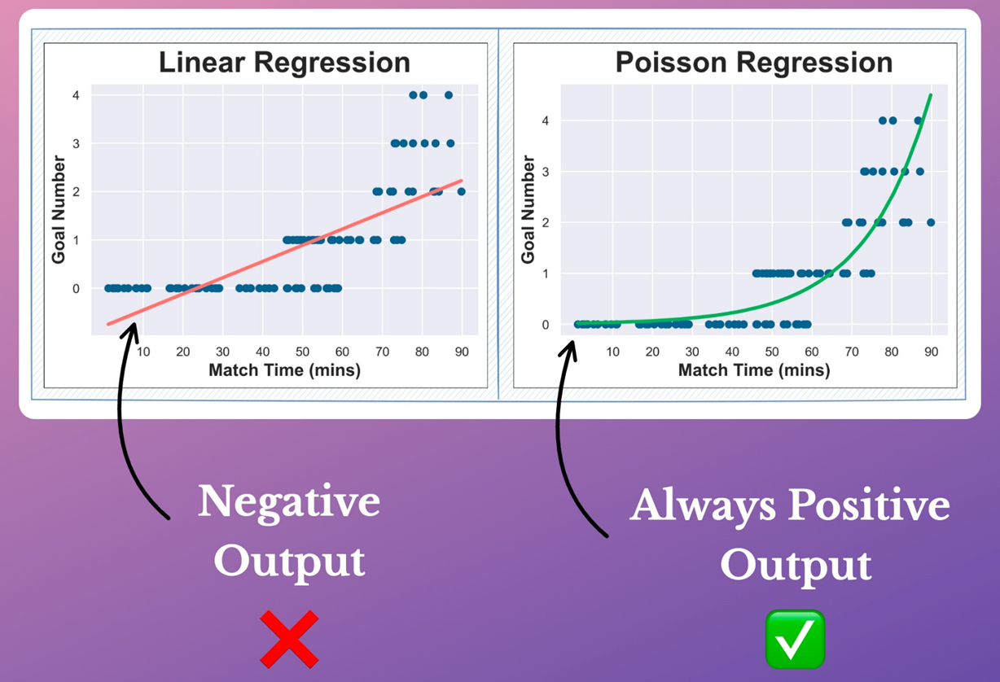

```{=html}
<p style="font-size: 12px">版权声明：本套课程材料开源，使用和分享必须遵守「创作共用许可协议 CC BY-NC-SA」（来源引用-非商业用途使用-以相同方式共享）。</p>
```

```{r Config, include=FALSE}
options(
  knitr.kable.NA = "",
  digits = 4
)
knitr::opts_chunk$set(
  comment = "",
  fig.width = 6,
  fig.height = 4,
  dpi = 300
)
```

------------------------------------------------------------------------

# Chap09：回归分析

#### 往期要点回顾

-   [Chap08 \# 多因素方差分析](https://psychbruce.github.io/RCourse/Chap08#%E5%A4%9A%E5%9B%A0%E7%B4%A0%E6%96%B9%E5%B7%AE%E5%88%86%E6%9E%90){.uri}
-   [Chap08 \# 简单效应检验与多重比较](https://psychbruce.github.io/RCourse/Chap08#%E7%AE%80%E5%8D%95%E6%95%88%E5%BA%94%E6%A3%80%E9%AA%8C%E4%B8%8E%E5%A4%9A%E9%87%8D%E6%AF%94%E8%BE%83){.uri}

#### 本章要点目录

-   [【知识点】回归分析（regression）统计术语](#知识点回归分析regression统计术语)
-   [【实践1】截距模型](#实践1截距模型)
-   [【实践2】一元回归模型](#实践2一元回归模型)
-   [【实践3】多元回归模型](#实践3多元回归模型)
-   [【实践4】交互作用模型](#实践4交互作用模型)（重点）
-   [【知识点】为什么回归分析交互作用中的斜率并不是“主效应”？](#知识点为什么回归分析交互作用中的斜率并不是主效应)（重点）
-   [【实践5】如何让回归分析交互作用中的斜率具有“主效应”含义？](#实践5如何让回归分析交互作用中的斜率具有主效应含义)
-   [【实践6】多元回归模型的结果表输出](#实践6多元回归模型的结果表输出)（重点）
-   [【实践7】空气质量数据回归分析实例](#实践7空气质量数据回归分析实例)
-   [【实践8】基于PROCESS()函数的调节效应与简单斜率分析](#实践8基于process函数的调节效应与简单斜率分析)（重点）
-   [【知识点】回归模型的基本假定](#知识点回归模型的基本假定)
-   [【实践9】检查回归模型是否满足基本假定](#实践9检查回归模型是否满足基本假定)
-   [【探索发现】各类回归模型使用的R函数](#探索发现各类回归模型使用的r函数)

```{r, message=FALSE, warning=FALSE}
## 本章所需R包
library(bruceR)  # 回归模型结果的 Word 表格输出
library(sjPlot)  # 回归模型结果的 HTML 表格输出
```

# 回归分析的统计知识回顾

#### 【知识点】回归分析（regression）统计术语 {#知识点回归分析regression统计术语}

多元回归模型的一般形式：

$$
Y_i = b_0 + b_1 X_1 + b_2 X_2 + ... + b_p X_p + e_i
$$

-   **截距（intercept）**
    -   $b_0$：所有自变量都取0时，因变量的预测期望值
        -   如果没有任何自变量，截距就是因变量的平均值
-   **斜率（slope）**
    -   $b_1$, ..., $b_p$：自变量每变化1，因变量变化多少个单位
        -   非标准化系数：$b$
        -   标准化系数：$\beta$
-   **残差（residual）**
    -   $e_i = Y_i - \hat{Y_i}$：每个个体（$i$）因变量的真实观测值（$Y_i$）与模型预测值（$\hat{Y_i}$）之间的差异

# 回归模型建立与结果报告

```{r}
## 数据准备
data = data.table(
  A = c(0, 0, 0,  0, 0, 0,  1, 1, 1,  1, 1, 1),
  B = c(0, 0, 0,  1, 1, 1,  0, 0, 0,  1, 1, 1),
  Y = c(0, 1, 2,  3, 4, 5,  0, 1, 2,  6, 7, 8)
)
data

## 方差分析
m = MANOVA(data, dv="Y", between=c("A", "B"))
emmip(m, ~ A, CIs=TRUE)
emmip(m, ~ B, CIs=TRUE)
emmip(m, ~ A | B, CIs=TRUE)
emmip(m, B ~ A, CIs=TRUE)
```

#### 【实践1】截距模型 {#实践1截距模型}

```{r}
## lm(formula=..., data=...)

m1 = lm(Y ~ 1, data)  # 1表示模型截距
summary(m1)
bruceR::model_summary(m1)
sjPlot::tab_model(m1)
sjPlot::tab_model(
  m1, digits=3, show.ci=FALSE,
  show.se=TRUE, collapse.se=TRUE
)

## 截距含义：Y的均值
mean(data$Y)  # 截距等于均值
predict(m1)  # 预测期望值
TTEST(data, y="Y", digits=3)  # 截距模型等价于单样本t检验
```

#### 【实践2】一元回归模型 {#实践2一元回归模型}

```{r}
m2 = lm(Y ~ 1 + A, data)
m2 = lm(Y ~ A, data)  # 相当于：Y ~ 1 + A
# 当有自变量时，截距1默认存在，可省略不写
summary(m2)
tab_model(m2, digits=3, show.ci=FALSE,
          show.se=TRUE, collapse.se=TRUE)

## 截距含义：A=0时，Y的预测期望值（等于均值）
mean(data[A==0]$Y)
predict(m2)  # 预测期望值
predict(m2, data.table(A=0))  # A=0时，Y的预测期望值
## 斜率含义：A从0变到1，Y的均值变化
TTEST(data, y="Y", x="A", digits=3)  # 一元回归等价于独立样本t检验
```

```{r}
m3 = lm(Y ~ 1 + B, data)
m3 = lm(Y ~ B, data)  # 相当于：Y ~ 1 + B
# 当有自变量时，截距1默认存在，可省略不写
summary(m3)
tab_model(m3, digits=3, show.ci=FALSE,
          show.se=TRUE, collapse.se=TRUE)

## 截距含义：B=0时，Y的预测期望值（等于均值）
mean(data[B==0]$Y)
predict(m3)  # 预测期望值
predict(m3, data.table(B=0))  # B=0时，Y的预测期望值
## 斜率含义：B从0变到1，Y的均值变化
TTEST(data, y="Y", x="B", digits=3)  # 一元回归等价于独立样本t检验
```

#### 【实践3】多元回归模型 {#实践3多元回归模型}

```{r}
m4 = lm(Y ~ A + B, data)  # 相当于：Y ~ 1 + A + B
# 当有自变量时，截距1默认存在，可省略不写
summary(m4)
tab_model(m4, digits=3, show.ci=FALSE,
          show.se=TRUE, collapse.se=TRUE)

## 截距含义：A=B=0时，Y的预测期望值（此时不再是简单均值）
mean(data[A==0 & B==0]$Y)  # 简单均值
predict(m4, data.table(A=0, B=0))  # A=B=0时，Y的预测期望值
## 斜率含义：A或B从0变到1，Y的预测期望值变化
mean(data[A==1]$Y) - mean(data[A==0]$Y)
mean(data[B==1]$Y) - mean(data[B==0]$Y)
```

#### 【实践4】交互作用模型 {#实践4交互作用模型}

-   R语言回归模型公式中的交互作用设定（适用于所有类型的回归模型）
    -   `Y ~ A * B`（精简写法）
    -   `Y ~ 1 + A + B + A:B`（展开写法）
        -   `1`为截距（可省略不写）
        -   `A`和`B`为固定效应（“条件效应”，并非ANOVA中的“主效应”！！！）⭐️
        -   `A:B`为交互项（interaction term）

```{r}
## 方差分析（回顾）
MANOVA(data, dv="Y", between=c("A", "B"))

## 回归分析
m5 = lm(Y ~ A * B, data)  # 相当于：Y ~ 1 + A + B + A:B
anova(m5)  # 真正的主效应、交互作用
summary(m5)  # A和B的固定效应（条件效应），并非“主效应”！！！
## A和B的固定效应（条件效应），并非“主效应”！！！
tab_model(m5, digits=3, show.ci=FALSE,
          show.se=TRUE, collapse.se=TRUE)
```

#### 【知识点】为什么回归分析交互作用中的斜率并不是“主效应”？ {#知识点为什么回归分析交互作用中的斜率并不是主效应}

-   回归分析中，如果存在交互作用（A × B），则每个自变量的斜率代表另一个变量取0时，该变量的**简单斜率（也可以叫：固定效应、简单效应、条件效应）**！
-   在【实践4】模型结果中：
    -   A的斜率/条件效应（*b* = 0.00）：B = 0时，A的简单斜率（1.00 – 1.00 = 0.00）
    -   B的斜率/条件效应（*b* = 3.00）：A = 0时，B的简单斜率（4.00 – 1.00 = 3.00）
-   而真正的主效应结果是：
    -   A的主效应/边际效应：无论B，A1与A0的边际均值差异（4.00 – 2.50 = 1.50）
    -   B的主效应/边际效应：无论A，B1与B0的边际均值差异（5.50 – 1.00 = 4.50）

| 原始数据   | B0条件  | B1条件  |
|------------|---------|---------|
| **A0条件** | 0, 1, 2 | 3, 4, 5 |
| **A1条件** | 0, 1, 2 | 6, 7, 8 |

: 表1. 原始数据

| 均值           | B0条件均值 | B1条件均值 | 边际均值 |
|----------------|------------|------------|----------|
| **A0条件均值** | **1.00**   | **4.00**   | 2.50     |
| **A1条件均值** | **1.00**   | **7.00**   | 4.00     |
| **边际均值**   | 1.00       | 5.50       | 3.25     |

: 表2. A和B的条件均值与边际均值

```{r}
## 注意，这不是A和B的主效应！（这是固定效应、简单效应、条件效应！）
tab_model(m5, digits=3, show.ci=FALSE,
          show.se=TRUE, collapse.se=TRUE)
## 对比方差分析“简单效应”结果
EMMEANS(m, "A", by="B")
```

#### 【实践5】如何让回归分析交互作用中的斜率具有“主效应”含义？ {#实践5如何让回归分析交互作用中的斜率具有主效应含义}

-   变量中心化（[Chap05](https://psychbruce.github.io/RCourse/Chap05#%E5%8F%98%E9%87%8F%E4%B8%AD%E5%BF%83%E5%8C%96%E4%B8%8E%E6%A0%87%E5%87%86%E5%8C%96){.uri}）：使新变量（B'）取0等价于原变量（B）取均值
    -   中心化消除了“边际效应”与“条件效应”之间的偏差
        -   边际效应（主效应）= 条件效应（固定效应/回归斜率）+ 交互效应 × 调节变量均值
        -   $\text{Main Effect}_X = b_{X_{Marginal}} = b_{X_{Conditional}} + b_{X*M_{Interaction}} \bar{M}$
        -   $\text{Main Effect}_A = 1.50 = 0.00 + 3.00 \times (0+1)/2$
        -   $\text{Main Effect}_B = 4.50 = 3.00 + 3.00 \times (0+1)/2$

```{r}
## 中心化处理
data$A.c = data$A - mean(data$A)  # 也可以直接用 grand_mean_center()
data$B.c = data$B - mean(data$B)  # 也可以直接用 grand_mean_center()
data

m6 = lm(Y ~ A.c * B.c, data)
anova(m6)  # 真正的主效应、交互作用
summary(m6)  # A和B中心化后，固定效应（条件效应）等价于“主效应”
## A和B中心化后，固定效应（条件效应）等价于“主效应”
tab_model(m6, digits=3, show.ci=FALSE,
          show.se=TRUE, collapse.se=TRUE)
```

------------------------------------------------------------------------

# 多个模型汇总与表格输出

#### 【实践6】多元回归模型的结果表输出 {#实践6多元回归模型的结果表输出}

模型结果表可以输出到：

-   R Console控制台
-   Microsoft Word文档
-   HTML表格

```{r}
m1 = lm(Y ~ 1, data)
m2 = lm(Y ~ A, data)
m3 = lm(Y ~ B, data)
m4 = lm(Y ~ A + B, data)
m5 = lm(Y ~ A * B, data)
m6 = lm(Y ~ A.c * B.c, data)

model_summary(list(m1, m2, m3, m4, m5, m6))

model_summary(list(m1, m2, m3, m4, m5, m6),
              digits=2,
              file="Models.doc")
```



```{r}
tab_model(m1, m2, m3, m4, m5, m6,
          digits=2, string.est="b (SE)",
          show.ci=FALSE, show.se=TRUE, collapse.se=TRUE)
```

#### 【实践7】空气质量数据回归分析实例 {#实践7空气质量数据回归分析实例}

```{r}
## 数据准备
str(airquality)
Corr(airquality)

## 回归分析
m1 = lm(Ozone ~ Solar.R, data=airquality)
m2 = lm(Ozone ~ Solar.R + Temp, data=airquality)
m3 = lm(Ozone ~ Solar.R + Temp + Wind, data=airquality)
m4 = lm(Ozone ~ Solar.R + Temp + Wind + Month, data=airquality)
model = lm(Ozone ~ ., data=airquality)  # . 表示纳入剩余所有变量
```

```{r, include=FALSE}
GLM_summary(model)
```

思考：

-   截距（*b* = –64.116, *p* = .007）的含义是？
-   气温斜率（*b* = 1.896, β = .543, *p* \< .001）的含义是？
-   *t*值与*b*、*SE*的关系是？（请验算一下）

$$
t = \frac{b}{SE}
$$

```{r}
## bruceR系列函数
GLM_summary(model)
model_summary(model)
model_summary(model, std=TRUE)  # 标准化回归系数

model_summary(list(m1, m2, m3, m4, model), file="Models.doc")
```



```{r}
## sjPlot系列函数
tab_model(model)
tab_model(m1, m2, m3, m4, model,
          digits=3, string.est="b (SE)",
          show.ci=FALSE, show.se=TRUE, collapse.se=TRUE)
```

# 简单斜率检验与多重比较

#### 【实践8】基于PROCESS()函数的调节效应与简单斜率分析 {#实践8基于process函数的调节效应与简单斜率分析}

-   `bruceR`包`PROCESS()`函数：中介与调节效应分析多功能“一站式”函数
    -   [`PROCESS()`函数帮助文档](https://psychbruce.github.io/bruceR/reference/PROCESS.html){.uri}
    -   [`PROCESS()`函数轻松实现中介效应和调节效应分析 - 知乎文章](https://zhuanlan.zhihu.com/p/376007591){.uri}
-   调节效应 = 交互作用
    -   调节效应本质上就是交互作用，只是明确了交互项中的哪个变量是**调节变量（moderator）**

```{r}
## 数据准备
data = airquality
data$Month = as.factor(data$Month)
data$Temp.C = (data$Temp - 32) / 1.8  # 摄氏度 = (华氏度 - 32) / 1.8
str(data)

## 描述统计
Freq(data$Month)
Describe(data)

## PROCESS()调节效应分析
PROCESS(data, y="Ozone", x="Solar.R", mods="Month")

PROCESS(data, y="Ozone", x="Solar.R", mods="Temp.C")

PROCESS(data, y="Ozone", x="Solar.R", mods="Temp.C",
        mod1.val=c(0, 5, 10, 15, 20, 25, 30, 35, 40))

PROCESS(data, y="Ozone", x="Solar.R", mods="Temp.C",
        covs="Month")  # Month作为协变量（控制变量）

P = PROCESS(data, y="Ozone", x="Solar.R", mods="Temp.C",
            covs=c("Month", "Day", "Wind"))  # 控制其他所有变量
P$results[[1]]$jn[[1]]$plot
```

# 模型诊断

#### 【知识点】回归模型的基本假定 {#知识点回归模型的基本假定}

回归模型的基本假定（basic assumptions）

-   线性关系（linearity）
-   残差独立（independence）
-   残差正态分布（normality）
-   残差方差齐性（homoscedasticity）
-   不存在多重共线性（no multicollinearity）





#### 【实践9】检查回归模型是否满足基本假定 {#实践9检查回归模型是否满足基本假定}

-   使用`performance`包的`check_*()`系列函数（`bruceR`包已加载`performance`包）

```{r, fig.width=8, fig.height=12}
model = lm(Ozone ~ ., data=airquality)

check_model(model)  # 一次性检查所有假定

check_outliers(model)  # 极端值问题
check_normality(model)  # 非正态问题
check_heteroscedasticity(model)  # 异方差问题
check_autocorrelation(model)  # 自相关问题
check_collinearity(model)  # 共线性问题
```

# \* 拓展：其他回归模型

#### 【探索发现】各类回归模型使用的R函数 {#探索发现各类回归模型使用的r函数}

-   **一般线性模型**
    -   `lm()`函数：OLS回归（连续因变量）
-   **广义线性模型**
    -   `glm()`函数
        -   Logistic回归（二分类因变量）：`glm(..., data, family=binomial)`
        -   Poisson回归（计数因变量）：`glm(..., data, family=poisson)`





-   **多分类因变量回归模型**
    -   `nnet::multinom()`函数：Multinomial Log-Linear回归（多分类因变量）
-   **线性混合模型（多水平模型）**
    -   `nlme::lme()`函数
    -   `lme4::lmer()`、`lmerTest::lmer()`函数
-   **广义线性混合模型**
    -   `nlme::nlme()`函数
    -   `lme4::glmer()`函数

（多水平模型/线性混合模型的原理与方法，将在研究生阶段系统学习）

```{r, include=FALSE}
unlink("Models.doc")
```

# 【阶段作业②】统计分析综合

作业要求：

-   基于期末自选数据和所有代码积累，综合运用第7章（基础统计）、第8章（方差分析）、第9章（回归分析）所学的统计方法和代码，自由分析你的期末自选数据，体现对R语言统计分析代码的掌握和迁移应用（7/8/9每章至少有一种方法体现在作业中）
-   使用R Markdown完成，对关键代码及结果要有注释说明

平台提交：

-   运行得到的HTML网页文件（本地的“.html”后缀格式文件）
    -   提交文件命名格式：`学号-姓名-R阶段作业2.html`

------------------------------------------------------------------------

[返回课程主页](https://psychbruce.github.io/RCourse/)

© 包寒吴霜
