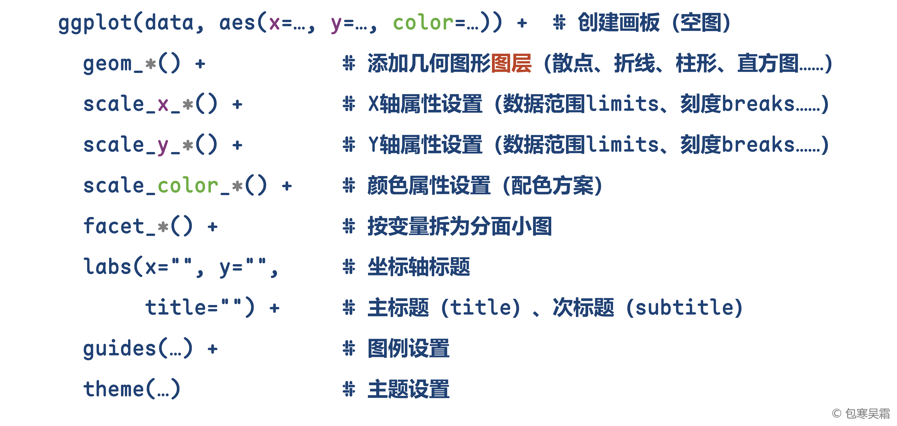
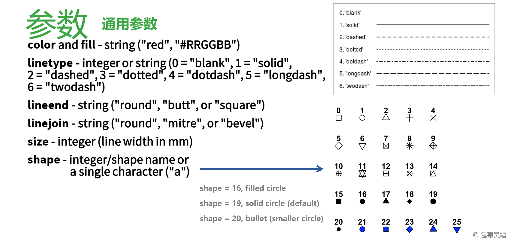
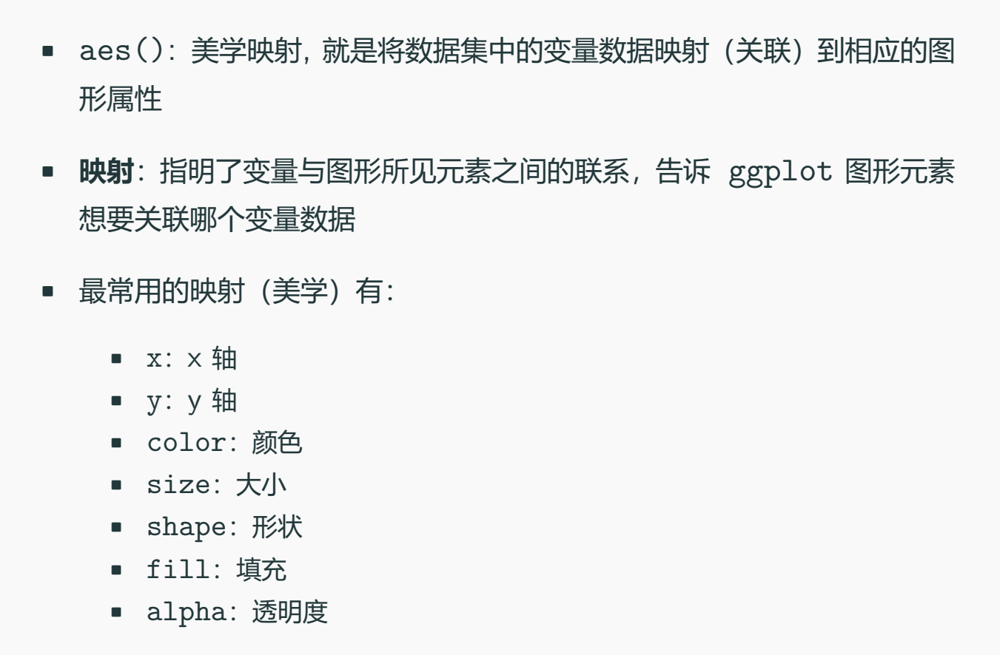
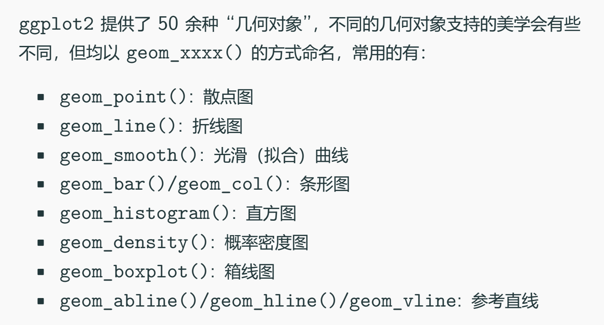
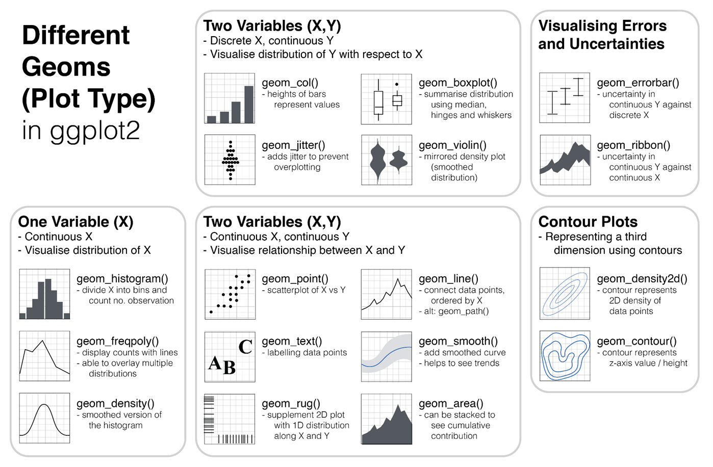
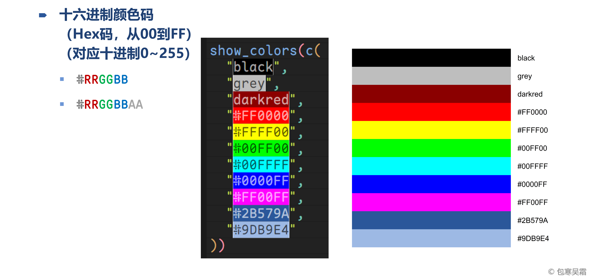
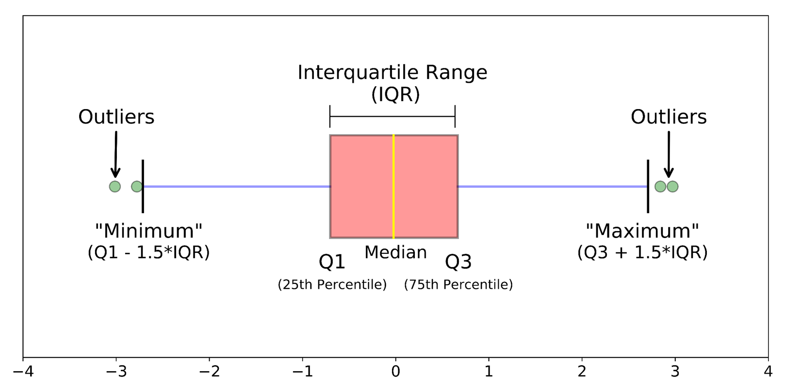
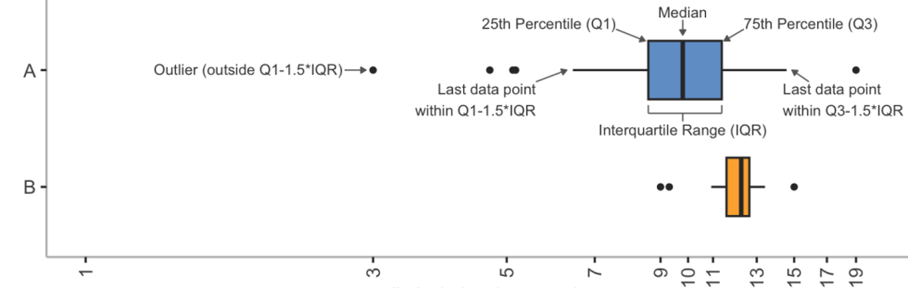

```{=html}
<p style="font-size: 12px">版权声明：本套课程材料开源，使用和分享必须遵守「创作共用许可协议 CC BY-NC-SA」（来源引用-非商业用途使用-以相同方式共享）。</p>
```

```{r Config, include=FALSE}
options(
  knitr.kable.NA = "",
  digits = 4
)
knitr::opts_chunk$set(
  comment = "",
  fig.width = 6,
  fig.height = 4,
  dpi = 300
)
```

------------------------------------------------------------------------

# Chap10：基础绘图

#### 往期要点回顾

-   [Chap09 \# 回归模型建立与结果报告](https://psychbruce.github.io/RCourse/Chap09#%E5%9B%9E%E5%BD%92%E6%A8%A1%E5%9E%8B%E5%BB%BA%E7%AB%8B%E4%B8%8E%E7%BB%93%E6%9E%9C%E6%8A%A5%E5%91%8A){.uri}
-   [Chap09 \# 多个模型汇总与表格输出](https://psychbruce.github.io/RCourse/Chap09#%E5%A4%9A%E4%B8%AA%E6%A8%A1%E5%9E%8B%E6%B1%87%E6%80%BB%E4%B8%8E%E8%A1%A8%E6%A0%BC%E8%BE%93%E5%87%BA){.uri}

#### 本章要点目录

-   [【探索发现】数据有了，图怎么画？](#探索发现数据有了图怎么画)
-   [【知识点】ggplot2“搭积木”式绘图语法](#知识点ggplot2搭积木式绘图语法)
-   [【实践1】直方图](#实践1直方图)
-   [【实践2】密度图](#实践2密度图)
-   [【探索发现】颜色的RGB十六进制码](#探索发现颜色的rgb十六进制码)
-   [【知识点】箱线图的统计含义](#知识点箱线图的统计含义)
-   [【实践3】箱线图](#实践3箱线图)
-   [【实践4】提琴图](#实践4提琴图)
-   [【探索发现】山脊图](#探索发现山脊图)
-   [【实践5】柱形图](#实践5柱形图)
-   [【实践6】点线图](#实践6点线图)
-   [【实践7】散点图](#实践7散点图)
-   [【实践8】气泡图](#实践8气泡图)
-   [【探索发现】热力图](#探索发现热力图)
-   [【实践9】折线图](#实践9折线图)

```{r, message=FALSE, warning=FALSE}
## 本章所需R包
library(bruceR)
# library(ggplot2)  # 加载bruceR时已默认加载ggplot2
```

# 数据可视化的总体思路

#### 【探索发现】数据有了，图怎么画？ {#探索发现数据有了图怎么画}

-   [R Graph Gallery R绘图美术馆](https://r-graph-gallery.com/){.uri}
    -   绘制变量分布
        -   直方图（Histogram）
        -   密度图（Density）
        -   箱线图（Boxplot）
        -   提琴图（Violin）
        -   山脊图（Ridgeline）
    -   绘制变量大小
        -   柱形图（Barplot）
        -   点线图（Dotted line）
    -   绘制变量关系
        -   散点图（Scatterplot）
        -   气泡图（Bubble）
        -   热力图（Heatmap）
    -   绘制变量趋势
        -   折线图（Line chart）
        -   面积图（Area chart）

#### 【知识点】ggplot2“搭积木”式绘图语法 {#知识点ggplot2搭积木式绘图语法}

`ggplot2`绘图语法的逻辑：

1.  准备数据（`data`），将变量映射到美学属性（`aes`），定义XY轴、颜色、大小等
2.  添加几何对象（`geom`），绘制点、线、面等，多个图层可通过加号依次叠加（`+`）
3.  可做分面小图（`facet`），调整标度（`scale`），投影到不同坐标系（`coord`）
4.  设置标题标签（`labs`），调整图例（`guides`），根据喜好选择主题方案（`theme`）











# 绘制变量分布

## 直方图

#### 【实践1】直方图 {#实践1直方图}

```{r}
## 数据准备
data = airquality
data$Month = as.factor(data$Month)
data$Temp.C = (data$Temp - 32) / 1.8  # 摄氏度 = (华氏度 - 32) / 1.8
str(data)

## R基础作图函数：直方图
hist(data$Temp.C)

## ggplot2搭积木作图
ggplot()  # 空画板
ggplot(data, aes(x=Temp.C))  # 有了坐标系
ggplot(data, aes(x=Temp.C)) +
  geom_histogram()  # 直方图

ggplot(data, aes(x=Temp.C)) +
  geom_histogram(bins=10,
                 color="black",
                 fill="grey")

ggplot(data, aes(x=Temp.C)) +
  geom_histogram(binwidth=5,
                 color="black",
                 fill="grey")

ggplot(data, aes(x=Temp.C)) +
  geom_histogram(
    aes(y=after_stat(density)),
    ## density, integrate to 1
    binwidth=5,
    color="black",
    fill="grey")

ggplot(data, aes(x=Temp.C)) +
  geom_histogram(
    aes(y=after_stat(ndensity)),
    ## density, maximum to 1
    binwidth=5,
    color="black",
    fill="grey")
```

## 密度图

#### 【实践2】密度图 {#实践2密度图}

```{r}
ggplot(data, aes(x=Temp.C)) +
  geom_density()

ggplot(data, aes(x=Temp.C)) +
  geom_density(adjust=0.5)

ggplot(data, aes(x=Temp.C)) +
  geom_density(adjust=2)

ggplot(data, aes(x=Temp.C)) +
  geom_density(adjust=2,
               linewidth=2,
               color="darkblue",
               fill="lightblue")

ggplot(data, aes(x=Temp.C, y=after_stat(ndensity))) +
  geom_histogram(binwidth=5) +
  geom_density(adjust=2,
               linewidth=2,
               color="darkblue",
               fill="lightblue",
               alpha=0.5)
```

#### 【探索发现】颜色的RGB十六进制码 {#探索发现颜色的rgb十六进制码}



## 箱线图

#### 【知识点】箱线图的统计含义 {#知识点箱线图的统计含义}

-   四分位数（quartile）：把数据四等分的界限
    -   Q1：0\~25%（前25%界限）
    -   Q2：25\~50%（中位数50%界限）
    -   Q3：50\~75%（后25%界限）
    -   Q4：75\~100%（垫底）
-   IQR（interquartile range）：四分位距（分布中Q1和Q3之间的变量值范围）
    -   IQR = Q3 – Q1





#### 【实践3】箱线图 {#实践3箱线图}

```{r}
## R基础作图函数：箱线图
boxplot(data$Temp.C)
boxplot(Temp.C ~ Month, data=data)

## ggplot2搭积木作图
ggplot(data, aes(y=Temp.C)) +
  geom_boxplot()

ggplot(data, aes(x=Month, y=Temp.C)) +
  geom_boxplot()

ggplot(data, aes(x=Month, y=Temp.C)) +
  geom_boxplot(
    fill="blue",
    alpha=0.3,
    outlier.color="red",
    outlier.size=2)

ggplot(data, aes(x=Month, y=Temp.C)) +
  geom_boxplot(aes(fill=Month)) +
  scale_y_continuous(
    limits=c(10, 40)) +
  labs(x="Month",
       y="Temperature",
       fill="Month")
```

## 提琴图

#### 【实践4】提琴图 {#实践4提琴图}

```{r}
ggplot(data, aes(x=Month, y=Temp.C)) +
  geom_violin(aes(fill=Month)) +
  scale_y_continuous(limits=c(10, 40)) +
  labs(x="Month",
       y="Temperature",
       fill="Month")

ggplot(data, aes(x=Month, y=Temp.C)) +
  geom_violin(aes(fill=Month)) +
  geom_boxplot(fill="white", width=0.3) +
  scale_y_continuous(limits=c(10, 40)) +
  labs(x="Month",
       y="Temperature",
       fill="Month")
```

## 山脊图

#### 【探索发现】山脊图 {#探索发现山脊图}

```{r}
## install.packages("ggridges")
library(ggridges)

ggplot(data, aes(x=Temp.C, y=Month)) +
  geom_density_ridges() +
  theme_ridges()

ggplot(data, aes(x=Temp.C, y=Month, fill=after_stat(x))) +
  geom_density_ridges_gradient() +
  labs(x="Temperature", y="Month") +
  theme_ridges()

ggplot(data, aes(x=Temp.C, y=Month, fill=after_stat(x))) +
  geom_density_ridges_gradient(
    scale=0.95,        # 最高峰高度缩放到95%
    show.legend=FALSE  # 不显示图例
  ) +
  scale_fill_viridis_c(option="C") +  # Viridis配色方案
  labs(x="Temperature", y="Month") +
  theme_ridges()

ggplot(data, aes(x=Temp.C, y=Month, fill=after_stat(x))) +
  geom_density_ridges_gradient(
    stat="binline",    # 直方图统计转换
    bins=20,           # 20个直方图分段
    scale=0.8,         # 最高峰高度缩放到95%
    show.legend=FALSE  # 不显示图例
  ) +
  scale_x_continuous(limits=c(10, 40)) +
  scale_fill_viridis_c(option="C") +
  labs(x="Temperature", y="Month") +
  theme_ridges()
```

# 绘制变量大小

## 柱形图

#### 【实践5】柱形图 {#实践5柱形图}

```{r}
## 数据准备：每月气温的估计边际均值（emmeans）
model = lm(Temp.C ~ Month, data)
# summary(emmeans(model, "Month"))
means = model %>% emmeans("Month") %>% summary()
means

ggplot(means, aes(x=Month, y=emmean)) +
  geom_col(color="black",
           fill="grey",
           width=0.6)

ggplot(means, aes(x=Month, y=emmean)) +
  geom_col(color="black",
           fill="grey",
           width=0.6) +
  geom_errorbar(aes(ymin=lower.CL,
                    ymax=upper.CL),
                width=0.1) +
  labs(y="Mean Temperature",
       title="Air Quality Data") +
  theme_classic()

## 数据准备：两因素组间ANOVA的估计边际均值（emmeans）
d = between.2
d$A = as.factor(d$A)
d$B = as.factor(d$B)
model = lm(SCORE ~ A * B, data=d)
means = model %>% emmeans("A", by="B") %>% summary()
means

ggplot(means, aes(x=A, y=emmean, fill=B)) +
  geom_col(position="dodge",  # 调整水平位置，躲避重叠图形
           width=0.6)

ggplot(means, aes(x=A, y=emmean, fill=B)) +
  geom_col(position="dodge",  # 调整水平位置，躲避重叠图形
           width=0.6) +
  geom_errorbar(aes(ymin=lower.CL,
                    ymax=upper.CL),
                position=position_dodge(0.6),
                width=0.15,
                color="black")

ggplot(means, aes(x=A, y=emmean, fill=B)) +
  geom_col(position="dodge", width=0.6) +
  geom_errorbar(aes(ymin=lower.CL,
                    ymax=upper.CL),
                position=position_dodge(0.6),
                width=0.15,
                color="black") +
  scale_y_continuous(expand=expansion(add=0),
                     limits=c(0, 15),
                     breaks=seq(0, 15, 3)) +
  scale_fill_brewer(palette="Set1") +
  labs(x="A", y="SCORE") +
  theme_classic()
```

## 点线图

#### 【实践6】点线图 {#实践6点线图}

```{r}
## 数据准备：每月气温的估计边际均值（emmeans）
model = lm(Temp.C ~ Month, data)
# summary(emmeans(model, "Month"))
means = model %>% emmeans("Month") %>% summary()
means

emmip(model, ~ Month, CIs=TRUE)  # 返回ggplot对象

emmip(model, ~ Month, CIs=TRUE) +
  labs(x="Month",
       y="Mean Temperature",
       title="Air Quality Data",
       subtitle="Daily Temperature",
       caption="* Error bar = 95% CI") +
  theme_classic()
```

# 绘制变量关系

## 散点图

#### 【实践7】散点图 {#实践7散点图}

```{r}
## R基础作图函数：散点图
plot(x=data$Wind, y=data$Temp.C)

## ggplot2搭积木作图
ggplot(data, aes(x=Wind, y=Temp.C)) +
  geom_point()

ggplot(data, aes(x=Wind, y=Temp.C)) +
  geom_point(color="grey") +
  geom_smooth()  # 后画的geom图层在最上面！

ggplot(data, aes(x=Wind, y=Temp.C)) +
  geom_smooth() +
  geom_point(color="grey")  # 后画的geom图层在最上面！

ggplot(data, aes(x=Wind, y=Temp.C)) +
  geom_point(color="grey") +
  geom_smooth(method="lm", color="black")

ggplot(data, aes(x=Wind, y=Temp.C)) +
  geom_point(color="grey") +
  geom_smooth(method="lm", color="black") +
  geom_hline(yintercept=22, linetype="dashed", color="red")

ggplot(data, aes(x=Wind, y=Temp.C)) +
  geom_hline(yintercept=22, linetype="dashed", color="red") +
  geom_point(color="grey") +
  geom_smooth(method="lm", color="black")

ggplot(data, aes(x=Wind, y=Temp.C)) +
  geom_hline(yintercept=22, linetype="dashed", color="red") +
  geom_vline(xintercept=9, linetype="dashed", color="blue") +
  geom_point(color="grey") +
  geom_smooth(method="lm", color="black")

ggplot(data, aes(x=Wind, y=Temp.C, color=Month)) +
  geom_point()

ggplot(data, aes(x=Wind, y=Temp.C, color=Month)) +
  geom_point() +
  scale_color_brewer(palette="Set1")

ggplot(data, aes(x=Wind, y=Temp.C, color=Month)) +
  geom_point() +
  geom_smooth(method="lm", se=FALSE) +
  scale_color_brewer(palette="Set1") +
  labs(title="Temperature & Wind Speed")

ggplot(data, aes(x=Wind, y=Temp.C, color=Month)) +
  geom_point() +
  geom_smooth(method="lm", se=FALSE) +
  geom_smooth(method="lm", color="black") +
  scale_x_continuous(limits=c(0, 21)) +
  scale_y_continuous(limits=c(10, 40)) +
  scale_color_brewer(palette="Set1") +
  labs(title="Temperature & Wind Speed")
```

## 气泡图

#### 【实践8】气泡图 {#实践8气泡图}

```{r}
ggplot(data, aes(x=Wind, y=Temp.C, color=Month, size=Solar.R)) +
  geom_point(shape=21) +
  scale_color_brewer(palette="Set1")

ggplot(data, aes(x=Wind, y=Temp.C, color=Month, size=Solar.R)) +
  geom_point(shape=21) +
  scale_color_brewer(palette="Set1") +
  scale_size_continuous(breaks=seq(50, 300, 50))

ggplot(data, aes(x=Wind, y=Temp.C, color=Month, size=Solar.R)) +
  geom_point(aes(fill=Month), alpha=0.2, shape=21) +
  geom_point(shape=21) +
  scale_color_brewer(palette="Set1") +
  scale_fill_brewer(palette="Set1") +
  scale_size_continuous(breaks=seq(50, 300, 50))
```

## 热力图

#### 【探索发现】热力图 {#探索发现热力图}

```{r}
cor = Corr(airquality)

cor$plot + labs(title="Correlation Plot")

cor$plot +
  labs(title="Correlation Plot") +
  scale_fill_fermenter(
    palette="RdBu",
    direction=1,
    limits=c(-1, 1),
    breaks=seq(-1, 1, 0.2),
    guide=guide_colorsteps(
      barwidth=0.5,
      barheight=10))

cor$plot +
  labs(title="Correlation Plot") +
  scale_fill_fermenter(
    palette="Spectral",
    direction=1,
    limits=c(-1, 1),
    breaks=seq(-1, 1, 0.2),
    guide=guide_colorsteps(
      barwidth=0.5,
      barheight=10))
```

# 绘制变量趋势

## 折线图

#### 【实践9】折线图 {#实践9折线图}

```{r}
data = as.data.table(airquality)
data[, Date := as.Date(sprintf("1973-%02d-%02d", Month, Day))]
data[, Temp.C := (Temp - 32) / 1.8]
data

ggplot(data, aes(x=Date, y=Temp.C)) +
  geom_line()

ggplot(data, aes(x=Date, y=Temp.C)) +
  geom_line() +
  geom_smooth()

ggplot(data, aes(x=Date, y=Temp.C)) +
  geom_line() +
  geom_point() +
  geom_smooth()

ggplot(data, aes(x=Date, y=Temp.C)) +
  geom_line(color="grey") +
  geom_point(aes(color=Temp.C)) +
  geom_smooth(color="black") +
  scale_color_distiller(palette="RdYlBu")

ggplot(data, aes(x=Date, y=Temp.C)) +
  geom_line(linewidth=1) +
  geom_point(aes(fill=Temp.C), shape=21) +
  scale_x_date(date_labels="%m-%d",  # "%Y-%m-%d"
               date_breaks="1 month",
               date_minor_breaks="7 days") +
  scale_y_continuous(limits=c(10, 40)) +
  scale_fill_distiller(palette="RdYlBu") +
  labs(x=NULL,
       y="Temperature",
       title="Daily Temperature")
```

# 【作业9】基础绘图练习

作业要求：

-   基于期末自选数据，运用本章所学的`ggplot2`绘图代码，练习绘制变量的分布（直方图）、大小（柱形图）、关系（散点图）、 趋势（折线图），每种图绘制一个即可
-   使用R Markdown完成，对关键代码及结果要有注释说明

平台提交：

-   运行得到的HTML网页，及其关键部分截图
