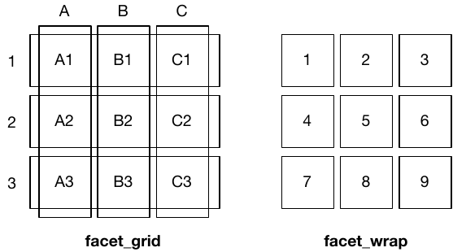
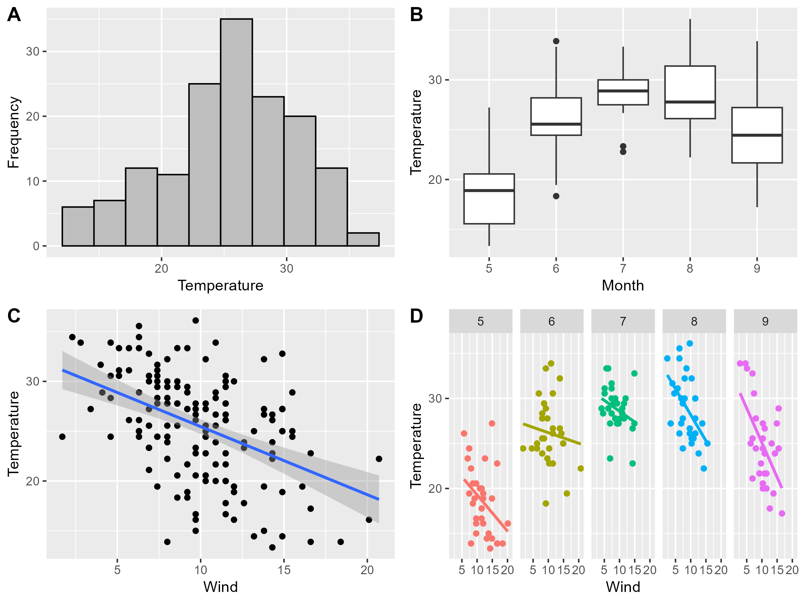
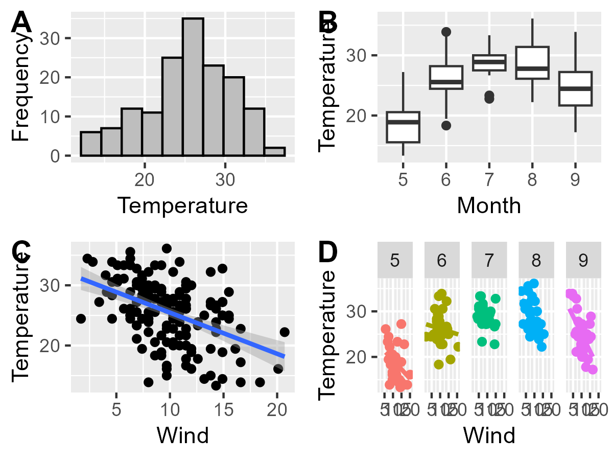
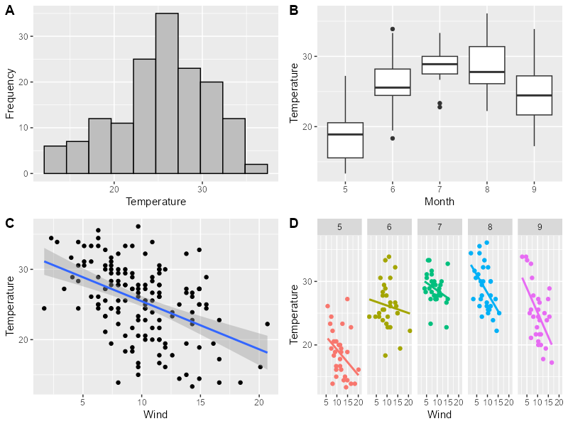
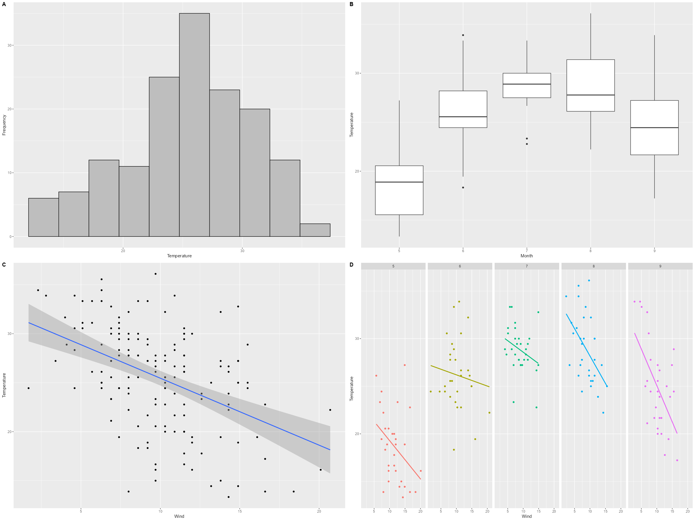

```{=html}
<p style="font-size: 12px">版权声明：本套课程材料开源，使用和分享必须遵守「创作共用许可协议 CC BY-NC-SA」（来源引用-非商业用途使用-以相同方式共享）。</p>
```

```{r Config, include=FALSE}
options(
  knitr.kable.NA = "",
  digits = 4
)
knitr::opts_chunk$set(
  comment = "",
  fig.width = 6,
  fig.height = 4,
  dpi = 300
)
```

------------------------------------------------------------------------

# Chap11：多图组合

#### 往期要点回顾

-   [Chap10 \# 绘制变量分布](https://psychbruce.github.io/RCourse/Chap10#%E7%BB%98%E5%88%B6%E5%8F%98%E9%87%8F%E5%88%86%E5%B8%83){.uri}（直方图）
-   [Chap10 \# 绘制变量大小](https://psychbruce.github.io/RCourse/Chap10#%E7%BB%98%E5%88%B6%E5%8F%98%E9%87%8F%E5%A4%A7%E5%B0%8F){.uri}（柱形图）
-   [Chap10 \# 绘制变量关系](https://psychbruce.github.io/RCourse/Chap10#%E7%BB%98%E5%88%B6%E5%8F%98%E9%87%8F%E5%85%B3%E7%B3%BB){.uri}（散点图）
-   [Chap10 \# 绘制变量趋势](https://psychbruce.github.io/RCourse/Chap10#%E7%BB%98%E5%88%B6%E5%8F%98%E9%87%8F%E8%B6%8B%E5%8A%BF){.uri}（折线图）

#### 本章要点目录

-   [【实践1】facet_wrap()：拆解分面小图](#实践1facet_wrap拆解分面小图)
-   [【实践2】facet_grid()：两个分类变量的交叉组合分面](#实践2facet_grid两个分类变量的交叉组合分面)
-   [【实践3】cowplot::plot_grid()：多图组合](#实践3cowplotplot_grid多图组合)（重点）
-   [【实践4】ggsave()：图形文件保存](#实践4ggsave图形文件保存)（重点）

```{r, message=FALSE, warning=FALSE}
## 本章所需R包
library(bruceR)
# library(ggplot2)  # 加载bruceR时已默认加载ggplot2
# library(cowplot)  # 加载bruceR时已默认加载cowplot
```

# 分面小图

#### 【实践1】facet_wrap()：拆解分面小图 {#实践1facet_wrap拆解分面小图}

```{r}
## 数据准备
data = airquality
data$Month = as.factor(data$Month)
data$Temp.C = (data$Temp - 32) / 1.8  # 摄氏度 = (华氏度 - 32) / 1.8
str(data)

## 基础散点图
ggplot(data, aes(x=Wind, y=Temp.C)) +
  geom_point()

ggplot(data, aes(x=Wind, y=Temp.C, color=Month)) +
  geom_point()

ggplot(data, aes(x=Wind, y=Temp.C, color=Month)) +
  geom_point() +
  facet_wrap(~ Month)

ggplot(data, aes(x=Wind, y=Temp.C, color=Month)) +
  geom_point() +
  facet_wrap(~ Month, ncol=5)

ggplot(data, aes(x=Wind, y=Temp.C, color=Month)) +
  geom_point(show.legend=FALSE) +
  facet_wrap(~ Month, nrow=1)

ggplot(data, aes(x=Wind, y=Temp.C, color=Month)) +
  geom_point(show.legend=FALSE) +
  geom_smooth(method="lm", se=FALSE, show.legend=FALSE) +
  facet_wrap(~ Month, nrow=1)

## 修改因子标签
data$Months = factor(
  data$Month,
  levels = 5:9,
  labels = c("May", "June", "July", "August", "September")
)
ggplot(data, aes(x=Wind, y=Temp.C, color=Months)) +
  geom_point(show.legend=FALSE) +
  geom_smooth(method="lm", show.legend=FALSE) +
  facet_wrap(~ Months, nrow=1)

ggplot(data, aes(x=Wind, y=Temp.C, color=Months)) +
  geom_point(show.legend=FALSE) +
  geom_smooth(method="lm", show.legend=FALSE) +
  facet_wrap(~ Months, nrow=1, scales="free")
```

#### 【实践2】facet_grid()：两个分类变量的交叉组合分面 {#实践2facet_grid两个分类变量的交叉组合分面}

-   `facet_wrap()`：线性排列（卷饼🌯）
    -   `~ 分组变量`
-   `facet_grid()`：两因素交叉组合排列（华夫饼🧇）
    -   `行分组变量 ~ 列分组变量`



```{r, fig.width=8, fig.height=6}
## 两个分类变量的情况
## 数据变量计算复习（Chap 05 & 06）
data.bfi = as.data.table(psych::bfi)
data.bfi[, let(
  Gender = factor(gender, levels=1:2, labels=c("Male", "Female")),
  Age = as.numeric(age),
  Edu = as.factor(education),
  E = MEAN(data.bfi, "E", 1:5, rev=c(1,2), range=1:6),
  A = MEAN(data.bfi, "A", 1:5, rev=1, range=1:6),
  C = MEAN(data.bfi, "C", 1:5, rev=c(4,5), range=1:6),
  N = MEAN(data.bfi, "N", 1:5, rev=NULL, range=1:6),
  O = MEAN(data.bfi, "O", 1:5, rev=c(2,5), range=1:6)
)]
str(data.bfi)

p = ggplot(data.bfi[Age>=18 & Age<60 & !is.na(Edu)],
           aes(x=Age, y=E)) +
  geom_point(alpha=0.1) +
  geom_smooth(method="loess", color="firebrick", fill="orange") +
  labs(y="Extraversion")
p

p + facet_wrap(~ Gender)
p + facet_wrap(~ Gender + Edu)  # 并不理想
p + facet_wrap(~ Gender * Edu)  # 并不理想
p + facet_grid(~ Gender)  # . ~ 列分组变量（.点可以省略）
p + facet_grid(Gender ~ .)  # 行分组变量 ~ .（.点不能省略）
p + facet_grid(Gender ~ Edu)  # 行变量 ~ 列变量
```

```{r, fig.width=8, fig.height=12}
p + facet_grid(Edu ~ Gender)  # 行变量 ~ 列变量
```

# 多图组合

#### 【实践3】cowplot::plot_grid()：多图组合 {#实践3cowplotplot_grid多图组合}

```{r}
p1 = ggplot(data, aes(x=Temp.C)) +
  geom_histogram(bins=10, color="black", fill="grey") +
  labs(x="Temperature", y="Frequency")

p2 = ggplot(data, aes(x=Month, y=Temp.C)) +
  geom_boxplot() +
  labs(y="Temperature")

p12 = cowplot::plot_grid(p1, p2, nrow=1, labels="AUTO")
p12
```

```{r, fig.width=8, fig.height=6}
p3 = ggplot(data, aes(x=Wind, y=Temp.C)) +
  geom_point() +
  geom_smooth(method="lm") +
  labs(y="Temperature")

p4 = ggplot(data, aes(x=Wind, y=Temp.C, color=Month)) +
  geom_point(show.legend=FALSE) +
  geom_smooth(method="lm", se=FALSE, show.legend=FALSE) +
  facet_wrap(~ Month, nrow=1) +
  labs(y="Temperature")

p1234 = cowplot::plot_grid(p1, p2, p3, p4, ncol=2, labels="AUTO")
p1234
```

# 图形文件保存

#### 【实践4】ggsave()：图形文件保存 {#实践4ggsave图形文件保存}

`ggsave()`：保存`ggplot`对象到文件

-   `file`：可以是`.png`、`.jpg`、`.pdf`等文件格式
    -   PDF格式是矢量图，无限放大依然清晰
-   `width`：宽度（英寸inch）
-   `height`：高度（英寸inch）
-   `dpi`（dots per inch）：每英寸像素点数

```{r}
ggsave(p1234, file="Fig1.png", width=8, height=6, dpi=300)
# 分辨率：2400 * 1800（比例合适，分辨率高）
```



```{r}
ggsave(p1234, file="Fig2.png", width=4, height=3, dpi=300)
# 分辨率：1200 * 900（比例不合适，虽然分辨率高）
```



```{r}
ggsave(p1234, file="Fig3.png", width=8, height=6, dpi=100)
# 分辨率：800 * 600（比例合适，但分辨率低）
```



```{r}
ggsave(p1234, file="Fig4.png", width=24, height=18, dpi=100)
# 分辨率：2400 * 1800（比例不合适，分辨率也低）
```



```{r, include=FALSE}
unlink(c("Fig1.png", "Fig2.png", "Fig3.png", "Fig4.png"))
```

# 【作业10】多图组合练习

作业要求：

-   使用`cowplot::plot_grid()`函数，把[【作业9】](https://psychbruce.github.io/RCourse/Chap10#%E4%BD%9C%E4%B8%9A9%E5%9F%BA%E7%A1%80%E7%BB%98%E5%9B%BE%E7%BB%83%E4%B9%A0){.uri}完成的4张图拼合在一起，添加A\~D标签，最后保存为合适尺寸的高清晰度图形文件（`.png`格式，清晰度`dpi`至少为300）
-   使用R Markdown完成，对关键代码及结果要有注释说明

平台提交：

-   关键代码截图及保存的PNG图形

------------------------------------------------------------------------

[返回课程主页](https://psychbruce.github.io/RCourse/)

© 包寒吴霜
