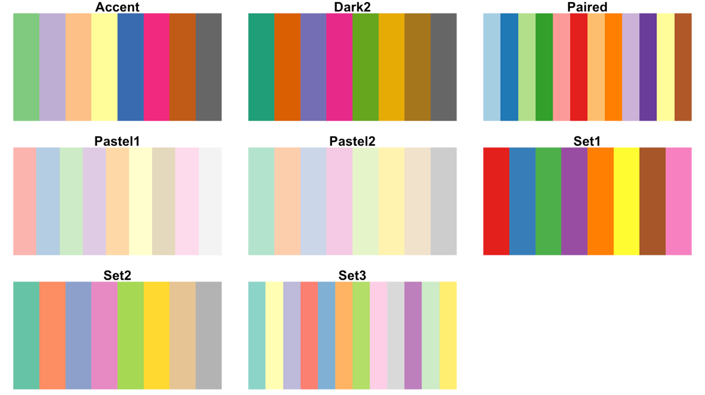
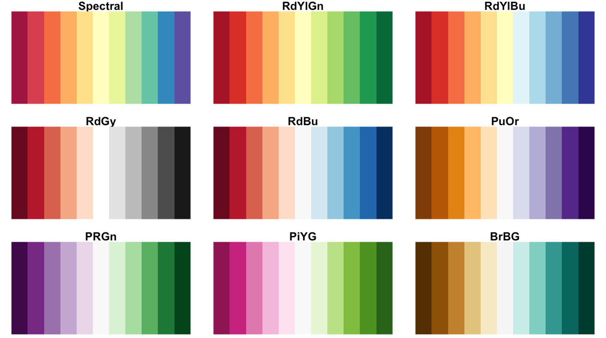
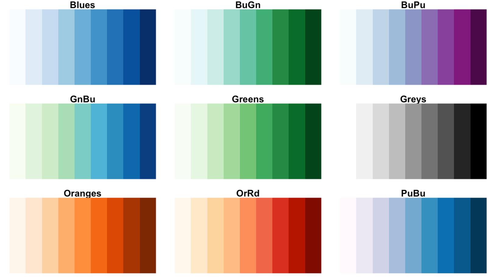
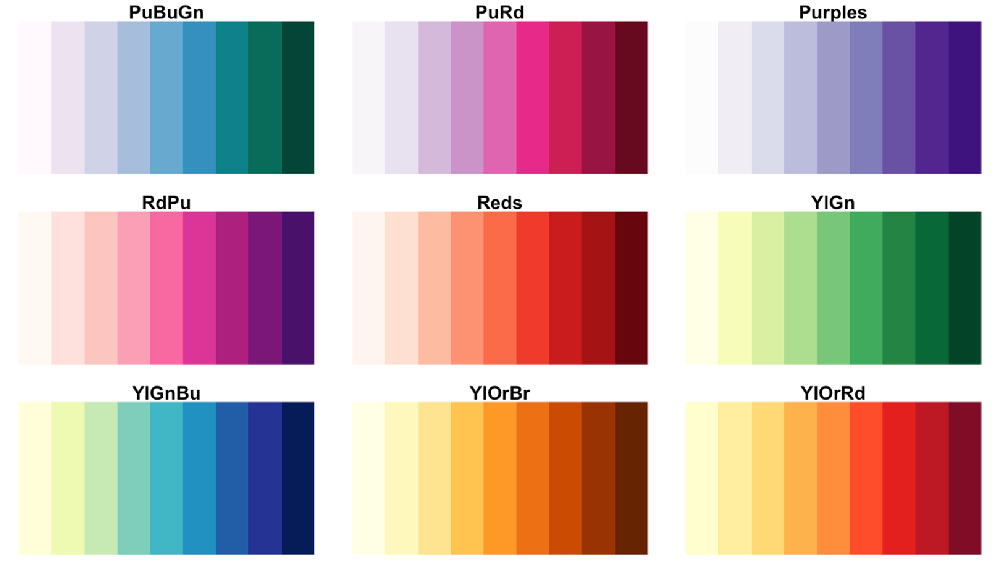
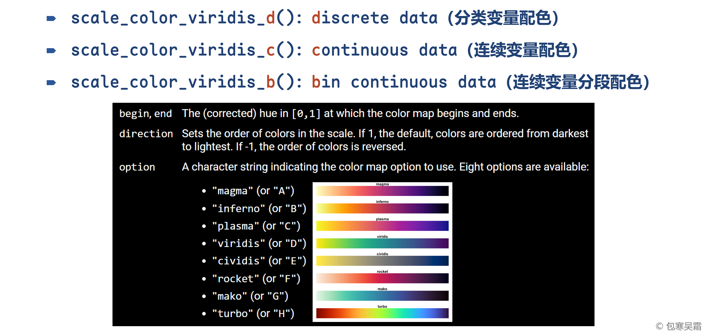
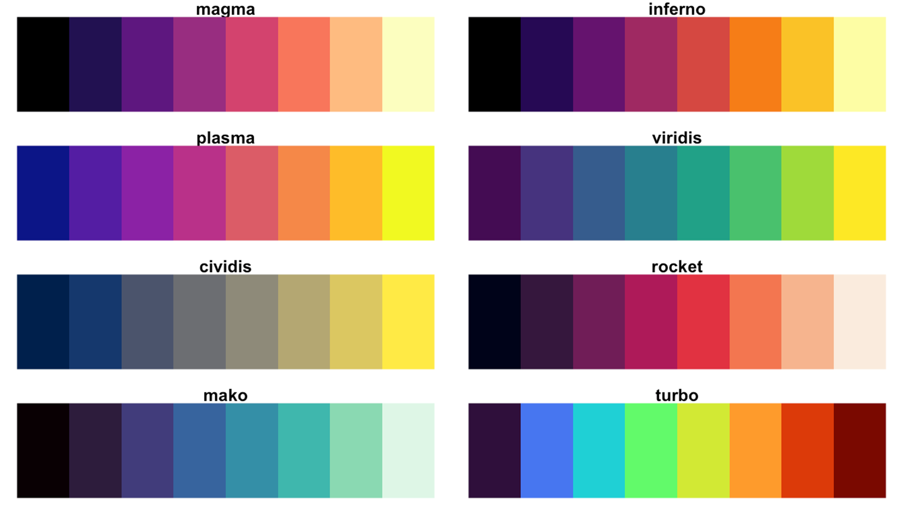

```{=html}
<p style="font-size: 12px">版权声明：本套课程材料开源，使用和分享必须遵守「创作共用许可协议 CC BY-NC-SA」（来源引用-非商业用途使用-以相同方式共享）。</p>
```

```{r Config, include=FALSE}
options(
  knitr.kable.NA = "",
  digits = 4
)
knitr::opts_chunk$set(
  comment = "",
  fig.width = 6,
  fig.height = 4,
  dpi = 300
)
```

------------------------------------------------------------------------

# Chap12：主题配色

#### 往期要点回顾

- [Chap11 \# 分面小图](https://psychbruce.github.io/RCourse/Chap11#%E5%88%86%E9%9D%A2%E5%B0%8F%E5%9B%BE){.uri}
- [Chap11 \# 多图组合](https://psychbruce.github.io/RCourse/Chap11#%E5%A4%9A%E5%9B%BE%E7%BB%84%E5%90%88){.uri}
- [Chap11 \# 图形文件保存](https://psychbruce.github.io/RCourse/Chap11#%E5%9B%BE%E5%BD%A2%E6%96%87%E4%BB%B6%E4%BF%9D%E5%AD%98){.uri}

#### 本章要点目录

- [【实践1】配色方案设置](#实践1配色方案设置)（重点）
- [【实践2】主题元素设置](#实践2主题元素设置)

```{r, message=FALSE, warning=FALSE}
## 本章所需R包
library(bruceR)
# library(ggplot2)  # 加载bruceR时已默认加载ggplot2
```

# 配色方案设置

主要认识两套经典调色板：Brewer和Viridis。

#### 【实践1】配色方案设置 {#实践1配色方案设置}

- Brewer调色板（<https://colorbrewer2.org/>）
  - 分类色（Qualitative palettes）—— 适用于离散/分类/因子型变量
    - Accent, Dark2, Paired, Pastel1, Pastel2, **Set1 (常用)**, Set2, Set3
  - 对比色（Diverging palettes）—— 适用于连续/数值型变量
    - BrBG, PiYG, PRGn, PuOr, **RdBu (常用)**, RdGy, RdYlBu, RdYlGn, Spectral
  - 渐变色（Sequential palettes）—— 适用于连续/数值型变量
    - Blues, BuGn, BuPu, GnBu, Greens, Greys, Oranges, OrRd, PuBu, PuBuGn, PuRd, Purples, RdPu, Reds, YlGn, YlGnBu, YlOrBr, YlOrRd









```{r}
## ggplot基础图形对象设定（赋值给p，避免重复写代码）
p = ggplot(
  data = na.omit(airquality),
  mapping = aes(x=Solar.R, y=Ozone, color=(Temp-32)/1.8)
)
p = p +
  geom_point() +
  labs(x="Solar Radiation",
       y="Ozone Pollution",
       color="Temp.")
p  # 默认配色

p + scale_color_continuous(palette="Reds")
p + scale_color_continuous(palette="YlOrRd")
p + scale_color_continuous(palette="RdYlBu")

## distiller：蒸馏器（离散颜色 => 连续颜色）
p + scale_color_distiller(palette="Set1", direction=-1)
p + scale_color_distiller(palette="RdYlBu", direction=-1)

## fermenter：发酵器（连续颜色 => 离散颜色）
p + scale_color_fermenter(palette="RdYlBu", direction=-1)
p + scale_color_fermenter(palette = "RdYlBu",
                          direction = -1,
                          limits = c(10, 40),
                          breaks = seq(10, 40, 3))
```

- Viridis调色板
  - `"magma"` (or `"A"`)
  - `"inferno"` (or `"B"`)
  - `"plasma"` (or `"C"`)
  - `"viridis"` (or `"D"`)
  - `"cividis"` (or `"E"`)
  - `"rocket"` (or `"F"`)
  - `"mako"` (or `"G"`)
  - `"turbo"` (or `"H"`)





```{r}
p + scale_color_viridis_c(option="magma")  # "A"
p + scale_color_viridis_b(option="magma")  # "A"

p + scale_color_viridis_c(option="inferno")  # "B"
p + scale_color_viridis_b(option="inferno")  # "B"

p + scale_color_viridis_c(option="plasma")  # "C"
p + scale_color_viridis_b(option="plasma")  # "C"

p + scale_color_viridis_c(option="viridis")  # "D"
p + scale_color_viridis_b(option="viridis")  # "D"

p + scale_color_viridis_c(option="cividis")  # "E"
p + scale_color_viridis_b(option="cividis")  # "E"

p + scale_color_viridis_c(option="rocket")  # "F"
p + scale_color_viridis_b(option="rocket")  # "F"

p + scale_color_viridis_c(option="mako")  # "G"
p + scale_color_viridis_b(option="mako")  # "G"

p + scale_color_viridis_c(option="turbo")  # "H"
p + scale_color_viridis_b(option="turbo")  # "H"
```

# 主题元素设置

#### 【实践2】主题元素设置 {#实践2主题元素设置}

（1）`theme()`主题元素设置函数（[自学`theme()`函数帮助文档](https://ggplot2.tidyverse.org/reference/theme.html){.uri}）

- `theme()`函数共144个参数！（以下列出了常用参数）
  - 整张图（`plot.*`）
    - 背景：`plot.background`
    - 主标题：`plot.title`, `plot.title.position`
    - 副标题：`plot.subtitle`
    - 说明文字：`plot.caption`, `plot.caption.position`
    - 序号标签：`plot.tag`, `plot.tag.position`
    - 边距：`plot.margin`
  - 绘图区（`panel.*`）
    - 背景：`panel.background`
    - 网格线：`panel.grid`
    - 主刻度网格线：`panel.grid.major`
    - 副刻度网格线：`panel.grid.minor`
  - 坐标轴（`axis.*`）
    - 轴线：`axis.line`
    - 轴标题：`axis.title`
    - 刻度值：`axis.text`
    - 刻度线：`axis.ticks`
  - 图例区（`legend.*`）
    - 背景：`legend.background`
    - 位置：`legend.position`, `legend.position.inside`
    - 方向：`legend.direction`
    - 图例标题：`legend.title`
    - 图例刻度值：`legend.text`
    - 图例刻度线：`legend.ticks`
- 分面图（`strip.*`）
  - 背景：`strip.background`
  - 文字：`strip.text`

（2）`element_*()`元素属性设置函数（[自学`element_*()`系列函数帮助文档](https://ggplot2.tidyverse.org/reference/element.html){.uri}）

- `element_blank()`：设置为空（移除该元素）
- `element_rect()`：设置矩形元素（边框与底色）
- `element_line()`：设置线条元素
- `element_text()`：设置文本元素

```{r}
p1 = p + scale_color_continuous(palette="YlOrRd")
p1  # 默认主题：theme_grey()

## 预定义的theme主题方案
p1 + theme_void()  # 空无主题
p1 + theme_bw()  # 黑白主题
p1 + theme_dark()  # 深色主题
p1 + theme_light()  # 浅色主题
p1 + theme_linedraw()  # 线条主题
p1 + theme_minimal()  # 极简主题
p1 + theme_classic()  # 经典主题
p1 + cowplot::theme_cowplot()  # cowplot主题
p1 + cowplot::theme_nothing()  # cowplot完全空无主题
p1 + theme_bruce()  # bruceR主题
```

# 复习与答疑

## 课程期末总复习

- [课程大纲与学习目标回顾](https://psychbruce.github.io/RCourse/Syllabus_R-Programming_BaoHWS.pdf)

## 个性化答疑辅导

- 对提问/作业/报告/操作的个性化反馈与指导

# 【期末作业】数据分析与可视化

作业要求：

- 自主选择任意一个感兴趣的公开数据，综合运用本课程所学内容，迭代积累完成一项完整的R语言数据分析与可视化编程期末作业
  - **随堂作业1\~10、个人阶段作业①②是期末大作业的基础和拆分任务**，请在这些平时作业基础上，进一步修改完善R代码、文字注释和文档结构，即可作为期末大作业提交！
- 使用R Markdown完成，对关键代码及结果要有注释说明

平台提交：

- R Markdown原始代码文件（.Rmd）和运行得到的HTML网页文件（.html）
  - 提交文件命名格式
    - `学号-姓名-R期末作业.Rmd`
    - `学号-姓名-R期末作业.html`

------------------------------------------------------------------------

[返回课程主页](https://psychbruce.github.io/RCourse/)

© 包寒吴霜
